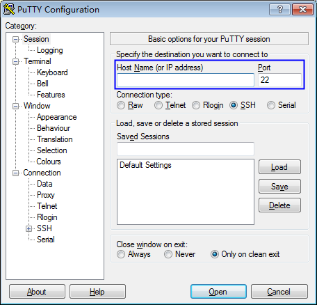

# 使用私钥登录Linux ECS

## 操作场景

用户通过管理控制台创建或者导入密钥对后，在购买弹性云服务器时，“登录方式“选择“密钥对“，并选择创建或者导入的密钥对。

用户购买弹性云服务器成功后，可使用密钥对的私钥登录弹性云服务器。

该任务指导用户使用私钥登录Linux弹性云服务器。

## 前提条件

-   已获取该弹性云服务器的私钥文件。
-   弹性云服务器已经绑定弹性IP地址。
-   使用的登录工具（如PuTTY）与待登录的弹性云服务器之间网络连通。

## 本地使用Windows系统

如果您本地使用Windows操作系统登录Linux弹性云服务器，可以按照以下方式登录弹性云服务器。

**方式一：使用PuTTY登录**

以PuTTY为例介绍如何登录弹性云服务器，使用PuTTY登录弹性云服务器前，需要先将私钥文件转化为“.ppk“格式。

1.  判断私钥文件是否为“.ppk“格式。
    -   若是“.ppk“格式文件，请跳过此步骤。
    -   若不是“.ppk“格式，请按以下步骤将私钥文件格式转换为“.ppk“格式。
        1.  在以下路径中下载PuTTY和PuTTYgen。

            http://www.chiark.greenend.org.uk/~sgtatham/putty/download.html

            > **说明：**   
            >PuTTYgen是密钥生成器，用于创建SSH密钥对，生成一个公钥和私钥供PuTTY使用。  

        2.  运行PuTTYgen。
        3.  在“Actions“区域，单击“Load“，并导入购买弹性云服务器时保存的私钥文件。

            导入时注意确保导入的格式要求为“All files\(\*.\*\)“。

        4.  单击“Save private key“。
        5.  保存转化后的私钥到本地。例如：kp-123.ppk。

1.  双击“PuTTY.EXE“，打开“PuTTY Configuration“。
2.  选择“Connection \> data“，在“Auto-login username“处输入镜像的用户名。

    > **说明：**   
    >-   若是“CoreOS“的公共镜像，镜像的用户名为“core“。  
    >-   若是“非CoreOS“的公共镜像，镜像的用户名为“root“。  

3.  选择“Connection \> SSH \> Auth“，在“Private key file forauthentication“配置项中，单击“Browse“，选择[1](#l589950e2b89c441c8cf1be301cf04941)转化的私钥文件。
4.  单击“Session“，在“Host Name \(or IP address\)“下的输入框中输入弹性云服务器的弹性IP地址。

    **图 1**  配置弹性IP  
    

5.  单击“Open“，登录弹性云服务器。

**方式二：使用Xshell登录**

1.  打开Xshell工具。
2.  执行以下命令，SSH远程连接弹性云服务器。

    **ssh** _用户名@弹性IP_

    示例：

    **ssh** _root@192.168.1.1_

3.  （可选）如果系统弹窗提示“SSH安全警告“，此时，需要单击“接受并保存“。
4.  选择“Public Key“，并单击“用户密钥\(K\)“栏的“浏览“。
5.  在“用户密钥“窗口中，单击“导入“。
6.  选择本地保存的密钥文件，并单击“打开“。
7.  单击“确定“，登录弹性云服务器。

## 本地使用Linux操作系统

如果您是在Linux操作系统上登录Linux弹性云服务器，可以按照下面方式登录。下面步骤以私钥文件是“kp-123.ppk“为例进行介绍。

1.  在您的Linux计算机的命令行中执行以下命令，变更权限。

    **chmod 600  __/path/私钥文件名称__**

    > **说明：**   
    >path为密钥文件的存放路径。  

2.  执行以下命令登录弹性云服务器。

    **ssh -i  _/path/kp-123_  root@_弹性IP地址_**

    > **说明：**   
    >-   path为密钥文件的存放路径。  
    >-   弹性IP地址为弹性云服务器绑定的弹性IP地址。  

