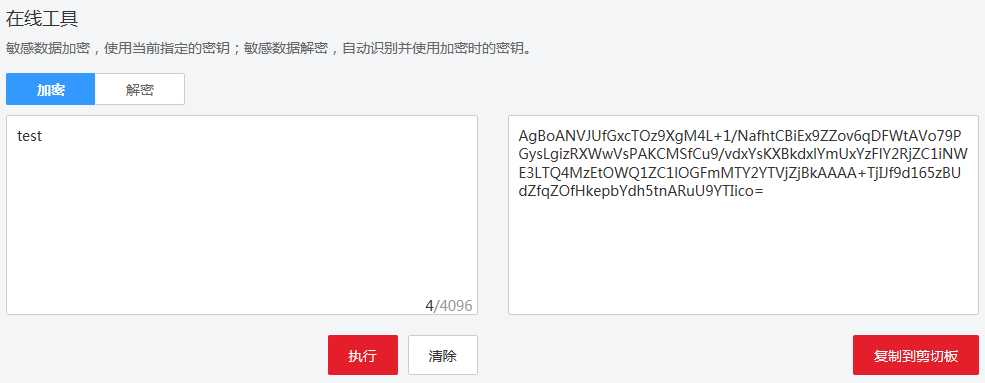
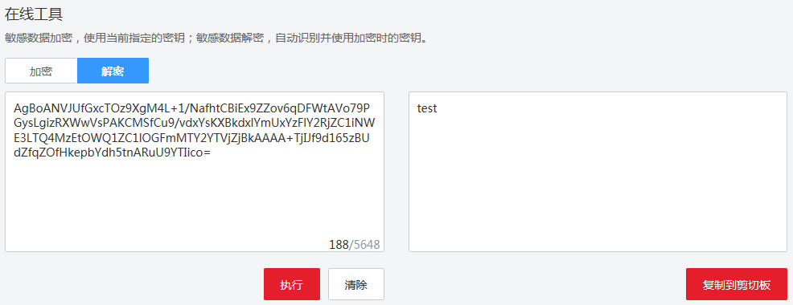

# 如何使用在线工具加解密数据？

使用在线工具加解密小数据的操作步骤如下所示：

## 加密数据

1.  登录管理控制台。
2.  单击管理控制台左上角，选择区域或项目。
3.  单击页面上方的“服务列表“，选择“安全  \>  数据加密服务“，默认进入数据加密服务的“密钥管理“界面。
4.  单击目标密钥管理所在行，展开密钥管理。
5.  单击目标用户主密钥的别名，进入密钥详细信息在线工具加密数据页面。
6.  在“加密“文本框中输入待加密的数据，如[图1](#dew_01_0022_fig61927028183617)所示。

    **图 1**  加密数据  
    

7.  单击“执行“，右侧文本框显示加密后的密文数据。

    > **说明：**   
    >-   加密数据时，使用当前指定的密钥加密数据。  
    >-   用户可单击“清除“，清除已输入的数据。  
    >-   用户可单击“复制到剪切板“拷贝加密后的密文数据，并保存到本地文件中。  

## 解密数据

1.  登录管理控制台。
2.  单击管理控制台左上角，选择区域或项目。
3.  单击页面上方的“服务列表“，选择“安全  \>  数据加密服务“，默认进入数据加密服务的“密钥管理“界面。
4.  单击目标密钥管理所在行，展开密钥管理。
5.  解密数据时，可单击任意“启用“状态的非默认主密钥别名，进入该密钥的在线工具页面。
6.  单击“解密“，在左侧文本框中数据待解密的密文数据，如[图2](#dew_01_0022_fig1586514341014)所示。

    > **说明：**   
    >-   在线工具自动识别并使用数据被加密时使用的密钥解密数据。  
    >-   若该密钥已被删除，会导致解密失败。  

    **图 2**  解密数据  
    

7.  单击“执行“，右侧文本框中显示解密后的明文数据。

    > **说明：**   
    >用户可直接单击“复制到剪切板“拷贝解密后的明文数据，并保存到本地文件中。  

