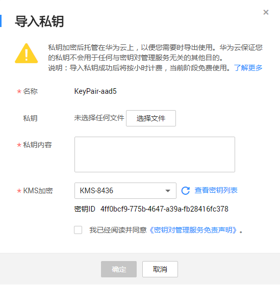
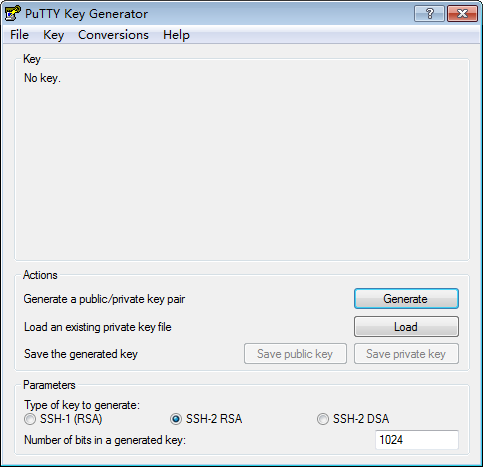

# 导入私钥

为了方便用户管理本地的私钥，用户可将私钥导入管理控制台，由KPS统一管理。导入的私钥由KMS提供的密钥加密，保证用户私钥的存储、导入或者导出安全。当用户需要使用私钥时，可从管理控制台多次下载，为了保证私钥的安全，请妥善保管下载的私钥。

该任务指导用户通过密钥对管理界面导入私钥。

## 前提条件

-   已获取管理控制台的登录帐号与密码。
-   已获取与公钥匹配的私钥文件。

## 导入私钥

1.  登录管理控制台。
2.  单击管理控制台左上角，选择区域或项目。
3.  单击页面上方的“服务列表“，选择“安全  \>  数据加密服务“，默认进入数据加密服务的“密钥管理“界面。
4.  在左侧导航树中，选择“密钥对管理“，进入“密钥对列表“页面。
5.  单击目标公钥所在行的“导入私钥“，弹出的“导入私钥“对话框，如[图1](#f27b1b3c0409647ee9de25cc580829628)所示。

    **图 1**  导入私钥  
    

6.  单击“选择文件“，选择本地保存的私钥文件，或者将私钥内容复制并粘贴至“私钥内容“文本框中。

    > **说明：**   
    >一个公钥下只能导入与这个公钥匹配的私钥。  

    上传或者拷贝至文本框的私钥必须是“.pem“格式文件，若是“.ppk“格式文件，需要通过以下步骤将“.ppk“格式文件转换为“.pem“格式文件。

    1.  双击“PUTTYGEN.exe“，打开“PuTTY Key Generator“，如[图2](#f68625d7525504cc1bbc7b0bc9efe3597)所示。

        **图 2**  PuTTY Key Generator  
        

    2.  选择“Conversions \> Import Key“导入格式为“.ppk“的私钥文件。
    3.  选择“Conversions \> Export OpenSSH Key“，弹出“PuTTYgen Warning“对话框。
    4.  单击“是“，将文件保存为“.pem“格式文件。

7.  在“KMS加密“下拉列表中选择加密密钥。

    > **说明：**   
    >-   用户使用密钥对的KMS加密功能时，KMS会自动为密钥对创建一个“kps/default“默认主密钥。  
    >-   用户在选择加密密钥时，可选择已有的加密密钥，或者单击“查看密钥列表“，创建新的加密密钥。  

8.  请阅读并勾选“我已阅读并同意《密钥对管理服务免责声明》“。
9.  单击“确定“，完成私钥托管。

