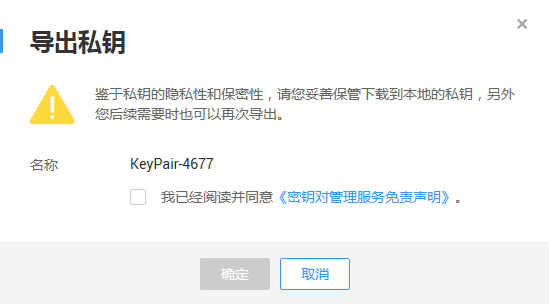

# 导出私钥

若用户已将私钥托管在管理控制台上，用户可根据自己的需要多次下载托管的私钥，为了保证私钥的安全，请妥善保管下载的私钥。

## 前提条件

-   已获取管理控制台的登录帐号与密码。
-   已将私钥托管在管理控制台。

## 导出私钥

1.  登录管理控制台。
2.  单击管理控制台左上角，选择区域或项目。
3.  单击页面上方的“服务列表“，选择“安全  \>  数据加密服务“，默认进入数据加密服务的“密钥管理“界面。
4.  在左侧导航树中，选择“密钥对管理“，进入“密钥对列表“页面。
5.  单击目标密钥对所在行的“导出私钥“，弹出“导出私钥“对话框，如[图1](#f704b6a279532488994495fe0ba649283)所示。

    **图 1**  导出私钥  
    

6.  请阅读并勾选“我已阅读并同意《密钥对管理服务免责声明》“。
7.  单击“确定“，浏览器自动执行下载任务，下载私钥文件。

    > **注意：**   
    >用户导出私钥时，使用的是托管私钥时加密私钥的加密密钥进行解密。如果加密密钥已被彻底删除，那么导出私钥将会失败。  

