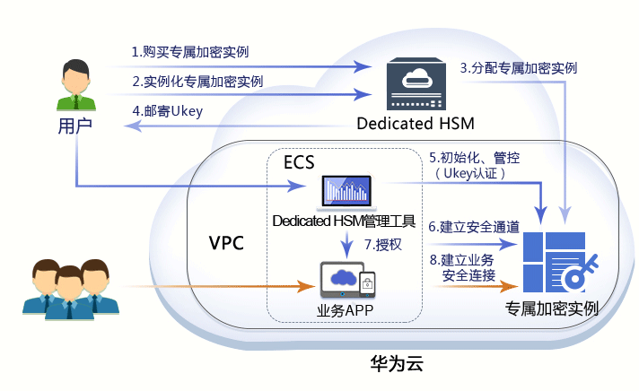

# 操作指引

该任务指导用户如何初始化专属加密实例。

## 前提条件

在获取专属加密实例后，用户需要获取以下信息，初始化专属加密实例。

**表 1**  获取初始化专属加密实例的信息

<table><thead align="left"><tr id="row024774062610"><th class="cellrowborder" valign="top" width="16.981698169816983%" id="mcps1.2.4.1.1">
名称

</th>
<th class="cellrowborder" valign="top" width="46.11461146114612%" id="mcps1.2.4.1.2">
说明

</th>
<th class="cellrowborder" valign="top" width="36.9036903690369%" id="mcps1.2.4.1.3">
来源

</th>
</tr>
</thead>
<tbody><tr id="row15247184010263"><td class="cellrowborder" valign="top" width="16.981698169816983%" headers="mcps1.2.4.1.1 ">
Ukey

</td>
<td class="cellrowborder" valign="top" width="46.11461146114612%" headers="mcps1.2.4.1.2 ">
保存专属加密实例的权限管理信息。

</td>
<td class="cellrowborder" valign="top" width="36.9036903690369%" headers="mcps1.2.4.1.3 ">
订单付款后，由华为云邮寄到用户的Ukey收件地址。

</td>
</tr>
<tr id="row12247114002613"><td class="cellrowborder" valign="top" width="16.981698169816983%" headers="mcps1.2.4.1.1 ">
Ukey驱动

</td>
<td class="cellrowborder" valign="top" width="46.11461146114612%" headers="mcps1.2.4.1.2 ">
Windows驱动，识别Ukey。

</td>
<td class="cellrowborder" rowspan="6" valign="top" width="36.9036903690369%" headers="mcps1.2.4.1.3 ">
华为云安全专家通过用户提供的联系方式联系用户，并提供软件包链接供用户下载。

</td>
</tr>
<tr id="row16247104052610"><td class="cellrowborder" valign="top" headers="mcps1.2.4.1.1 ">
Dedicated HSM管理工具

</td>
<td class="cellrowborder" valign="top" headers="mcps1.2.4.1.2 ">
配合Ukey，远程管理专属加密实例。

</td>
</tr>
<tr id="row192496408266"><td class="cellrowborder" valign="top" headers="mcps1.2.4.1.1 ">
安全代理软件

</td>
<td class="cellrowborder" valign="top" headers="mcps1.2.4.1.2 ">
与专属加密实例建立安全通道。

</td>
</tr>
<tr id="row14249154014264"><td class="cellrowborder" valign="top" headers="mcps1.2.4.1.1 ">
SDK

</td>
<td class="cellrowborder" valign="top" headers="mcps1.2.4.1.2 ">
用于提供专属加密实例的API接口，用户通过调用SDK与专属加密实例建立安全连接。

</td>
</tr>
<tr id="row75571314736"><td class="cellrowborder" valign="top" headers="mcps1.2.4.1.1 ">
华为云Windows ECS实例

</td>
<td class="cellrowborder" valign="top" headers="mcps1.2.4.1.2 ">
运行Dedicated&nbsp;HSM管理工具，与专属加密实例处于同一VPC组，并分配弹性IP地址用于远程连接。

</td>
</tr>
<tr id="row12249154015267"><td class="cellrowborder" valign="top" headers="mcps1.2.4.1.1 ">
华为云Linux ECS实例

</td>
<td class="cellrowborder" valign="top" headers="mcps1.2.4.1.2 ">
运行安全代理软件和用户的应用程序，与专属加密实例处于同一VPC组。

</td>
</tr>
</tbody>
</table>

## 操作指引

当用户需要在云上使用专属加密服务时，可通过Dedicated HSM界面购买专属加密实例。购买专属加密实例后，用户需要通过Dedicated HSM界面实例化专属加密实例。当用户收到华为云邮寄的Ukey后，通过Ukey初始化，并管控专属加密实例。用户通过Dedicated HSM管理工具授权业务APP，允许业务用户通过APP访问专属加密实例。操作指引如[图1](#fig1244473721510)所示。

**图 1**  操作指引  

操作指引说明如[表2](#table844653719155)所示。

**表 2**  操作指引说明

<table><thead align="left"><tr id="row74462037191514"><th class="cellrowborder" valign="top" width="7.000000000000001%" id="mcps1.2.3.1.1">
编号

</th>
<th class="cellrowborder" valign="top" width="93%" id="mcps1.2.3.1.2">
说明

</th>
</tr>
</thead>
<tbody><tr id="row1144611375155"><td class="cellrowborder" valign="top" width="7.000000000000001%" headers="mcps1.2.3.1.1 ">
1

</td>
<td class="cellrowborder" valign="top" width="93%" headers="mcps1.2.3.1.2 ">
用户通过Dedicated HSM界面购买专属加密实例。

</td>
</tr>
<tr id="row5305147152619"><td class="cellrowborder" valign="top" width="7.000000000000001%" headers="mcps1.2.3.1.1 ">
2

</td>
<td class="cellrowborder" valign="top" width="93%" headers="mcps1.2.3.1.2 ">
用户购买专属加密实例后，通过Dedicated HSM界面实例化专属加密实例。用户需要选择专属加密实例部署的虚拟私有云，以及专属加密实例的功能类型等，详细操作请参见<a href="实例化专属加密实例.md">实例化专属加密实例</a>。

</td>
</tr>
<tr id="row42441826231"><td class="cellrowborder" valign="top" width="7.000000000000001%" headers="mcps1.2.3.1.1 ">
3

</td>
<td class="cellrowborder" valign="top" width="93%" headers="mcps1.2.3.1.2 ">
用户实例化专属加密实例后，华为云分配专属加密实例给用户。

</td>
</tr>
<tr id="row132575315816"><td class="cellrowborder" valign="top" width="7.000000000000001%" headers="mcps1.2.3.1.1 ">
4

</td>
<td class="cellrowborder" valign="top" width="93%" headers="mcps1.2.3.1.2 ">
Ukey是华为云提供给用户的身份识别卡，此卡仅购买专属加密实例的用户持有，请妥善保管。

华为云安全专家将通过用户提供的Ukey收件地址将Ukey邮寄给用户。

</td>
</tr>
<tr id="row1144614377154"><td class="cellrowborder" valign="top" width="7.000000000000001%" headers="mcps1.2.3.1.1 ">
5

</td>
<td class="cellrowborder" valign="top" width="93%" headers="mcps1.2.3.1.2 ">
用户使用Ukey和Dedicated HSM管理工具初始化专属加密实例，并注册相应的管理员，管控专属加密实例。

</td>
</tr>
<tr id="row5446183781514"><td class="cellrowborder" valign="top" width="7.000000000000001%" headers="mcps1.2.3.1.1 ">
6

</td>
<td class="cellrowborder" valign="top" width="93%" headers="mcps1.2.3.1.2 ">
用户通过Dedicated HSM管理工具配置安全代理，建立与专属加密实例之间的安全通道。

</td>
</tr>
<tr id="row441114582211"><td class="cellrowborder" valign="top" width="7.000000000000001%" headers="mcps1.2.3.1.1 ">
7

</td>
<td class="cellrowborder" valign="top" width="93%" headers="mcps1.2.3.1.2 ">
注册的管理员需要通过Dedicated HSM管理工具授予业务APP访问专属加密实例的权限。

</td>
</tr>
<tr id="row144614375156"><td class="cellrowborder" valign="top" width="7.000000000000001%" headers="mcps1.2.3.1.1 ">
8

</td>
<td class="cellrowborder" valign="top" width="93%" headers="mcps1.2.3.1.2 ">
用户将SDK安装在业务APP上，业务用户通过调用SDK与专属加密实例建立安全连接，并访问专属加密实例。

</td>
</tr>
</tbody>
</table>

## 初始化专属加密实例

1.  在用户本地Windows PC上安装Ukey驱动。
2.  远程连接华为云Windows ECS实例。
    1.  运行本地Windows PC的**mstsc**远程连接工具，并通过华为云上Windows  ECS实例的弹性IP地址远程连接ECS实例。
    2.  在本地PC的USB口插入Ukey，通过远程连接功能将本地Ukey端口映射到华为云的Windows ECS实例。

3.  通过Dedicated HSM管理工具管理专属加密实例。
    1.  在华为云Windows ECS实例上运行Dedicated HSM管理工具。
    2.  通过与专属加密实例的VPC子网IP连接，配合Ukey初始化专属加密实例，并产生、备份、恢复密钥。

## 配置安全代理软件

1.  通过Dedicated HSM管理工具连接专属加密实例，给华为云Linux ECS实例上的安全代理签发许可文件。
2.  在Linux ECS实例上运行安全代理软件，将许可文件导入到安全代理软件，并与专属加密实例建立安全通道。

## 接口调用

应用程序通过SDK提供的接口与安全代理软件建立连接，通过安全代理软件调用专属加密实例。

