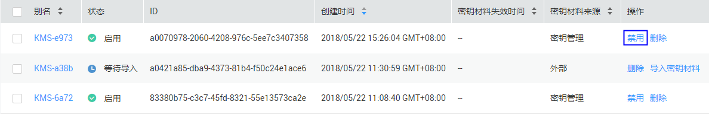
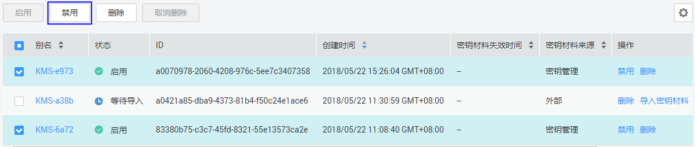

# 禁用密钥

该任务指导用户通过密钥管理界面对指定的用户主密钥进行禁用，以紧急保护数据。

用户主密钥被禁用后，用户将不能使用该密钥进行加解密任何数据。如果要使用该密钥进行加解密数据，用户需将该密钥重新启用，具体操作请参见[启用密钥](启用密钥.md)。

> **说明：**   
>默认主密钥为密钥管理自动创建，不支持禁用操作。  

## 前提条件

-   已获取管理控制台的登录帐号与密码。
-   待禁用的密钥需处于“启用“状态。

## 禁用单个密钥

1.  登录管理控制台。
2.  单击管理控制台左上角，选择区域或项目。
3.  单击页面上方的“服务列表“，选择“安全  \>  数据加密服务“，默认进入数据加密服务的“密钥管理“界面。
4.  单击目标密钥管理所在行，展开密钥管理。
5.  在需要禁用的密钥所在行，单击“禁用“。

    **图 1**  禁用单个密钥  
    

6.  在弹出窗口中，单击“确定“，完成禁用单个密钥操作。

## 批量禁用密钥

1.  登录管理控制台。
2.  单击管理控制台左上角，选择区域或项目。
3.  单击页面上方的“服务列表“，选择“安全  \>  数据加密服务“，默认进入数据加密服务的“密钥管理“界面。
4.  单击目标密钥管理所在行，展开密钥管理。
5.  在密钥列表中，勾选所有需要禁用的密钥，单击“禁用“。

    **图 2**  批量禁用密钥  
    

6.  在弹出窗口中，单击“确定“，完成批量禁用密钥操作。

