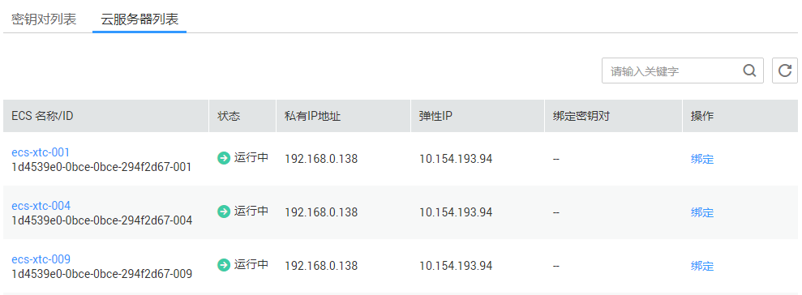

# 解绑密钥对后，如果没有密码和密钥对登录ECS，该如何处理？<a name="dew_01_0084"></a>

## 问题描述<a name="section1490062351313"></a>

-   当用户购买弹性云服务器使用的是“密钥对方式“登录弹性云服务器时，解绑初始密钥对后，用户没有密码和密钥对登录弹性云服务器，该如何处理？
-   当用户在KMS管理控制台绑定密钥对时，勾选了“关闭密码登录方式“，解绑密钥对后，用户没有密码和密钥对登录弹性云服务器，该如何处理？

## 处理方法<a name="section9940161813529"></a>

**方式一：**

通过弹性云服务器界面重置密码，使用密码登录弹性云服务器，详细信息请参见《弹性云服务器用户指南》。

**方式二：**

将弹性云服务器关机，然后通过管理控制台重新绑定密钥对，使用密钥对登录弹性云服务器，操作步骤如下所示：

1.  登录管理控制台。
2.  单击管理控制台左上角，选择区域或项目。
3.  单击页面上方的“服务列表“，选择“安全  \>  数据加密服务“，默认进入数据加密服务的“密钥管理“界面。
4.  在左侧导航树中，选择“密钥对管理“，进入“密钥对列表“页面。
5.  单击“云服务器列表“，显示云服务器列表页面，如[图1](#dew_01_0071_fig1682318516365)所示。

    **图 1**  弹性云服务器列表<a name="dew_01_0071_fig1682318516365"></a>  
    

6.  单击目标弹性云服务器的名称，进入弹性云服务器详细信息界面。
7.  单击右上角“关机“，将弹性云服务器关机。
8.  单击页面上方的“服务列表“，选择“安全  \>  数据加密服务“，默认进入数据加密服务的“密钥管理“界面。
9.  在左侧导航树中，选择“密钥对管理“，进入“密钥对列表“页面。
10. 单击“云服务器列表“，显示云服务器列表页面。
11. 单击目标弹性云服务器所在行的“绑定“，弹出绑定密钥对的对话框，如[图2](#fig15882370512)所示。

    **图 2**  绑定密钥对<a name="fig15882370512"></a>  
    

12. 在“新密钥对“下拉列表中，选择新的密钥对。
13. 用户可根据自己的需要选择是否勾选“关闭密码登录方式“，默认勾选“关闭密码登录方式“。

    > **说明：**   
    >若不关闭密码登录方式，用户既可使用密码登录弹性云服务器，也可以使用密钥对登录弹性云服务器。  
    >若关闭了密码登录方式，用户只能使用密钥对登录弹性云服务器，若用户仍然需要使用密码登录弹性云服务器，可再次开启密码登录方式，操作步骤如下所示：  
    >1.  登录弹性云服务器。  
    >2.  执行以下命令，打开**“/etc/ssh/sshd\_config“**文件。  
    >    **vi /etc/ssh/sshd\_config**  
    >3.  按“i“进入编辑模式，开启密码登录。  
    >    -   非SUSE操作系统，将“PasswordAuthentication“字段值修改为“yes“。  
    >        ```  
    >        PasswordAuthentication yes  
    >        ```  
    >    -   SUSE操作系统，将“PasswordAuthentication“和“UsePAM“字段值修改为“yes“。  
    >        ```  
    >        PasswordAuthentication yes  
    >        UsePAM yes  
    >        ```  
    >4.  按“Esc“，退出编辑模式。  
    >5.  输入“:wq“，按“Enter“，保存退出。  
    >6.  执行以下命令，重启SSH服务，使配置生效。  
    >    -   非_Ubuntu14.xx_版本的操作系统。  
    >        **service sshd restart**  
    >    -   _Ubuntu14.xx_版本的操作系统。  
    >        **service ssh restart**  

14. 请确认并勾选“该服务器使用华为云提供的公共镜像并未修改过SSH配置“。
15. 请阅读并勾选“我已阅读并同意《密钥对管理服务免责声明》“。
16. 单击“确定“，完成密钥对绑定操作，绑定完成后，可使用密钥对登录弹性云服务器。

