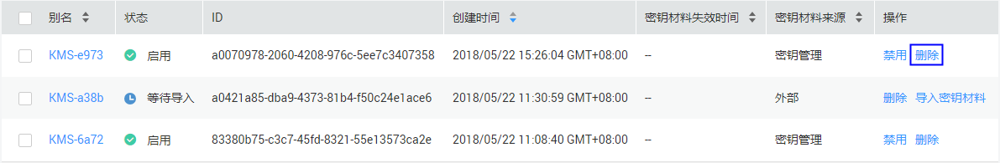
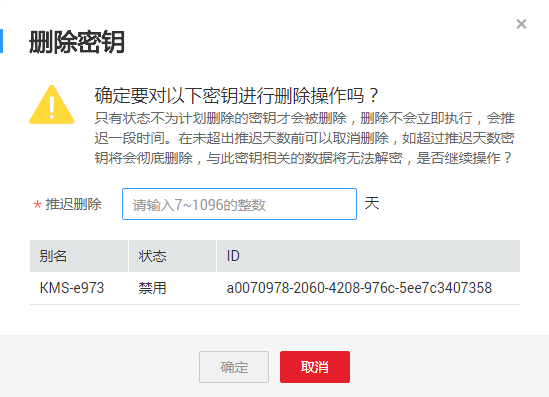
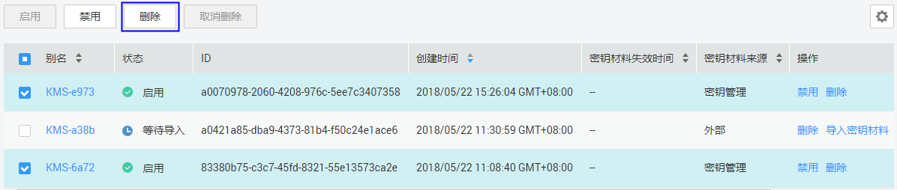
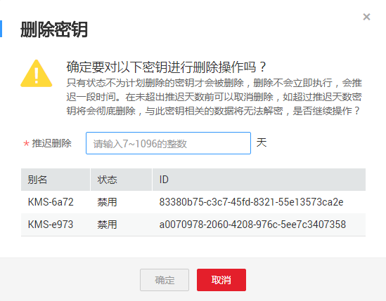

# 计划删除密钥

该任务指导用户通过密钥管理界面对不再使用的用户主密钥进行有计划删除。

用户执行删除密钥操作后，密钥不会立即删除，密钥管理会将该操作按用户指定时间推迟执行，推迟时间范围为7天～1096天。在推迟删除时间未到时，若需要重新使用该密钥，可以执行取消删除密钥操作。若超过推迟时间，密钥将被KMS彻底删除，使用该密钥加密的数据将无法解密，请谨慎操作。

在删除密钥前，用户需要确保该密钥没有被使用或将来也不会被使用。

> **说明：**   
>默认主密钥为服务自动创建，不支持删除操作。  

## 前提条件

-   已获取管理控制台的登录帐号与密码。
-   待删除的密钥需处于“启用“、“禁用“或者“等待导入“状态。

## 删除单个密钥

1.  登录管理控制台。
2.  单击管理控制台左上角，选择区域或项目。
3.  单击页面上方的“服务列表“，选择“安全  \>  数据加密服务“，默认进入数据加密服务的“密钥管理“界面。
4.  单击目标密钥管理所在行，展开密钥管理。
5.  在需要删除的密钥所在行，单击“删除“。

    **图 1**  删除单个密钥  
    

6.  在弹出的窗口中，填写“推迟删除“的时间。

    **图 2**  推迟删除时间  
    

7.  单击“确定“，完成删除单个密钥操作。

## 批量删除密钥

1.  登录管理控制台。
2.  单击管理控制台左上角，选择区域或项目。
3.  单击页面上方的“服务列表“，选择“安全  \>  数据加密服务“，默认进入数据加密服务的“密钥管理“界面。
4.  单击目标密钥管理所在行，展开密钥管理。
5.  在密钥列表中，勾选所有需要删除的密钥，单击“删除“。

    **图 3**  批量删除密钥  
    

6.  在弹出的窗口中，填写“推迟删除“的时间。

    **图 4**  批量推迟删除时间  
    

7.  单击“确定“，完成批量删除密钥操作。

