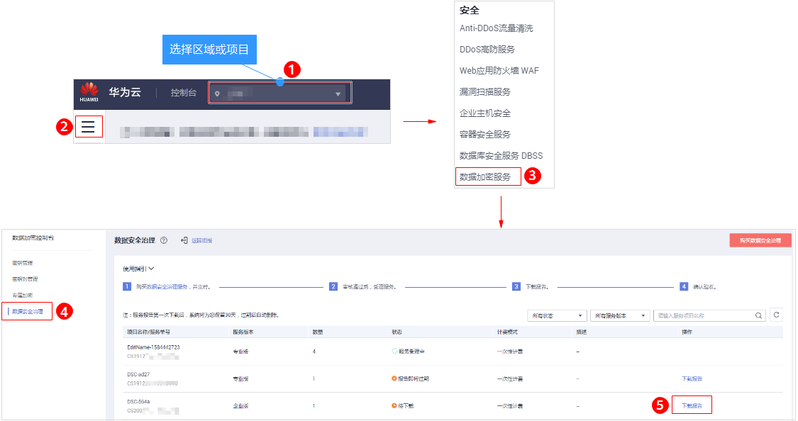
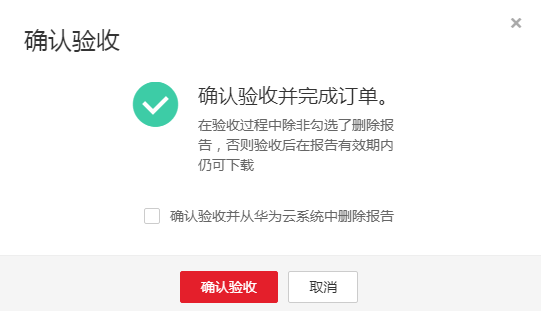

# 下载报告和确认验收

## 前提条件

-   已获取管理控制台账号和密码。
-   实例列表状态显示待下载。

## 操作步骤

1.  [登录管理控制台](https://console.huaweicloud.com/)。
2.  进入下载报告入口，如[图1](#fig1578442912552)所示。

    **图 1**  进入下载报告入口  
    

3.  单击“下载报告“，系统会自动将报告下载到本地。
4.  单击“确认验收“，完成订单验收，如[图2](#fig167714594712)所示。

    **图 2**  确认验收  
    

    > **说明：**   
    >在验收过程中除非勾选了删除报告，否则验收后在报告有效期内仍然可以下载。  
    >报告下载次数不能超过20次。  
    >如果验收过程中勾选了删除报告，在验收后，可删除实例，具体操作请参见[删除记录](删除记录.md)。  

