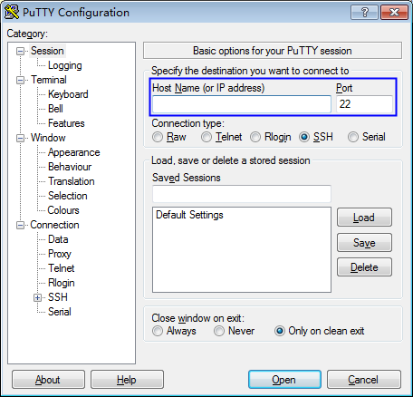

# 使用私钥登录Linux ECS

## 操作场景

用户通过管理控制台创建或者导入密钥对后，在购买弹性云服务器时，“登录方式“选择“密钥对“，并选择创建或者导入的密钥对。

用户购买弹性云服务器成功后，可使用密钥对的私钥登录弹性云服务器。

## 前提条件

-   使用的登录工具（如PuTTY、Xshell）与待登录的弹性云服务器之间网络连通。
-   弹性云服务器已经绑定弹性IP地址。
-   已获取该弹性云服务器的私钥文件，需要的格式说明如下：

    **表 1**  选择私钥文件格式

    
    <table><thead align="left"><tr id="row24419413336"><th class="cellrowborder" valign="top" width="26.170000000000005%" id="mcps1.2.4.1.1">
本地使用的操作系统

    </th>
    <th class="cellrowborder" valign="top" width="30.770000000000003%" id="mcps1.2.4.1.2">
登录Linux弹性云服务器使用的工具

    </th>
    <th class="cellrowborder" valign="top" width="43.06%" id="mcps1.2.4.1.3">
私钥文件格式

    </th>
    </tr>
    </thead>
    <tbody><tr id="row1644117417331"><td class="cellrowborder" rowspan="2" valign="top" width="26.170000000000005%" headers="mcps1.2.4.1.1 ">
Windows操作系统

    </td>
    <td class="cellrowborder" valign="top" width="30.770000000000003%" headers="mcps1.2.4.1.2 ">
<strong id="b164412423314">Xshell</strong>

    </td>
    <td class="cellrowborder" valign="top" width="43.06%" headers="mcps1.2.4.1.3 ">
“.pem”

    </td>
    </tr>
    <tr id="row1444274103318"><td class="cellrowborder" valign="top" headers="mcps1.2.4.1.1 ">
<strong id="b16442242334">PuTTY</strong>

    </td>
    <td class="cellrowborder" valign="top" headers="mcps1.2.4.1.2 ">
“.ppk”

    </td>
    </tr>
    <tr id="row513174585111"><td class="cellrowborder" valign="top" width="26.170000000000005%" headers="mcps1.2.4.1.1 ">
Linux操作系统

    </td>
    <td class="cellrowborder" valign="top" width="30.770000000000003%" headers="mcps1.2.4.1.2 ">
-

    </td>
    <td class="cellrowborder" valign="top" width="43.06%" headers="mcps1.2.4.1.3 ">
“.pem”或“.ppk”

    </td>
    </tr>
    </tbody>
    </table>

    > **说明：**   
    >若私钥文件格式不满足要求，请参考[如何转换私钥文件格式？](https://support.huaweicloud.com/dew_faq/dew_01_0099.html)进行转换。  

## 本地使用Windows操作系统

如果您本地使用Windows操作系统登录Linux弹性云服务器，可以按照以下方式登录弹性云服务器。

**方式一：使用PuTTY登录**

1.  双击“PuTTY.EXE“，打开“PuTTY Configuration“。
2.  选择“Connection \> data“，在“Auto-login username“处输入镜像的用户名。

    > **说明：**   
    >-   若是“CoreOS“的公共镜像，镜像的用户名为“core“。  
    >-   若是“非CoreOS“的公共镜像，镜像的用户名为“root“。  

3.  选择“Connection \> SSH \> Auth“，在“Private key file forauthentication“配置项中，单击“Browse“，选择私钥文件（“.ppk“格式）。
4.  单击“Session“，在“Host Name \(or IP address\)“下的输入框中输入弹性云服务器的弹性IP地址。

    **图 1**  配置弹性IP  
    

5.  单击“Open“，登录弹性云服务器。

**方式二：使用Xshell登录**

1.  打开Xshell工具。
2.  执行以下命令，SSH远程连接弹性云服务器。

    **ssh** _用户名@弹性IP_

    示例：

    **ssh** _root@192.168.1.1_

3.  （可选）如果系统弹窗提示“SSH安全警告“，此时，需要单击“接受并保存“。
4.  选择“Public Key“，并单击“用户密钥\(K\)“栏的“浏览“。
5.  在“用户密钥“窗口中，单击“导入“。
6.  选择本地保存的私钥文件（“.pem“格式），并单击“打开“。
7.  单击“确定“，登录弹性云服务器。

## 本地使用Linux操作系统

如果您是在Linux操作系统上登录Linux弹性云服务器，可以按照下面方式登录。下面步骤以私钥文件是“kp-123.ppk“为例进行介绍。

1.  在您的Linux计算机的命令行中执行以下命令，变更权限。

    **chmod 600  __/path/kp-123.ppk__**

    > **说明：**   
    >_path_为密钥文件的存放路径。  

2.  执行以下命令登录弹性云服务器。

    **ssh -i  _/path/kp-123_  root@_弹性IP地址_**

    > **说明：**   
    >-   _path_为密钥文件的存放路径。  
    >-   _弹性IP地址_为弹性云服务器绑定的弹性IP地址。  

