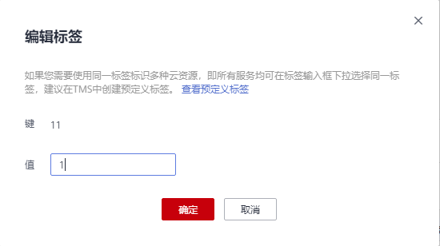

# 修改标签值

该任务指导用户通过凭据管理界面修改标签值。

## 前提条件

已获取管理控制台的登录帐号与密码。

## 操作步骤

1.  [登录管理控制台](https://console.huaweicloud.com)。
2.  单击管理控制台左上角，选择区域或项目。
3.  单击页面左侧，选择“安全与合规  \>  数据加密服务“，默认进入“密钥管理“界面。
4.  在左侧导航树中，选择“凭据管理“，进入“凭据管理“页面。
5.  单击凭据名称，进入凭据详细信息页面。
6.  在“标签“区，单击目标标签所在行的“编辑“，弹出编辑标签对话框。

    **图 1**  编辑标签  
    

7.  在弹出的编辑标签对话框中修改标签值，单击“确定“，完成标签值的修改。

