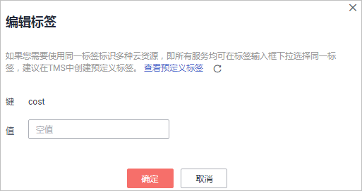

# 修改标签值

本章节指导用户对已创建密标签进行修改。

## 操作步骤

1.  [登录管理控制台](https://console.huaweicloud.com)。
2.  单击管理控制台左上角，选择区域或项目。
3.  单击页面左侧，选择“安全与合规  \>  数据加密服务“，默认进入“密钥管理“界面。
4.  在左侧选择对应服务进入页面，单击需要修改标签的实例，进入详情页面。
5.  选择对应的标签页签后，单击“编辑“，弹出“编辑标签“对话框。修改标签值后单击“确定“，完成标签值修改。

    **图 1**  编辑标签  
    

