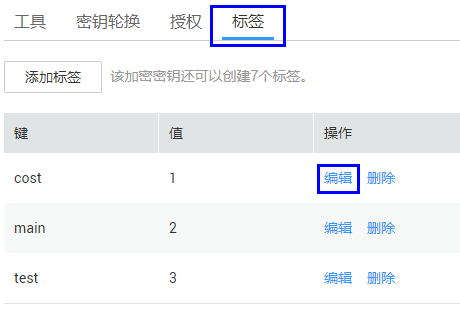

# 修改标签值

该任务指导用户通过密钥管理界面修改标签值。

## 前提条件

已获取管理控制台的登录帐号与密码。

## 修改标签值

1.  登录管理控制台。
2.  单击管理控制台左上角，选择区域或项目。
3.  单击页面上方的“服务列表“，选择“安全  \>  数据加密服务“，默认进入数据加密服务的“密钥管理“界面。

1.  单击目标用户主密钥的别名，进入密钥详细信息页面。

    > **说明：**   
    >若用户需要修改密钥管理的标签值，可直接单击目标密钥管理的名称，进入密钥管理详细信息页面，单击目标标签所在行的“编辑“，修改标签值。  

2.  单击“标签“，进入标签管理页面，如[图1](#zh-cn_topic_0112947600_ff11132284da543c287ffa43f1b232c92)所示。

    **图 1**  修改标签  
    

3.  单击目标标签所在行的“编辑“，弹出编辑标签对话框，如[图2](#fc21b4774073445f7a22f54789d517274)所示。

    **图 2**  编辑标签  
    

4.  在弹出的编辑标签对话框中修改标签值，单击“确定“，完成标签值的修改。

