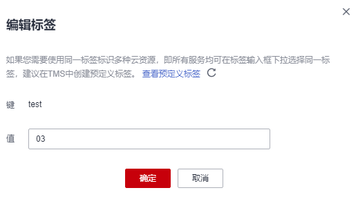

# 修改标签值

该任务指导用户通过密钥管理界面修改标签值。

## 前提条件

已获取管理控制台的登录帐号与密码。

## 操作步骤

1.  [登录管理控制台](https://console.huaweicloud.com)。
2.  单击管理控制台左上角，选择区域或项目。
3.  单击页面左侧，选择“安全与合规  \>  数据加密服务“，默认进入“密钥管理“界面。

1.  单击目标用户主密钥的别名，进入密钥详细信息页面。

    > **说明：** 
    >若用户需要修改密钥管理的标签值，可直接单击目标密钥管理的名称，进入密钥管理详细信息页面，单击目标标签所在行的“编辑“，修改标签值。

2.  单击“标签“，进入标签管理页面。
3.  单击目标标签所在行的“编辑“，弹出编辑标签对话框。

    **图 1**  编辑标签  
    

4.  在弹出的编辑标签对话框中修改标签值，单击“确定“，完成标签值的修改。

