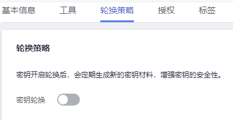

# 关闭密钥轮换

该任务指导用户通过密钥管理界面关闭自动轮换密钥。

## 前提条件

-   密钥处于“启用“状态。
-   “密钥材料来源“为“密钥管理“。
-   已开启密钥轮换。

## 操作步骤

1.  [登录管理控制台](https://console.huaweicloud.com)。
2.  单击管理控制台左上角，选择区域或项目。
3.  单击页面左侧，选择“安全与合规  \>  数据加密服务“，默认进入“密钥管理“界面。

1.  单击目标对称密钥的别名，进入密钥详细信息页面。
2.  单击“轮换策略“，进入密钥轮换管理界面。
3.  单击，关闭密钥轮换。
4.  在弹出的确认是否关闭密钥轮换提示框中，单击“确定“。
5.  关闭后，页面将显示密钥轮换管理界面，如[图1](#fig163766132919)所示。

    **图 1**  关闭密钥轮换  
    

