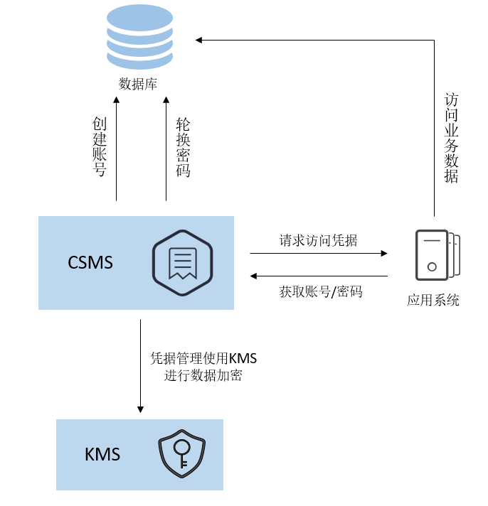

# 凭据概述

## 通用凭据

通用凭据支持在各场景下进行自定义凭据的全生命周期管理，用户可以通过凭据管理服务实现对数据库账号口令、服务器口令、SSH Key、访问密钥等各类型凭据的统一管理、检索与安全存储，且支持多个版本管理，方便用户实现凭据轮转。

## RDS凭据

数据库凭据泄露是导致数据泄露的主要途径。针对华为云关系型数据库RDS，凭据管理服务支持托管RDS凭据，能够全自动的定期轮转与手动立即轮转，满足各类数据库凭据管理场景，降低业务数据面临的安全风险。

## 通用凭据与RDS凭据差异

**表 1**  凭据差异

<table><thead align="left"><tr id="row17136134614181"><th class="cellrowborder" valign="top" width="18%" id="mcps1.2.4.1.1">&nbsp;&nbsp;</th>
<th class="cellrowborder" valign="top" width="40%" id="mcps1.2.4.1.2">
通用凭据

</th>
<th class="cellrowborder" valign="top" width="42%" id="mcps1.2.4.1.3">
RDS凭据

</th>
</tr>
</thead>
<tbody><tr id="row15137124610181"><td class="cellrowborder" valign="top" width="18%" headers="mcps1.2.4.1.1 ">
使用场景

</td>
<td class="cellrowborder" valign="top" width="40%" headers="mcps1.2.4.1.2 ">
各场景下自定义凭据的全生命周期管理

</td>
<td class="cellrowborder" valign="top" width="42%" headers="mcps1.2.4.1.3 ">
自动托管华为云RDS数据库凭据

</td>
</tr>
<tr id="row16137134618187"><td class="cellrowborder" valign="top" width="18%" headers="mcps1.2.4.1.1 ">
是否支持自动轮转

</td>
<td class="cellrowborder" valign="top" width="40%" headers="mcps1.2.4.1.2 ">
否，需要用户自行触发轮转

</td>
<td class="cellrowborder" valign="top" width="42%" headers="mcps1.2.4.1.3 ">
是，支持单双用户两种经典轮转模型

</td>
</tr>
</tbody>
</table>

## RDS凭据使用流程

**图 1**  产品架构  

流程说明：

1.  创建一个RDS凭据。

-   设置凭据名称、标签等。
-   配置自动轮转策略。

1.  应用系统在使用过程中需要访问数据库时，可以向CSMS服务请求访问凭据，获取凭据值，调用API接口详情请参见[查询凭据版本和凭据值](https://support.huaweicloud.com/api-dew/ShowSecretVersion.html)。
2.  应用系统通过访问返回的凭据值解析明文数据，获取账号和密码后，可以访问该用户对应的目标数据库。

    > **注意：** 
    >-   开启自动轮转后，数据库实例所托管的密码将定时轮转更新，请确认使用该数据库实例的应用端已完成代码适配，可在数据库连接建立时，动态获取最新凭据。
    >-   不要轻易缓存凭据中的任何信息，避免账号密码轮转后失效，导致数据库连接失败。

