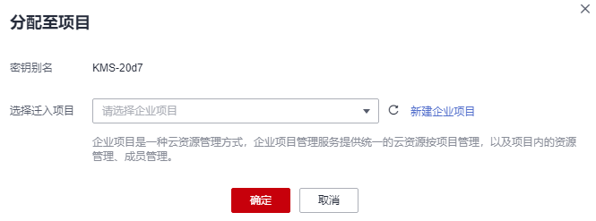

# 分配至企业项目

该任务指导用户通过密钥管理界面对指定的用户主密钥分配至企业项目。

## 前提条件

已获取管理控制台的登录帐号与密码。

## 操作步骤

1.  [登录管理控制台](https://console.huaweicloud.com)。
2.  单击管理控制台左上角，选择区域或项目。
3.  单击页面左侧，选择“安全与合规  \>  数据加密服务“，默认进入“密钥管理“界面。
4.  在目标密钥所在行，单击“分配至项目“，弹出对话框。

    **图 1**  分配至项目  
    

5.  在弹出的对话框中，选择迁入项目。
6.  单击“确定“，完成操作。

