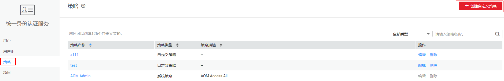
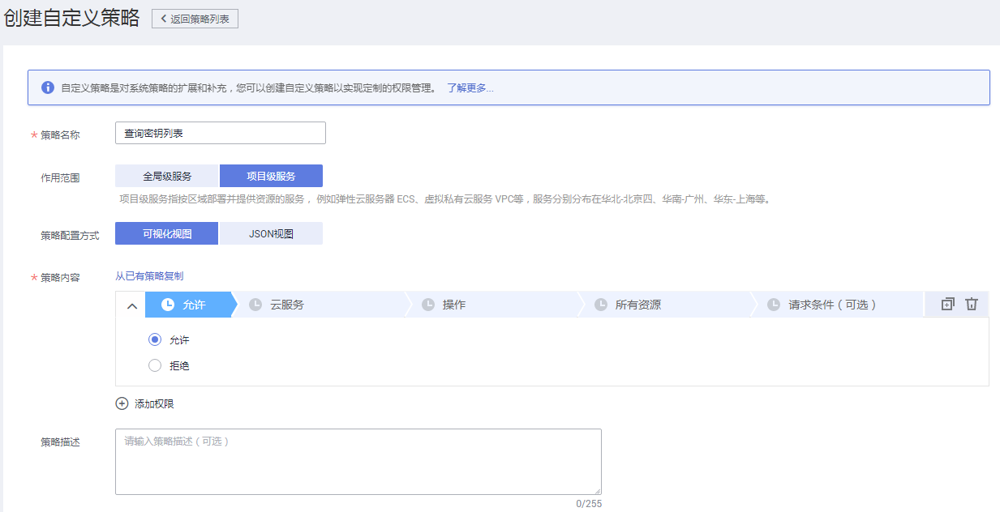
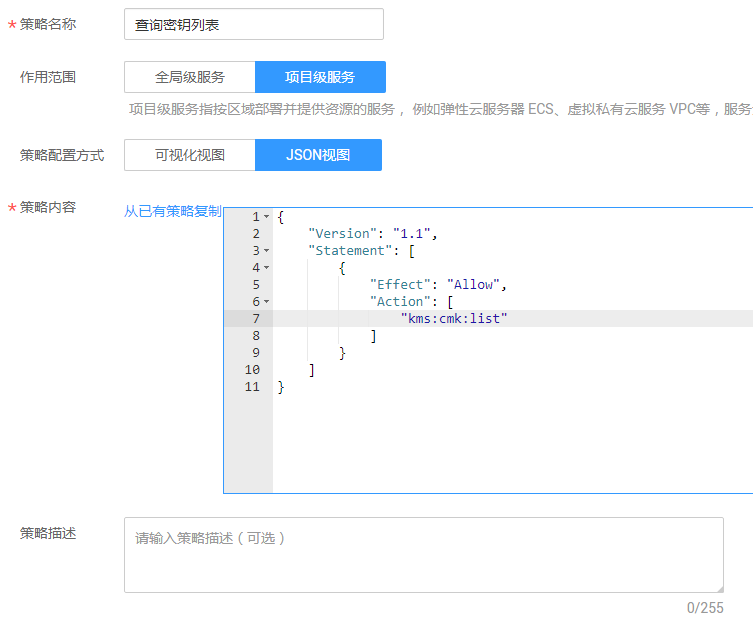

# 创建DEW自定义策略<a name="dew_01_0161"></a>

如果系统预置的DEW权限，不满足您的授权要求，可以创建自定义策略。自定义策略中可以添加的授权项（Action）请参见[策略及授权项说明](https://support.huaweicloud.com/api-dew/dew_02_0308.html)_。_

目前华为云支持以下两种方式创建自定义策略：

-   可视化视图创建自定义策略：无需了解策略语法，按可视化视图导航栏选择云服务、操作、资源、条件等策略内容，可自动生成策略。
-   JSON视图创建自定义策略：可以在选择策略模板后，根据具体需求编辑策略内容；也可以直接在编辑框内编写JSON格式的策略内容。

如下以定制一个用户仅能查询密钥列表的策略为例，分别采用可视化视图和JSON视图的配置方式创建自定义策略。

## 前提条件<a name="zh-cn_topic_0195548199_section1322163613388"></a>

-   请先在IAM控制台中开通细粒度策略，开通后可免费使用，开通方法请参见：[申请细粒度访问控制公测](https://support.huaweicloud.com/zh-cn/usermanual-iam/iam_01_019.html)。
-   如需使用JSON视图创建自定义策略，请您先熟悉策略结构，具体请参见[策略语法：细粒度策略](策略语法-细粒度策略.md)。
-   请确定自定义策略需要允许哪些操作，拒绝哪些操作，并获取操作对应的授权项。

## 可视化视图配置自定义策略<a name="section869144119307"></a>

1.  在IAM控制台，单击左侧导航栏的“策略“，在右上角选择“创建自定义策略“。

    **图 1**  创建自定义策略<a name="fig650611211111"></a>  
    

2.  在“创建自定义策略“中，配置如下信息：

    **图 2**  可视化视图<a name="fig277983163412"></a>  
    

    -   “策略名称“：填写“查询密钥列表“。
    -   “作用范围“：根据服务的属性填写，DEW为项目级服务，选择“项目级服务“。
    -   “策略配置方式“：选择“可视化视图“  。
    -   “策略内容“：
        1.  选择“允许“。
        2.  在“云服务“中选择“数据加密服务“。
        3.  在“操作“中勾选“ReadOnly“中的“kms:cmk:list“，即“查询密钥列表“。

3.  单击“确定“后，自定义策略创建成功。

## JSON视图配置自定义策略<a name="zh-cn_topic_0195548199_section10329113393910"></a>

1.  在IAM控制台，单击左侧导航栏的“策略“，在右上角选择“创建自定义策略“。

    **图 3**  创建自定义策略<a name="fig43015345115"></a>  
    

2.  在“创建自定义策略“界面中，填写如下参数：

    **图 4**  JSON视图<a name="fig038084131216"></a>  
    

    -   “策略名称“：填写“查询密钥列表“。
    -   “作用范围“：根据服务的属性填写，DEW为项目级服务，选择“项目级服务“。
    -   “策略配置方式“：选择“JSON视图“  。
    -   “策略内容“：将如下内容拷贝至策略信息中。如下策略表示允许查询密钥列表的操作。

        ```
        {
                "Version": "1.1",
                "Statement": [
                        {
                                "Effect": "Allow",
                                "Action": [
                                        "kms:cmk:list"
                                                               ]
                        }
                ]
        }
        ```

3.  单击“确定“，自定义策略创建成功。
4.  将新创建的自定义策略授予用户组，使得用户组中的用户仅具备查询密钥列表的权限。
5.  用户登录并验证自定义策略定义的权限：查询密钥列表。

    权限授予成功后，用户可以通过控制台以及REST API等多种方式验证。此处以登录控制台为例，介绍用户如何验证查询密钥列表的权限。

    1.  使用新创建的用户登录华为云，登录方法选择为“IAM用户登录“。
        -   账号名为该IAM用户所属华为云账号的名称。
        -   用户名和密码为账号在IAM创建用户时输入的用户名和密码。

    2.  在“密钥管理“界面，若能查询密钥列表，表示权限配置正确并已生效。
    3.  尝试进行其他操作，例如：创建密钥对。

        系统显示“权限不足“，权限配置正确并已生效。


## 策略样例<a name="zh-cn_topic_0195548199_section1435112710517"></a>

-   示例1：授权用户创建和导入密钥对

    ```
    {
            "Version": "1.1",
            "Statement": [
                    {
                            "Effect": "Allow",
                            "Action": [
                                    "ecs:serverKeypairs:create"
                                                           ]
                    }
            ]
    }
    ```


-   示例2：拒绝用户删除账号密钥对

    拒绝策略需要同时配合其他策略使用，否则没有实际作用。用户被授予的策略中，一个授权项的作用如果同时存在Allow和Deny，则遵循Deny优先。

    如果您给用户授予“KMS Administrator“的系统策略，但不希望用户拥有“KMS Administrator“中定义的密钥对的删除权限（ecs:serverKeypairs:delete），您可以创建一条相同Action的自定义策略，并将自定义策略的Effect设置为Deny，然后同时将“KMS Administrator“和拒绝策略授予用户，根据Deny优先原则用户可以对密钥对执行除了删除外的所有操作。以下策略样例表示：拒绝用户删除密钥对。

    ```
    {
            "Version": "1.1",
            "Statement": [
                    {
                            "Effect": "Deny",
                            "Action": [
                                    "ecs:serverKeypairs:delete"                                
                            ]
                    },
            ]
    }
    ```


