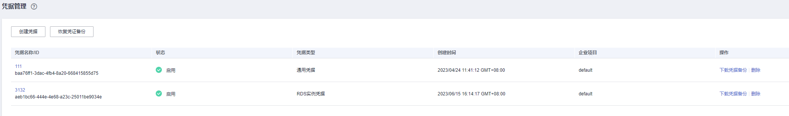

# 创建RDS凭据

该任务指导用户通过凭据管理界面创建通RDS凭据

创建新的凭据，并将凭据值存入凭据的初始版本，初始版本的状态被标记为“SYSCURRENT”。

## 约束条件

-   用户最多可创建200个凭据。
-   默认使用凭据管理为您创建的默认密钥“csms/default”作为当前凭据的加密密钥。您也可以前往KMS服务页面创建自定义对称密钥，并使用自定义加密密钥。
-   RDS凭据支持的数据库引擎为：MySQL、PostgreSQL。暂不支持SQL Server数据库。

## 创建通用凭据

1.  [登录管理控制台](https://console.huaweicloud.com)。
2.  单击管理控制台左上角，选择区域或项目。
3.  单击页面左侧，选择“安全与合规  \>  数据加密服务“，默认进入“密钥管理“界面。
4.  在左侧导航树中，选择“凭据管理“，进入“凭据管理“页面。
5.  单击“创建凭据”，选择RDS实例凭据，如[图 RDS实力凭据](#fig105717529331)所示。

    **图 1**  RDS实力凭据  
    

6.  在弹出的“创建凭据“对话框中，填写参数，参数说明如[表 RDS凭据参数说明](#table1917mcpsimp)所示。

    **表 1**  RDS凭据参数说明

    
    <table><thead align="left"><tr id="row1922mcpsimp"><th class="cellrowborder" valign="top" width="21.83%" id="mcps1.2.3.1.1">
参数名称

    </th>
    <th class="cellrowborder" valign="top" width="78.17%" id="mcps1.2.3.1.2">
参数说明

    </th>
    </tr>
    </thead>
    <tbody><tr id="row1927mcpsimp"><td class="cellrowborder" valign="top" width="21.83%" headers="mcps1.2.3.1.1 ">
凭据名称

    </td>
    <td class="cellrowborder" valign="top" width="78.17%" headers="mcps1.2.3.1.2 ">
待创建凭据的名称

    </td>
    </tr>
    <tr id="row1932mcpsimp"><td class="cellrowborder" valign="top" width="21.83%" headers="mcps1.2.3.1.1 ">
企业项目

    </td>
    <td class="cellrowborder" valign="top" width="78.17%" headers="mcps1.2.3.1.2 ">
该参数针对企业用户使用。如果您是企业用户，且已创建企业项目，则请从下拉列表中为密钥选择需要绑定的企业项目，默认项目为“default”。

    
未开通企业管理的用户页面则没有“企业项目”参数项，无需进行配置。

    </td>
    </tr>
    <tr id="row1939mcpsimp"><td class="cellrowborder" valign="top" width="21.83%" headers="mcps1.2.3.1.1 ">
RDS实例

    </td>
    <td class="cellrowborder" valign="top" width="78.17%" headers="mcps1.2.3.1.2 ">
选择用户通过RDS控制台创建的实例名称（目前只适用于MySQL数据库）

    </td>
    </tr>
    <tr id="row1944mcpsimp"><td class="cellrowborder" valign="top" width="21.83%" headers="mcps1.2.3.1.1 ">
设置凭据值

    </td>
    <td class="cellrowborder" valign="top" width="78.17%" headers="mcps1.2.3.1.2 ">
待加密的用户凭据键/值和明文凭据。

    <ul id="ul122881320173619"><li>选择单用户轮转时，需要填入一个可使用的数据库账号。</li><li>选择双用户轮转时，需要填入两个可使用的数据库账号。</li></ul>
    
具体差异可以参考凭据概述中的<a href="轮转策略.md">轮转策略</a>。

    </td>
    </tr>
    <tr id="row1952mcpsimp"><td class="cellrowborder" valign="top" width="21.83%" headers="mcps1.2.3.1.1 ">
描述信息

    </td>
    <td class="cellrowborder" valign="top" width="78.17%" headers="mcps1.2.3.1.2 ">
凭据的描述信息

    </td>
    </tr>
    <tr id="row1957mcpsimp"><td class="cellrowborder" valign="top" width="21.83%" headers="mcps1.2.3.1.1 ">
KMS加密

    </td>
    <td class="cellrowborder" valign="top" width="78.17%" headers="mcps1.2.3.1.2 ">
选择默认主密钥“csms/default”或用户在KMS已创建的用户密钥。

    
 说明： 

默认使用凭据管理为您创建的默认密钥“csms/default”作为当前凭据的加密密钥。您也可以前往KMS服务页面创建自定义密钥，使用自定义密钥作为加密密钥，在KMS创建用户密钥的操作，请参见<a href="创建密钥.md">创建密钥</a>。

    

    </td>
    </tr>
    <tr id="row67961922135510"><td class="cellrowborder" valign="top" width="21.83%" headers="mcps1.2.3.1.1 ">
关联事件

    </td>
    <td class="cellrowborder" valign="top" width="78.17%" headers="mcps1.2.3.1.2 ">
为凭据选择关联事件，可以查看凭据轮转、版本过期等信息。

    </td>
    </tr>
    </tbody>
    </table>

7.  单击“下一步“，选择轮转周期。

    > **须知：** 
    >若自动轮转开关未打开，凭据需进行手动轮转。后续若需开启自动轮转，可在凭据详情页面单击“设置轮转策略“，开启自动轮转并设置轮转周期。

1.  打开自动轮转开关，选择轮转周期，可选择已有轮转周期或者自定义设置轮转周期。

    自定义设置轮转周期的取值为6-8760小时，默认选择6小时。

    **图 2**  选择轮转周期  
    

2.  单击“下一步“，确认创建的信息。

    **图 3**  凭据信息  
    

3.  单击“确定“，凭据创建完成，页面右上角提示创建凭据成功。
4.  用户可在凭据列表查看已完成创建的凭据，如[图 凭据列表](#fig2556193664313)所示，凭据默认状态为“启用”。

    **图 4**  凭据列表  
    

    > **说明：** 
    >凭据与CCE服务集成，通过插件将凭据挂载至业务Pod内，将敏感信息与集群环境解耦，有效避免程序硬编码或明文配置等问题导致的敏感信息泄密，具体操作参见[CCE密钥管理](https://support.huaweicloud.com/usermanual-cce/cce_10_0370.html)。

