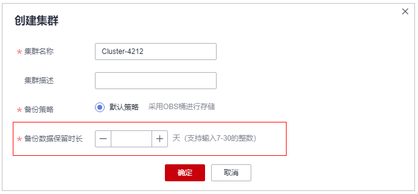

# 创建专属加密集群

该任务指导您通过专属加密服务创建集群。

## 操作步骤

1.  [登录管理控制台](https://console.huaweicloud.com)。
2.  单击管理控制台左上角，选择区域或项目。
3.  单击页面左侧，选择“安全与合规  \>  数据加密服务“，默认进入“密钥管理“界面。
4.  在左侧导航树中，选择“专属加密 \> 集群列表“，进入“集群列表“页面。
5.  在界面左上角，单击“创建集群“，填写“备份数据保留时长“。

    **图 1**  创建集群  
    

    > **说明：** 
    >备份数据保留时长支持输入7-30之间的整数。

6.  单击“确定“，完成创建专属加密集群。

