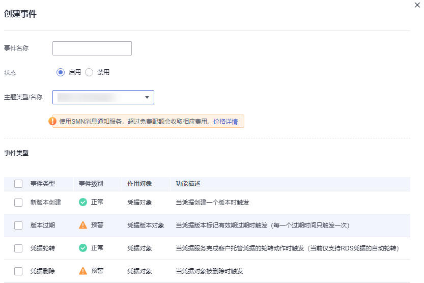
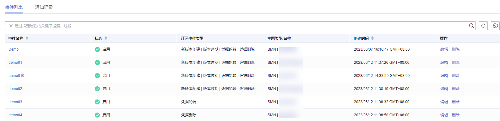

# 创建事件

该任务指导用户通过事件通知界面创建事件。

创建新的事件，可选择的事件类型包括新版本创建、版本过期、凭据轮转、凭据删除。

## 约束条件

用户最多可创建30个事件。

## 操作步骤

1.  [登录管理控制台](https://console.huaweicloud.com)。
2.  单击管理控制台左上角，选择区域或项目。
3.  单击页面左侧，选择“安全与合规  \>  数据加密服务“，默认进入“密钥管理“界面。
4.  在左侧导航树中，选择“凭据管理“，单击“事件通知“，进入“事件通知“页面。
5.  单击右上角“创建事件“，弹出创建事件页面，如[图 创建事件](#fig11476143971116)所示。

    **图 1**  创建事件  
    

    **表 1**  创建事件参数说明

    
    <table><thead align="left"><tr id="row1944894211319"><th class="cellrowborder" valign="top" width="35.839999999999996%" id="mcps1.2.3.1.1">
参数名称

    </th>
    <th class="cellrowborder" valign="top" width="64.16%" id="mcps1.2.3.1.2">
参数说明

    </th>
    </tr>
    </thead>
    <tbody><tr id="row10449134214312"><td class="cellrowborder" valign="top" width="35.839999999999996%" headers="mcps1.2.3.1.1 ">
事件名称

    </td>
    <td class="cellrowborder" valign="top" width="64.16%" headers="mcps1.2.3.1.2 ">
待创建事件的名称。

    </td>
    </tr>
    <tr id="row1544910423316"><td class="cellrowborder" valign="top" width="35.839999999999996%" headers="mcps1.2.3.1.1 ">
状态

    </td>
    <td class="cellrowborder" valign="top" width="64.16%" headers="mcps1.2.3.1.2 ">
启用、禁用。默认选择启用。

    </td>
    </tr>
    <tr id="row468795103310"><td class="cellrowborder" valign="top" width="35.839999999999996%" headers="mcps1.2.3.1.1 ">
主题类型/名称

    </td>
    <td class="cellrowborder" valign="top" width="64.16%" headers="mcps1.2.3.1.2 ">
主题类型：默认选择SMN。

    
名称：在消息通知服务（SMN）中创建的主题名称。

    
 说明： 

若需创建自定义主题类型/名称，具体操作参见<a href="https://support.huaweicloud.com/usermanual-smn/zh-cn_topic_0043961401.html" target="_blank" rel="noopener noreferrer">创建主题</a>。

    

    </td>
    </tr>
    <tr id="row136911128533"><td class="cellrowborder" valign="top" width="35.839999999999996%" headers="mcps1.2.3.1.1 ">
事件类型

    </td>
    <td class="cellrowborder" valign="top" width="64.16%" headers="mcps1.2.3.1.2 ">
支持选择的事件类型。包含新版本创建、版本过期、凭据轮转、凭据删除。

    </td>
    </tr>
    </tbody>
    </table>

6.  单击“确定“，完成事件创建。
7.  在事件列表中查看已创建的事件，如[图 事件列表](#fig6131164210446)所示。事件状态默认为“启用“。

    **图 2**  事件列表  
    

