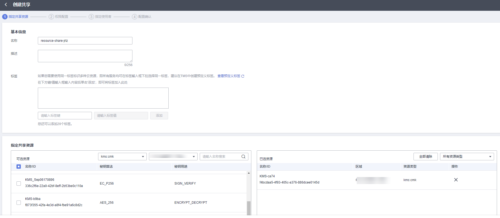

# 创建共享

## 操作场景

要共享您拥有的资源给其他帐号使用时，请创建共享。创建共享的流程分为指定共享资源、权限配置、指定使用者以及配置确认。

## 操作步骤

1.  [登录管理控制台](https://console.huaweicloud.com)。
2.  单击页面左上角的，选择“管理与监管 \> 资源访问管理“，进入“资源访问管理“页面。
3.  单击页面左侧“我的共享 \> 共享管理“，进入“共享管理“页面。
4.  单击页面右上角的“创建共享“，进入“创建共享“页面。

    **图 1**  指定共享资源  
    

5.  选择资源类型为“kms:cmk“，选择对应区域，勾选需进行共享的密钥。单击“下一步：权限配置“。
6.  进入“权限配置”页面，选择指定资源类型支持的共享权限，配置完成后，单击页面右下角的“下一步：指定使用者”。
7.  进入“指定使用者”页面，指定共享资源的使用者，配置完成后，单击页面右下角的“下一步：配置确认”。

    **表 1**  参数说明

    
    <table><thead align="left"><tr id="row2736143415387"><th class="cellrowborder" valign="top" width="50%" id="mcps1.2.3.1.1">
参数名称

    </th>
    <th class="cellrowborder" valign="top" width="50%" id="mcps1.2.3.1.2">
参数说明

    </th>
    </tr>
    </thead>
    <tbody><tr id="row15737934183810"><td class="cellrowborder" valign="top" width="50%" headers="mcps1.2.3.1.1 ">
使用者类型

    </td>
    <td class="cellrowborder" valign="top" width="50%" headers="mcps1.2.3.1.2 "><ul id="ul5342135613817"><li>组织
关于组织创建相关操作可参见<a href="https://support.huaweicloud.com/usermanual-organizations/org_03_0015.html" target="_blank" rel="noopener noreferrer">创建组织</a>。

    
 说明： 

如果您未打开“启用与组织共享资源”开关，使用者类型将无法选择“组织”。具体操作可参见<a href="https://support.huaweicloud.com/usermanual-ram/ram_03_0016.html" target="_blank" rel="noopener noreferrer">启用与组织共享资源</a>。

    

    </li><li>华为云帐号ID</li></ul>
    </td>
    </tr>
    </tbody>
    </table>

8.  进入“配置确认”页面，确认配置无误后，单击页面右下角的“确认”，完成资源共享实例的创建。

    > **说明：** 
    >共享创建完成后，RAM会向指定的使用者发送共享邀请，如果指定的使用者类型为“华为云帐号ID”时，使用者需接受共享邀请后，才可以访问和使用被共享的资源；如果指定的使用者类型为“组织”时，组织中的帐号无需接受邀请即可访问和使用被共享的资源。

