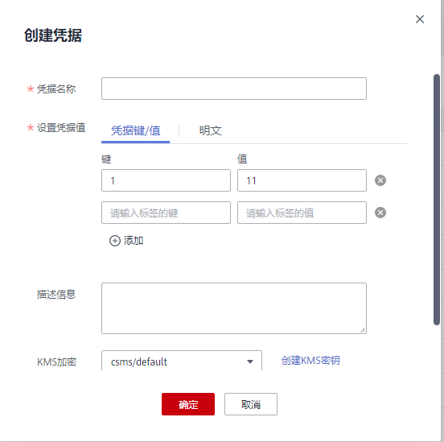

# 创建凭据

该任务指导用户通过凭据管理界面创建凭据。

创建新的凭据，并将凭据值存入凭据的初始版本，初始版本的状态被标记为“SYSCURRENT“。

## 前提条件

已获取管理控制台的登录帐号与密码。

## 约束条件

-   用户最多可创建200个凭据。
-   默认使用凭据管理为您创建的默认主密钥“csms/default“作为当前凭据的加密主密钥。您也可以前往KMS服务页面创建用户密钥，使用自定义加密密钥。

## 创建凭据

1.  [登录管理控制台](https://console.huaweicloud.com)。
2.  单击管理控制台左上角，选择区域或项目。
3.  单击页面左侧，选择“安全与合规  \>  数据加密服务“，默认进入“密钥管理“界面。
4.  在左侧导航树中，选择“凭据管理“，进入“凭据管理“页面。
5.  单击“创建凭据“。
6.  在弹出的“创建凭据“对话框中，填写“凭据名称“、“设置凭据值“、“描述信息“和“KMS加密“。

    **图 1**  创建凭据  
    

    -   凭据名称：待创建凭据的名称。
    -   设置凭据值：待加密的用户凭据键/值凭据值和明文凭据。
    -   描述信息：凭据的描述信息。
    -   KMS加密：选择默认主密钥“csms/default“或用户在KMS已创建的用户密钥。

        > **说明：** 
        >默认使用凭据管理为您创建的默认主密钥“csms/default“作为当前凭据的加密主密钥。您也可以前往KMS服务页面创建用户密钥，使用自定义加密密钥，在KMS创建用户密钥的操作，请参见[创建密钥](创建密钥.md)。

7.  单击“确定“，在页面右上角弹出“创建凭据成功“，则说明凭据创建完成。

    用户可在凭据列表查看已完成创建的凭据，凭据默认状态为“启用“。

