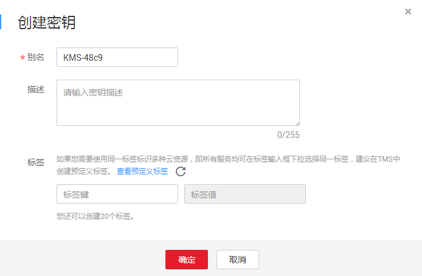

# 创建密钥

该任务指导用户通过密钥管理界面创建用户主密钥。用户最多可创建20个用户主密钥，不包含默认主密钥。

创建的用户主密钥使用的是AES-256加解密算法，密钥长度为256bit。

用户主密钥可用于如下场景：

-   对象存储服务中对象的服务端加密
-   云硬盘中数据的加密
-   私有镜像的加密
-   关系型数据库中数据库实例的磁盘加密
-   用户主密钥直接加解密小数据
-   用户应用程序的DEK加解密

> **说明：**   
>因为默认主密钥的别名后缀为“/default“，所以用户创建的密钥别名后缀不能为“/default“。  

## 前提条件

已获取管理控制台的登录帐号与密码。

## 创建密钥

1.  登录管理控制台。
2.  单击管理控制台左上角，选择区域或项目。
3.  单击页面上方的“服务列表“，选择“安全  \>  数据加密服务“，默认进入数据加密服务的“密钥管理“界面。
4.  单击“创建密钥“。
5.  在弹出的“创建密钥“对话框中，填写密钥的“别名“与“描述“。

    **图 1**  创建密钥  
    

6.  （可选）用户可根据自己的需要为用户主密钥添加标签，输入“标签键“和“标签值“。

    > **说明：**   
    >-   当用户在创建密钥时，没有为该用户主密钥添加标签。若用户需要为该用户主密钥添加标签，可单击该用户主密钥的别名，进入密钥详情页面，为该用户主密钥添加标签。  
    >-   同一个用户主密钥下，一个标签键只能对应一个标签值；不同的用户主密钥下可以使用相同的标签键。  
    >-   用户最多可以给单个用户主密钥添加10个标签。  
    >-   当同时添加多个标签，需要删除其中一个待添加的标签时，可单击该标签所在行的“删除“，删除标签。  

7.  单击“确定“，在页面右上角弹出“创建密钥成功“，则说明密钥创建完成。

    用户可在密钥列表上查看已完成创建的密钥，密钥默认状态为“启用“。

## 相关操作

-   对象存储服务中对象的服务端加密方法，具体请参见《对象存储服务控制台指南》的“使用服务端加密方式上传文件“章节。
-   云硬盘中数据加密方法，具体请参见《云硬盘用户指南》的“购买云硬盘“章节。
-   私有镜像的加密方法，具体请参见《镜像服务用户指南》的“加密镜像“章节。
-   关系型数据库中数据库实例的磁盘加密方法，具体请参见《关系型数据库快速入门》的“购买实例“章节。
-   创建DEK、不含明文的DEK方法，具体请参见《数据加密服务API参考》的“创建数据密钥“与“创建不含明文数据密钥“章节。
-   用户应用程序的DEK加解密方法，具体请参见《数据加密服务API参考》的“加密数据密钥“与“解密数据密钥“章节。

