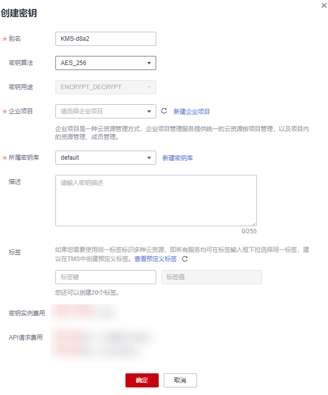

# 创建密钥

该任务指导用户通过密钥管理界面创建用户主密钥。

用户主密钥包括“对称密钥“和“非对称密钥“。

## 前提条件

已获取管理控制台的登录帐号与密码。

## 约束条件

-   用户最多可创建20个用户主密钥，不包含默认主密钥。
-   创建的对称密钥使用的是AES-256加解密算法，密钥长度为256bit，可用于小量数据的加解密或用于加解密数据密钥。
-   创建的非对称密钥使用的是RSA密钥或ECC密钥，可用于数字签名及验签。
-   因为默认主密钥的别名后缀为“/default“，所以用户创建的密钥别名后缀不能为“/default“。
-   数据加密服务不限定主密钥的调用次数。

## 应用场景

-   对象存储服务中对象的服务端加密。
-   云硬盘中数据的加密。
-   私有镜像的加密。
-   云数据库中数据库实例的磁盘加密。
-   用户主密钥直接加解密小数据。
-   用户应用程序的DEK加解密。
-   非对称密钥可用于数字签名及验签。

## 创建密钥

1.  [登录管理控制台](https://console.huaweicloud.com)。
2.  单击管理控制台左上角，选择区域或项目。
3.  单击页面左侧，选择“安全与合规  \>  数据加密服务“，默认进入“密钥管理“界面。
4.  单击“创建密钥“。
5.  在弹出的“创建密钥“对话框中，填写密钥参数。

    **图 1**  创建密钥  
    

    -   别名：待创建密钥的别名。
    -   密钥算法：选择密钥算法。KMS支持的密钥算法说明如[表1](#table0624027274)所示。

        **表 1**  KMS支持的密钥算法类型

        
        <table><thead align="left"><tr id="dew_01_7775_row1062492152718"><th class="cellrowborder" valign="top" width="20%" id="mcps1.2.6.1.1">
密钥类型

        </th>
        <th class="cellrowborder" valign="top" width="17.630000000000003%" id="mcps1.2.6.1.2">
算法类型

        </th>
        <th class="cellrowborder" valign="top" width="22.27%" id="mcps1.2.6.1.3">
密钥规格

        </th>
        <th class="cellrowborder" valign="top" width="20.1%" id="mcps1.2.6.1.4">
说明

        </th>
        <th class="cellrowborder" valign="top" width="20%" id="mcps1.2.6.1.5">
用途

        </th>
        </tr>
        </thead>
        <tbody><tr id="dew_01_7775_row1762412272713"><td class="cellrowborder" valign="top" width="20%" headers="mcps1.2.6.1.1 ">
对称密钥

        </td>
        <td class="cellrowborder" valign="top" width="17.630000000000003%" headers="mcps1.2.6.1.2 ">
AES

        </td>
        <td class="cellrowborder" valign="top" width="22.27%" headers="mcps1.2.6.1.3 ">
AES_256

        </td>
        <td class="cellrowborder" valign="top" width="20.1%" headers="mcps1.2.6.1.4 ">
AES对称密钥

        </td>
        <td class="cellrowborder" valign="top" width="20%" headers="mcps1.2.6.1.5 ">
小量数据的加解密或用于加解密数据密钥。

        </td>
        </tr>
        <tr id="dew_01_7775_row51341950153118"><td class="cellrowborder" rowspan="2" valign="top" width="20%" headers="mcps1.2.6.1.1 ">
非对称密钥

        </td>
        <td class="cellrowborder" valign="top" width="17.630000000000003%" headers="mcps1.2.6.1.2 ">
RSA

        </td>
        <td class="cellrowborder" valign="top" width="22.27%" headers="mcps1.2.6.1.3 "><ul id="dew_01_7775_ul858832973417"><li>RSA_2048</li><li>RSA_3072</li><li>RSA_4096</li></ul>
        </td>
        <td class="cellrowborder" valign="top" width="20.1%" headers="mcps1.2.6.1.4 ">
RSA非对称密钥

        </td>
        <td class="cellrowborder" valign="top" width="20%" headers="mcps1.2.6.1.5 ">
小量数据的加解密或数字签名。

        </td>
        </tr>
        <tr id="dew_01_7775_row037145343118"><td class="cellrowborder" valign="top" headers="mcps1.2.6.1.1 ">
ECC

        </td>
        <td class="cellrowborder" valign="top" headers="mcps1.2.6.1.2 "><ul id="dew_01_7775_ul384511534343"><li>EC_P256</li><li>EC_P384</li></ul>
        </td>
        <td class="cellrowborder" valign="top" headers="mcps1.2.6.1.3 ">
椭圆曲线密码，使用NIST推荐的椭圆曲线

        </td>
        <td class="cellrowborder" valign="top" headers="mcps1.2.6.1.4 ">
数字签名

        </td>
        </tr>
        </tbody>
        </table>

    -   密钥用途：选择“SIGN\_VERIFY“或“ENCRYPT\_DECRYPT“。
    -   （可选）描述：可根据自己的需要为用户主密钥添加描述。
    -   企业项目：该参数针对企业用户使用。

        如果您是企业用户，且已创建企业项目，则请从下拉列表中为密钥选择需要绑定的企业项目，默认项目为“default“。

        未开通企业管理的用户页面则没有“企业项目“参数项，无需进行配置。

        > **说明：** 
        >-   企业项目是一种云资源管理方式，企业项目管理服务提供统一的云资源按项目管理，以及项目内的资源管理、成员管理。更多关于企业项目的信息，请参见[《企业管理用户指南》](https://support.huaweicloud.com/usermanual-em/zh-cn_topic_0108763975.html)。
        >-   如需开通企业项目，请参考[如何开通企业项目/企业多账号](https://support.huaweicloud.com/usermanual-em/em_am_0008.html)。

6.  （可选）用户可根据自己的需要为用户主密钥添加标签，输入“标签键“和“标签值“。

    > **说明：** 
    >-   当用户在创建密钥时，没有为该用户主密钥添加标签。若用户需要为该用户主密钥添加标签，可单击该用户主密钥的别名，进入密钥详情页面，为该用户主密钥添加标签。
    >-   同一个用户主密钥下，一个标签键只能对应一个标签值；不同的用户主密钥下可以使用相同的标签键。
    >-   用户最多可以给单个用户主密钥添加20个标签。
    >-   当同时添加多个标签，需要删除其中一个待添加的标签时，可单击该标签所在行的“删除“，删除标签。

7.  单击“确定“，在页面右上角弹出“创建密钥成功“，则说明密钥创建完成。

    用户可在密钥列表上查看已完成创建的密钥，密钥默认状态为“启用“。

## 相关操作

-   对象存储服务中对象的服务端加密方法，具体请参见《对象存储服务控制台指南》的“使用服务端加密方式上传文件“章节。
-   云硬盘中数据加密方法，具体请参见《云硬盘用户指南》的“购买云硬盘“章节。
-   私有镜像的加密方法，具体请参见《镜像服务用户指南》的“加密镜像“章节。
-   云数据库中数据库实例的磁盘加密方法，具体请参见《云数据库RDS快速入门》的“购买实例“章节。
-   创建DEK、不含明文的DEK方法，具体请参见《数据加密服务API参考》的“创建数据密钥“与“创建不含明文数据密钥“章节。
-   用户应用程序的DEK加解密方法，具体请参见《数据加密服务API参考》的“加密数据密钥“与“解密数据密钥“章节。

