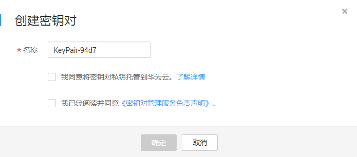
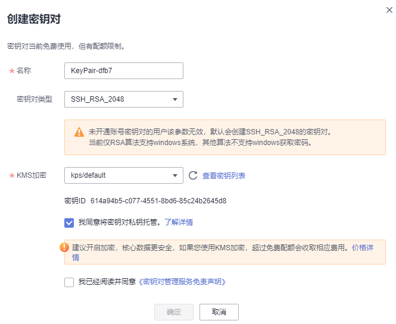
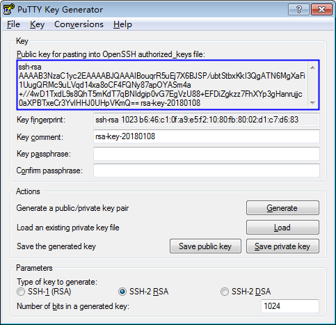

# 创建密钥对

为安全起见，用户登录弹性云服务器时建议使用密钥对方式进行身份认证。

用户可以新建一个密钥对，在登录弹性云服务器时进行鉴权。

> **说明：** 
>如果用户已有密钥对，可重复使用，不需多次创建。

创建密钥对的方法如下：

-   通过管理控制台创建的密钥对。

    公钥自动保存在华为云中，私钥由用户下载保存在本地。用户也可以根据自己的需要将私钥托管在华为云中，由华为云统一管理。华为云采用KMS提供的加密密钥对私钥进行加密，确保托管私钥的安全存储与访问。具体操作请参见[通过管理控制台创建密钥对](#section5800650145317)。

    > **说明：** 
    >-   通过管理控制台创建的密钥对使用的是“SSH-2（RSA，2048）“加解密算法。
    >-   IAM用户通过管理控制台创建的密钥对，仅能自己使用。如果多个IAM用户需要使用相同的密钥对，可以创建帐号密钥对。

-   通过**PuTTYgen**工具创建密钥对。

    公钥和私钥均保存在用户本地，具体操作请参见[通过PuTTYgen工具创建密钥对](#section3621887515920)。

    > **说明：** 
    >PuTTYgen是一款公钥私钥生成工具，获取路径：[https://www.putty.org/](https://www.putty.org/)。

## 前提条件

首次创建账号密钥对时，需要具有Tenant Administrator系统角色的用户完成一次账号密钥对创建。

## 通过管理控制台创建密钥对

1.  [登录管理控制台](https://console.huaweicloud.com)。
2.  单击管理控制台左上角的，选择区域或项目。
3.  单击页面左侧，选择“安全与合规  \>  数据加密服务“，默认进入“密钥管理“界面。
4.  在左侧导航树中，选择“密钥对管理“，进入“密钥对管理“页面。
5.  单击“创建密钥对“。
6.  在弹出的“创建密钥对“对话框中，输入密钥对名称，如[图1](#fig18001801152230)所示。

    **图 1**  创建密钥对  
    

7.  （可选）选择密钥对类型。当您帐号未开通帐号密钥对时，默认创建SSH\_RSA\_2048的密钥对。

    > **说明：** 
    >当前仅RSA算法支持windows系统。

8.  若需要托管私钥，请阅读并勾选“我同意将密钥对私钥托管“。在“KMS加密“下拉列表中选择加密密钥。若不需要托管私钥，请跳过此步骤。

    > **说明：** 
    >-   KPS采用KMS提供的加密密钥对私钥进行加密，用户使用密钥对的KMS加密功能时，KMS会自动为密钥对创建一个默认密钥“kps/default“。
    >-   用户在选择加密密钥时，可选择已有的加密密钥，或者单击“查看密钥列表“，创建新的加密密钥。

    **图 2**  托管私钥  
    

9.  请阅读《密钥对管理服务免责声明》并勾选“我已阅读并同意《密钥对管理服务免责声明》“。
10. 单击“确定“，浏览器自动执行下载任务，下载私钥文件，并弹出提示对话框。
11. 用户需要根据提示对话框的提示信息，保存私钥文件。

    > **须知：** 
    >-   若用户没有进行私钥托管，为保证安全，私钥只能下载一次，请妥善保管。若不慎遗失，您可以通过重置密码或重置密钥对的方式，重新给弹性云服务器绑定密钥对，具体可参照[解绑密钥对后用户无法登录ECS时如何处理？](https://support.huaweicloud.com/dew_faq/dew_01_0084.html)进行处理。
    >-   若用户已授权华为云托管私钥，可根据需要将托管的私钥导出使用。

12. 私钥保存完成后，单击“确定“，密钥对创建成功。

    密钥对创建成功后，用户可以在密钥对列表里看到新创建的密钥对信息，包括密钥对的“名称“、“指纹“、“私钥“以及“使用数量“等。

## 通过PuTTYgen工具创建密钥对

1.  生成公钥和私钥文件，双击“PUTTYGEN.exe“，打开“PuTTY Key Generator“。如[图3](#fig1028212177)所示。

    **图 3**  PuTTY Key Generator  
    

2.  请根据[表1](#table11561163013229)设置参数。

    **表 1**  生成密钥对参数说明

    
    <table><thead align="left"><tr id="row145601630192220"><th class="cellrowborder" valign="top" width="39.20792079207921%" id="mcps1.2.3.1.1">
参数

    </th>
    <th class="cellrowborder" valign="top" width="60.79207920792079%" id="mcps1.2.3.1.2">
参数说明

    </th>
    </tr>
    </thead>
    <tbody><tr id="row156133019224"><td class="cellrowborder" valign="top" width="39.20792079207921%" headers="mcps1.2.3.1.1 ">
Type of key to generate

    </td>
    <td class="cellrowborder" valign="top" width="60.79207920792079%" headers="mcps1.2.3.1.2 ">
当前导入管理控制台的密钥对的加解密算法，仅支持“SSH-2 RSA”。

    </td>
    </tr>
    <tr id="row6561230202210"><td class="cellrowborder" valign="top" width="39.20792079207921%" headers="mcps1.2.3.1.1 ">
Number of bits in a generated key

    </td>
    <td class="cellrowborder" valign="top" width="60.79207920792079%" headers="mcps1.2.3.1.2 ">
当前支持导入管理控制台的密钥对的算法长度为：1024、2048、4096。

    </td>
    </tr>
    </tbody>
    </table>

3.  单击“Generate“，生成一个公钥和一个私钥，如[图4](#fig1513010103413)所示。

    蓝框中标记的内容为生成的公钥内容。

    **图 4**  生成公钥和私钥文件  
    

4.  复制蓝框中的公钥内容，并将其粘贴在文本文档中，以“.txt“格式保存在本地。

    > **须知：** 
    >请勿直接单击“Save public key“保存公钥文件。若用户使用“Save public key“保存公钥，公钥内容的格式会发生变化，不能直接导入管理控制台使用。

5.  根据以下方式，选择保存私钥的格式，可保存为“.ppk“或者“.pem“格式的私钥。

    > **须知：** 
    >为保证安全，私钥只能下载一次，请妥善保管。

    **表 2**  私钥文件格式

    
    <table><thead align="left"><tr id="row24419413336"><th class="cellrowborder" valign="top" width="13.531353135313532%" id="mcps1.2.4.1.1">
私钥文件格式

    </th>
    <th class="cellrowborder" valign="top" width="38.28382838283828%" id="mcps1.2.4.1.2">
私钥使用场景

    </th>
    <th class="cellrowborder" valign="top" width="48.18481848184818%" id="mcps1.2.4.1.3">
保存方法

    </th>
    </tr>
    </thead>
    <tbody><tr id="row1644117417331"><td class="cellrowborder" rowspan="2" valign="top" width="13.531353135313532%" headers="mcps1.2.4.1.1 ">
“.pem”格式

    </td>
    <td class="cellrowborder" valign="top" width="38.28382838283828%" headers="mcps1.2.4.1.2 "><ul id="ul164411446337"><li>使用<strong id="b164412423314">Xshell</strong>工具登录Linux操作系统云服务器</li><li>将私钥托管在管理控制台</li></ul>
    </td>
    <td class="cellrowborder" valign="top" width="48.18481848184818%" headers="mcps1.2.4.1.3 "><ol id="ol16441841336"><li>选择“Conversions &gt; Export OpenSSH key”。</li><li>保存私钥到本地。例如：kp-123.pem。</li></ol>
    </td>
    </tr>
    <tr id="row1344212414333"><td class="cellrowborder" valign="top" headers="mcps1.2.4.1.1 ">
获取Windows操作系统云服务器的密码

    </td>
    <td class="cellrowborder" valign="top" headers="mcps1.2.4.1.2 "><ol id="ol1144215473315"><li>选择“Conversions &gt; Export OpenSSH key”。
 说明： 

请勿填写“Key passphrase”信息，否则会导致获取密码失败。

    

    </li><li>保存私钥到本地。例如：kp-123.pem。</li></ol>
    </td>
    </tr>
    <tr id="row1444274103318"><td class="cellrowborder" valign="top" width="13.531353135313532%" headers="mcps1.2.4.1.1 ">
“.ppk”

    </td>
    <td class="cellrowborder" valign="top" width="38.28382838283828%" headers="mcps1.2.4.1.2 ">
使用<strong id="b16442242334">PuTTY</strong>工具登录Linux操作系统云服务器

    </td>
    <td class="cellrowborder" valign="top" width="48.18481848184818%" headers="mcps1.2.4.1.3 "><ol id="ol114421748336"><li>在“PuTTY Key Generator”界面，选择“File &gt; Save private key”。</li><li>保存私钥到本地。例如：kp-123.ppk。</li></ol>
    </td>
    </tr>
    </tbody>
    </table>

    根据需要正确保存公钥和私钥文件后，可将密钥对导入管理控制台使用。

