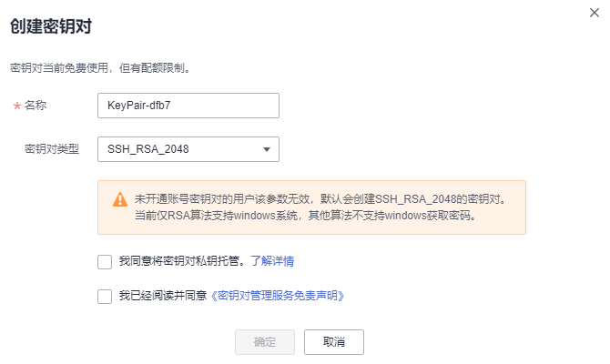
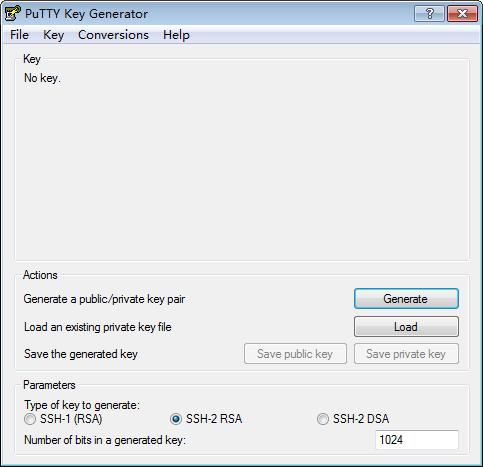

# 创建密钥对

为安全起见，用户登录弹性云服务器时建议使用密钥对方式进行身份认证。

用户可以新建一个密钥对，并在登录弹性云服务器时进行鉴权。

> **说明：**   
>如果用户已有密钥对，可重复使用，不需多次创建。  

创建密钥对的方法如下：

-   通过管理控制台创建的密钥对，公钥自动保存在华为云中，私钥由用户下载保存在本地。用户也可以根据自己的需要将私钥托管在华为云中，由华为云统一管理。华为云采用KMS提供的加密密钥对私钥进行加密，确保托管私钥的安全存储与访问。具体操作请参见[通过管理控制台创建密钥对](#section5800650145317)。

    > **注意：**   
    >通过管理控制台创建的密钥对默认使用“SSH-2（RSA，2048）“加解密算法。  

-   通过**PuTTYgen**工具创建密钥对，公钥和私钥均保存在用户本地，具体操作请参见[通过PuTTYgen工具创建密钥对](#section3621887515920)。

    > **说明：**   
    >PuTTYgen是一款公钥私钥生成工具，获取路径：[https://www.putty.org/](https://www.putty.org/)  

## 前提条件

已获取管理控制台的登录帐号与密码。

## 通过管理控制台创建密钥对

1.  登录管理控制台。
2.  单击管理控制台左上角，选择区域或项目。
3.  单击页面上方的“服务列表“，选择“安全  \>  数据加密服务“，默认进入数据加密服务的“密钥管理“界面。
4.  在左侧导航树中，选择“密钥对管理“，进入“密钥对列表“页面。
5.  单击“创建密钥对“。
6.  在弹出的“创建密钥对“对话框中，输入密钥对名称，如[图1](#fig18001801152230)所示。

    **图 1**  创建密钥对  
    

7.  若需要托管私钥，请阅读并勾选“我同意将密钥对私钥托管到华为云“。在“KMS加密“下拉列表中选择加密密钥。若不需要托管私钥，请跳过此步骤。

    > **说明：**   
    >-   用户使用密钥对的KMS加密功能时，KMS会自动为密钥对创建一个“kps/default“默认主密钥。  
    >-   用户在选择加密密钥时，可选择已有的加密密钥，或者单击“查看密钥列表“，创建新的加密密钥。  

    **图 2**  托管私钥  
    

8.  请阅读并勾选“我已阅读并同意《密钥对管理服务免责声明》“。
9.  单击“确定“，浏览器自动执行下载任务，下载私钥文件，并弹出提示对话框。
10. 用户需要根据提示对话框的提示信息，保存私钥文件。

    > **注意：**   
    >-   若用户没有进行私钥托管，为保证安全，私钥只能下载一次，请妥善保管。  
    >-   若用户已授权华为云托管私钥，可根据需要将托管的私钥导出使用。  

11. 私钥保存完成后，单击“确定“，密钥对创建成功。

    密钥对创建成功后，用户可以在密钥对列表里看到新创建的密钥对信息，包括密钥对的“名称“、“指纹“、“私钥“以及“使用数量“等。

## 通过PuTTYgen工具创建密钥对

1.  生成公钥和私钥文件，双击“PUTTYGEN.exe“，打开“PuTTY Key Generator“。如[图3](#fig1028212177)所示。

    **图 3**  PuTTY Key Generator  
    

2.  请根据[表1](#table11561163013229)设置参数。

    **表 1**  生成密钥对参数说明

    
    <table><thead align="left"><tr id="row145601630192220"><th class="cellrowborder" valign="top" width="44.554455445544555%" id="mcps1.2.3.1.1">
参数

    </th>
    <th class="cellrowborder" valign="top" width="55.44554455445545%" id="mcps1.2.3.1.2">
参数说明

    </th>
    </tr>
    </thead>
    <tbody><tr id="row156133019224"><td class="cellrowborder" valign="top" width="44.554455445544555%" headers="mcps1.2.3.1.1 ">
Type of key to generate

    </td>
    <td class="cellrowborder" valign="top" width="55.44554455445545%" headers="mcps1.2.3.1.2 ">
当前导入管理控制台的密钥对的加解密算法，仅支持“SSH-2 RSA”。

    </td>
    </tr>
    <tr id="row6561230202210"><td class="cellrowborder" valign="top" width="44.554455445544555%" headers="mcps1.2.3.1.1 ">
Number of bits in a generated key

    </td>
    <td class="cellrowborder" valign="top" width="55.44554455445545%" headers="mcps1.2.3.1.2 ">
当前支持导入管理控制台的密钥对的算法长度为：1024、2048、4096。

    </td>
    </tr>
    </tbody>
    </table>

3.  单击“Generate“，生成一个公钥和一个私钥，如[图4](#fig1513010103413)所示。

    蓝框中标记的内容为生成的公钥内容。

    **图 4**  生成公钥和私钥文件  
    

4.  复制蓝框中的公钥内容，并将其粘贴在文本文档中，以“.txt“格式保存在本地。

    > **注意：**   
    >请勿直接单击“Save public key“保存公钥文件。若用户使用“Save public key“保存公钥，公钥内容的格式会发生变化，不能直接导入管理控制台使用。  

5.  根据以下方式，选择保存私钥的格式，可保存为“.ppk“或者“.pem“格式的私钥。

    > **注意：**   
    >为保证安全，私钥只能下载一次，请妥善保管。  

    -   当用户需要使用**PuTTY**工具登录Linux云服务器时，私钥文件保存为“.ppk“格式。保存方法如下所示：
        1.  在“PuTTY Key Generator“界面，选择“File \> Save private key“。
        2.  保存私钥到本地。例如：kp-123.ppk。

    -   当用户需要使用**Xshell**工具登录Linux操作系统云服务器，或者获取Windows操作系统云服务器的密码时，私钥文件保存为“.pem“格式。保存方法如下所示：
        1.  选择“Conversions \> Export OpenSSH key“。

            > **说明：**   
            >如果该私钥文件用于Windows操作系统云服务器的获取密码操作，在选择“Export OpenSSH key“时，请勿填写“Key passphrase“信息，否则会导致获取密码失败。  

        2.  保存私钥到本地。例如：kp-123.pem。

6.  根据需要正确保存公钥和私钥文件后，可将公钥导入管理控制台使用。

