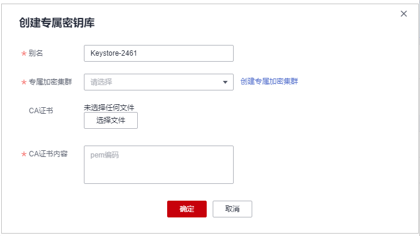

# 创建密钥库

该任务指导用户通过专属密钥库管理界面对单个或多个进行操作。新建的密钥库默认为“禁用“状态。

## 前提条件

已准备好加密机集群的CA证书。

## 约束条件

目前华北-北京一、华北-北京四、 华东-上海一、华东-上海二、华南-广州支持密钥库管理功能。

## 操作步骤

1.  [登录管理控制台](https://console.huaweicloud.com)。
2.  单击管理控制台左上角，选择区域或项目。
3.  单击页面左侧，选择“安全与合规  \>  数据加密服务“，默认进入“密钥管理“界面。
4.  选择“专属密钥库“页签，单击“创建专属密钥库“。
5.  弹出“创建专属密钥库“对话框，如[图 创建专属密钥库](#fig1567616353514)所示，填写参数，参数说明如[表 专属密钥库参数配置说明](#table967818323514)所示，单击“确定“。

    **图 1**  创建专属密钥库  
    

    **表 1**  专属密钥库参数配置说明

    
    <table><thead align="left"><tr id="row14677735354"><th class="cellrowborder" valign="top" width="16.971697169716972%" id="mcps1.2.4.1.1">
参数名称

    </th>
    <th class="cellrowborder" valign="top" width="49.694969496949696%" id="mcps1.2.4.1.2">
参数说明

    </th>
    <th class="cellrowborder" valign="top" width="33.33333333333333%" id="mcps1.2.4.1.3">
取值样例

    </th>
    </tr>
    </thead>
    <tbody><tr id="row7677183163515"><td class="cellrowborder" valign="top" width="16.971697169716972%" headers="mcps1.2.4.1.1 ">
别名

    </td>
    <td class="cellrowborder" valign="top" width="49.694969496949696%" headers="mcps1.2.4.1.2 ">
专属密钥库的别名。

    </td>
    <td class="cellrowborder" valign="top" width="33.33333333333333%" headers="mcps1.2.4.1.3 ">
Keystore-1234

    </td>
    </tr>
    <tr id="row206774317355"><td class="cellrowborder" valign="top" width="16.971697169716972%" headers="mcps1.2.4.1.1 ">
专属加密集群

    </td>
    <td class="cellrowborder" valign="top" width="49.694969496949696%" headers="mcps1.2.4.1.2 ">
选择您的加密集群。

    
 须知： 

专属加密集群需同时满足以下三点：

    <ul id="ul106774310354"><li>集群已激活</li><li>集群里的加密机数量不少于2台</li><li>加密机集群当前未用于创建专属密钥库</li></ul>
    

    </td>
    <td class="cellrowborder" valign="top" width="33.33333333333333%" headers="mcps1.2.4.1.3 ">
Cluster-1234

    </td>
    </tr>
    <tr id="row146783313512"><td class="cellrowborder" valign="top" width="16.971697169716972%" headers="mcps1.2.4.1.1 ">
CA证书

    </td>
    <td class="cellrowborder" valign="top" width="49.694969496949696%" headers="mcps1.2.4.1.2 ">
选择您的CA证书。

    </td>
    <td class="cellrowborder" valign="top" width="33.33333333333333%" headers="mcps1.2.4.1.3 ">
选择后，自动生成“CA证书内容”。

    </td>
    </tr>
    <tr id="row16780383510"><td class="cellrowborder" valign="top" width="16.971697169716972%" headers="mcps1.2.4.1.1 ">
CA证书内容

    </td>
    <td class="cellrowborder" valign="top" width="49.694969496949696%" headers="mcps1.2.4.1.2 ">
证书的pem编码。

    </td>
    <td class="cellrowborder" valign="top" width="33.33333333333333%" headers="mcps1.2.4.1.3 ">
-

    </td>
    </tr>
    </tbody>
    </table>

6.  启用密钥库。创建后默认状态为“禁用“，在“操作“列中，单击“启用”。

