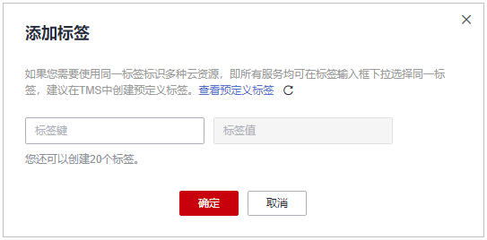
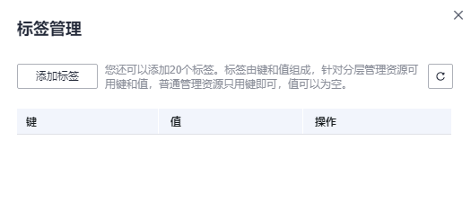
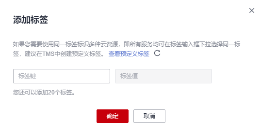

# 创建标签

本章节指导用户为已有密钥、凭据、专属加密实例添加标签。

## 约束条件

KMS不支持为默认密钥添加标签。

## 密钥管理

1.  [登录管理控制台](https://console.huaweicloud.com)。
2.  单击管理控制台左上角，选择区域或项目。
3.  单击页面左侧，选择“安全与合规  \>  数据加密服务“，默认进入“密钥管理“界面。
4.  单击目标自定义密钥的别名，进入密钥详细信息页面。
5.  单击“标签“，进入标签管理页面。
6.  单击“添加标签“，弹出添加标签对话框，如[图 添加标签](#fig1495319247218)所示，在弹出的“添加标签“对话框中输入“标签键“和“标签值“。

    **图 1**  添加标签  
    

    > **说明：** 
    >-   若需要使用同一标签标识多种云资源，即所有服务均可在标签输入框下选择同一标签，用户可在TMS中创建预定义标签。更多关于预定义标签的信息，请参见《标签管理用户指南》。
    >-   当同时添加多个标签，需要删除其中一个待添加的标签时，可单击该标签所在行的“删除“，删除标签。

7.  单击“确定“，完成标签的添加。

## 凭据管理

1.  [登录管理控制台](https://console.huaweicloud.com)。
2.  单击管理控制台左上角，选择区域或项目。
3.  单击页面左侧，选择“安全与合规  \>  数据加密服务“，默认进入“密钥管理“界面。
4.  在左侧导航树中，选择“凭据管理“，进入“凭据管理“页面。
5.  单击凭据名称，进入凭据详细信息页面。
6.  在“标签“区，单击“添加标签“，弹出添加标签对话框，如[图 添加标签](#fig311255467)所示，在弹出的“添加标签“对话框中输入“标签键“和“标签值“。

    **图 2**  添加标签  
    

    > **说明：** 
    >-   若需要使用同一标签标识多种云资源，即所有服务均可在标签输入框下选择同一标签，用户可在TMS中创建预定义标签。更多关于预定义标签的信息，请参见《标签管理用户指南》。
    >-   当同时添加多个标签，需要删除其中一个待添加的标签时，可单击该标签所在行的“删除“，删除标签。

7.  单击“确定“，完成标签的添加。

## 专属加密

1.  [登录管理控制台](https://console.huaweicloud.com)。
2.  单击管理控制台左上角，选择区域或项目。
3.  单击页面左侧，选择“安全与合规  \>  数据加密服务“，默认进入“密钥管理“界面。
4.  在左侧导航树中，选择“专属加密 \> 实例列表（新版）“，进入“实例列表（新版）“页面。
5.  在右侧“操作“列，单击“标签管理“，弹出标签管理页面，如[图 标签管理](#fig462411343214)所示。

    **图 3**  标签管理  
    

6.  单击“添加标签“，在弹出的对话框中输入“标签键“和“标签值“。

    **图 4**  添加标签  
    

    > **说明：** 
    >-   若需要使用同一标签标识多种云资源，即所有服务均可在标签输入框下选择同一标签，用户可在TMS中创建预定义标签。更多关于预定义标签的信息，请参见《标签管理用户指南》。
    >-   当同时添加多个标签，需要删除其中一个待添加的标签时，可单击该标签所在行的“删除“，删除标签。

7.  单击“确定“，完成标签的添加。

