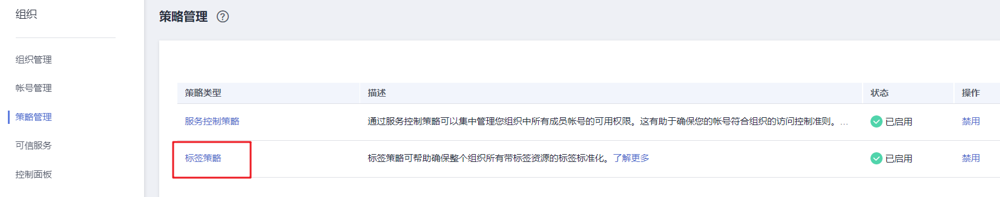
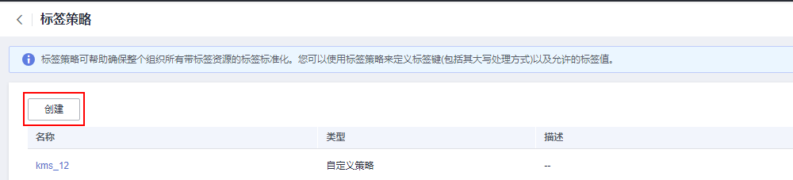
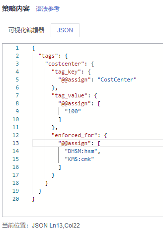

# 创建标签策略

## 标签策略简介

标签策略是策略的一种类型，可帮助您在组织帐号中对资源添加的标签进行标准化管理。标签策略对未添加标签的资源或未在标签策略中定义的标签不会生效。

例如：标签策略规定为某资源添加的标签A，需要遵循标签策略中定义的大小写规则和标签值。若标签A使用的大小写、标签值不符合标签策略，则资源将会被标记为不合规。

标签策略有如下两种应用方式：

1. 事后检查 —— 资源标签如果违反标签策略，则在资源在合规性结果中显示为不合规。

2. 事前拦截 —— 标签策略开启强制执行后，则会阻止在指定的资源类型上完成不合规的标记操作。

## 约束条件

只有组织管理员才可以创建标签策略，委托管理员无法执行此操作。

> **说明：** 
>在创建标签策略并将其附加到组织单元和帐号之前，必须先启用标签策略，且只能使用组织的管理帐号启用标签策略。具体操作请参见[启用和禁用标签策略](https://support.huaweicloud.com/usermanual-organizations/org_03_0073.html)。

## 操作步骤

1.  以组织管理员或管理帐号的身份登录华为云。
2.  单击页面左侧，选择“管理与监管 \> 组织“，默认进入“组织管理“界面。
3.  单击左侧“策略管理“，进入策略管理页，单击“标签策略”，进入标签策略页面。

    **图 1**  进入标签策略  
    

4.  单击“创建”，进入标签策略创建页面。

    **图 2**  创建策略  
    

5.  输入策略名称。注意，创建的策略名称不能与已有策略名称重复。
6.  根据[标签策略语法](https://support.huaweicloud.com/usermanual-organizations/org_03_0068.html)，标签策略内容。填写时，系统会自动校验语法。如不正确，请根据提示进行修正。

    **图 3**  填写标签策略  
    

7.  （可选）为策略添加标签。在标签栏目下，输入标签键和标签值，单击添加。
8.  单击右下角“保存”后，如跳转到标签策略列表，则标签策略创建成功。

    > **说明：** 
    >若需对标签策略进行修改、删除，可参见[修改、删除标签策略](https://support.huaweicloud.com/usermanual-organizations/org_03_0070.html)。
    >具体绑定与解绑操作，参见[绑定和解绑标签策略](https://support.huaweicloud.com/usermanual-organizations/org_03_0072.html)。

