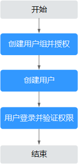

# 创建用户并授权使用DEW

如果您需要对您所拥有的DEW进行精细的权限管理，您可以使用[统一身份认证服务](https://support.huaweicloud.com/usermanual-iam/iam_01_0001.html)（Identity and Access Management，简称IAM），通过IAM，您可以：

-   根据企业的业务组织，在您的华为云账号中，给企业中不同职能部门的员工创建IAM用户，让员工拥有唯一安全凭证，并使用DEW资源。
-   根据企业用户的职能，设置不同的访问权限，以达到用户之间的权限隔离。
-   将DEW资源委托给更专业、高效的其他华为云账号或者云服务，这些账号或者云服务可以根据权限进行代运维。

如果华为云账号已经能满足您的要求，不需要创建独立的IAM用户，您可以跳过本章节，不影响您使用DEW服务的其它功能。

本章节为您介绍对用户授权的方法，操作流程如[图1](#fig23111471897)所示。

## 前提条件

-   “KMS CMKFullAccess“属于策略，请先在IAM控制台中开通基于策略的访问控制公测，开通方法请参见：[申请基于策略的访问控制公测](https://support.huaweicloud.com/usermanual-iam/iam_01_019.html)。
-   给用户组授权之前，请您了解用户组可以添加的DEW权限，并结合实际需求进行选择，DEW系统策略如[表1](#table1421117178)所示。若您需要对除DEW之外的其它服务授权，IAM支持服务的所有策略请参见[系统权限](https://support.huaweicloud.com/permissions/policy_list.html?product=dew)。

    **表 1**  DEW系统权限

    
    <table><thead align="left"><tr id="zh-cn_topic_0169425412_row1346222921318"><th class="cellrowborder" valign="top" width="27.69276927692769%" id="mcps1.2.5.1.1">
系统角色/策略名称

    </th>
    <th class="cellrowborder" valign="top" width="35.32353235323533%" id="mcps1.2.5.1.2">
描述

    </th>
    <th class="cellrowborder" valign="top" width="16.711671167116712%" id="mcps1.2.5.1.3">
类别

    </th>
    <th class="cellrowborder" valign="top" width="20.27202720272027%" id="mcps1.2.5.1.4">
依赖关系

    </th>
    </tr>
    </thead>
    <tbody><tr id="zh-cn_topic_0169425412_row1462142915137"><td class="cellrowborder" valign="top" width="27.69276927692769%" headers="mcps1.2.5.1.1 ">
KMS Administrator

    </td>
    <td class="cellrowborder" valign="top" width="35.32353235323533%" headers="mcps1.2.5.1.2 ">
数据加密服务加密密钥的管理员权限。

    </td>
    <td class="cellrowborder" valign="top" width="16.711671167116712%" headers="mcps1.2.5.1.3 ">
系统角色

    </td>
    <td class="cellrowborder" valign="top" width="20.27202720272027%" headers="mcps1.2.5.1.4 ">
无。

    </td>
    </tr>
    <tr id="zh-cn_topic_0169425412_row4708123532810"><td class="cellrowborder" valign="top" width="27.69276927692769%" headers="mcps1.2.5.1.1 ">
KMS CMKFullAccess

    </td>
    <td class="cellrowborder" valign="top" width="35.32353235323533%" headers="mcps1.2.5.1.2 ">
数据加密服务加密密钥所有权限。

    </td>
    <td class="cellrowborder" valign="top" width="16.711671167116712%" headers="mcps1.2.5.1.3 ">
系统策略

    </td>
    <td class="cellrowborder" valign="top" width="20.27202720272027%" headers="mcps1.2.5.1.4 ">
无。

    </td>
    </tr>
    <tr id="zh-cn_topic_0169425412_row13720637112819"><td class="cellrowborder" valign="top" width="27.69276927692769%" headers="mcps1.2.5.1.1 ">
DEW KeypairFullAccess

    </td>
    <td class="cellrowborder" valign="top" width="35.32353235323533%" headers="mcps1.2.5.1.2 ">
数据加密服务密钥对所有权限。

    </td>
    <td class="cellrowborder" valign="top" width="16.711671167116712%" headers="mcps1.2.5.1.3 ">
系统策略

    </td>
    <td class="cellrowborder" valign="top" width="20.27202720272027%" headers="mcps1.2.5.1.4 ">
无。

    </td>
    </tr>
    <tr id="zh-cn_topic_0169425412_row43641644115114"><td class="cellrowborder" valign="top" width="27.69276927692769%" headers="mcps1.2.5.1.1 ">
DEW KeypairReadOnlyAccess

    </td>
    <td class="cellrowborder" valign="top" width="35.32353235323533%" headers="mcps1.2.5.1.2 ">
数据加密服务密钥对查看权限。

    </td>
    <td class="cellrowborder" valign="top" width="16.711671167116712%" headers="mcps1.2.5.1.3 ">
系统策略

    </td>
    <td class="cellrowborder" valign="top" width="20.27202720272027%" headers="mcps1.2.5.1.4 ">
无。

    </td>
    </tr>
    </tbody>
    </table>

## 示例流程

**图 1**  给用户授权DEW权限流程  

1.  [创建用户组并授权](https://support.huaweicloud.com/usermanual-iam/iam_03_0001.html)

    在IAM控制台创建用户组，并授予数据加密服务加密密钥所有权限“KMS CMKFullAccess“。

2.  [创建用户并加入用户组](https://support.huaweicloud.com/usermanual-iam/iam_02_0001.html)

    在IAM控制台创建用户，并将其加入[1](#li960014441019)中创建的用户组。

3.  [用户登录](https://support.huaweicloud.com/usermanual-iam/iam_01_0552.html)并验证权限

    新创建的用户登录控制台，切换至授权区域，验证权限：

    -   在“服务列表“中选择数据加密服务，进入DEW主界面，选择密钥对管理，若提示权限不足，表示“KMS CMKFullAccess“已生效。
    -   在“服务列表“中选择除数据加密服务外的任一服务，若提示权限不足，表示“KMS CMKFullAccess“已生效。

