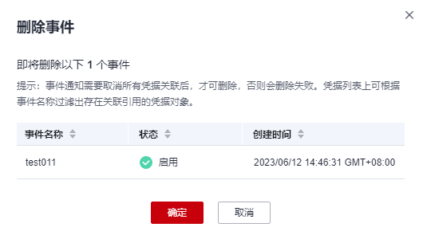

# 删除事件

该任务指导用户通过事件通知页面删除已创建的事件，删除前请确认事件已不使用。

## 约束条件

事件通知需要取消所有关联的凭据才能删除。若未取消关联凭据，会导致删除失败。

## 操作步骤

1.  [登录管理控制台](https://console.huaweicloud.com)。
2.  单击管理控制台左上角，选择区域或项目。
3.  单击页面左侧，选择“安全与合规  \>  数据加密服务“，默认进入“密钥管理“界面。
4.  在左侧导航树中，选择“凭据管理“，单击“事件通知“，进入“事件通知“页面。
5.  单击目标事件所在行的“删除“，弹出“删除事件“对话框，如所示。

    **图 1**  删除事件  
    

6.  单击“确定“，完成删除事件操作。

