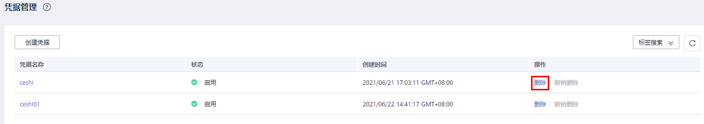
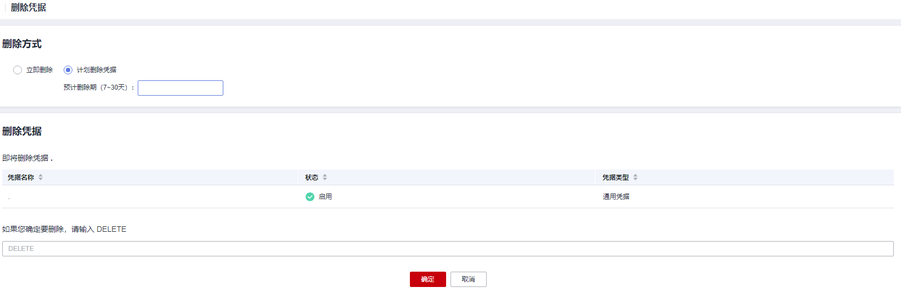

# 删除凭据

在删除凭据前，您需要确保该凭据没有被使用或将来也不会被使用。

## 前提条件

待删除的凭据需处于“启用“状态。

## 约束条件

-   “计划删除凭据“不会立即删除，凭据管理会将该操作按用户指定时间推迟执行，推迟时间范围为7天～30天。在推迟删除时间未到时，若需要重新使用该凭据，可以执行撤销删除凭据操作。若超过推迟时间，凭据将被彻底删除，请谨慎操作。
-   关于处于计划删除状态的凭据计费情况，请参见[计划删除的凭据是否还计费？](https://support.huaweicloud.com/dew_faq/dew_01_0193.html)。
-   “立即删除“凭据，删除后若需找回，需提前下载凭据备份用于恢复凭据，请谨慎操作。

## 操作步骤

1.  [登录管理控制台](https://console.huaweicloud.com)。
2.  单击管理控制台左上角，选择区域或项目。
3.  单击页面左侧，选择“安全与合规  \>  数据加密服务“，默认进入“密钥管理“界面。
4.  在左侧导航树中，选择“凭据管理“，进入“凭据管理“页面。
5.  在需要删除的凭据所在行，单击“删除“。

    **图 1**  删除凭据  
    

6.  在“删除凭据“界面，选择删除方式，若选择计划删除凭据，需填写“推迟删除“的时间。

    **图 2**  推迟删除时间  
    

7.  在确认删除提示框中输入“DELETE”后，单击“确定“，页面提示删除凭据成功，完成删除凭据操作。

    > **说明：** 
    >-   “计划删除凭据“不会立即删除，凭据管理会将该操作按用户指定时间推迟执行，推迟时间范围为7天～30天。在推迟删除时间未到时，若需要重新使用该凭据，可以执行撤销删除凭据操作。若超过推迟时间，凭据将被彻底删除，请谨慎操作。
    >-   关于处于计划删除状态的凭据计费情况，请参见[计划删除的凭据是否还计费？](https://support.huaweicloud.com/dew_faq/dew_01_0193.html)。
    >-   “立即删除“凭据，删除后若需找回，需提前下载凭据备份用于恢复凭据，请谨慎操作。

