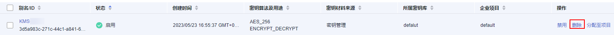
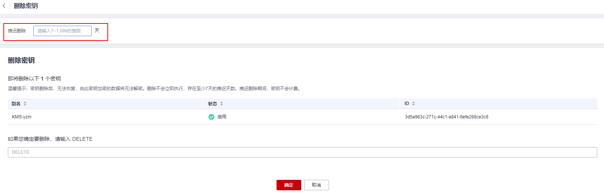

# 删除密钥

在删除密钥前，您需要确保该密钥没有被使用或将来也不会被使用。您可以通过以下方式确定密钥的使用情况。

-   检查CMK权限以确定潜在使用范围，详细操作请参见[查询授权](查询授权.md)。
-   检查审计日志以确定实际使用情况，详细操作请参见[使用云审计服务查询数据加密服务的操作事件](使用云审计服务查询数据加密服务的操作事件.md)。

## 前提条件

-   待删除的密钥需处于“启用“、“禁用“或“等待导入“状态。

## 约束条件

-   执行删除密钥操作后，密钥不会立即删除，密钥管理会将该操作按用户指定时间推迟执行，推迟时间范围为7天～1096天。

    在推迟删除时间未到时，若需要重新使用该密钥，可以执行取消删除密钥操作。若超过推迟时间，密钥将被KMS彻底删除，使用该密钥加密的数据将无法解密，请谨慎操作。

-   关于处于计划删除状态的密钥计费情况，请参见[计划删除的密钥是否还计费？](https://support.huaweicloud.com/dew_faq/dew_01_0126.html)。
-   默认密钥为服务自动创建，不支持删除操作。

## 操作步骤

1.  [登录管理控制台](https://console.huaweicloud.com)。
2.  单击管理控制台左上角，选择区域或项目。
3.  单击页面左侧，选择“安全与合规  \>  数据加密服务“，默认进入“密钥管理“界面。
4.  在需要删除的密钥所在行，单击“删除“,，进入“删除密钥“界面。

    **图 1**  删除单个密钥  
    

5.  在“删除密钥“界面，填写“推迟删除“的时间。

    **图 2**  推迟删除时间  
    

    > **说明：** 
    >-   密钥管理会将该操作按用户指定时间推迟执行，推迟时间范围为7天～1096天。在推迟删除时间未到时，若需要重新使用该密钥，可以执行取消删除密钥操作。
    >-   关于处于计划删除状态的密钥计费情况，请参见[计划删除的密钥是否还计费？](https://support.huaweicloud.com/dew_faq/dew_01_0126.html)。

6.  在确认删除提示框中输入“DELETE”后，单击“确定“，页面提示删除密钥任务下发成功，完成删除单个密钥操作。
7.  若密钥用于加密数据库服务DDS、RDS、NOSQL，在单击“确认“后，会弹出提示“正在被XXX服务使用，请确认是否删除“，如[图 删除确认](#fig8184217374)所示，需单击“确认删除“，确认后才能完成密钥删除操作。

    **图 3**  删除确认  
    

    > **说明：** 
    >如果您想批量计划删除密钥，可以勾选所有需要计划删除的密钥，然后在列表左上角，单击“删除“。

