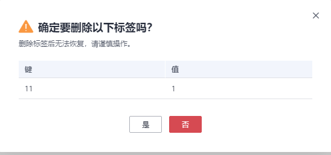

# 删除标签

本章节指导用户对已创建密标签进行删除。

## 操作步骤

1.  [登录管理控制台](https://console.huaweicloud.com)。
2.  单击管理控制台左上角，选择区域或项目。
3.  单击页面左侧，选择“安全与合规  \>  数据加密服务“，默认进入“密钥管理“界面。
4.  在左侧选择对应服务进入页面，单击需要删除标签的实例，进入详情页面。
5.  在“标签“区，单击目标标签所在行的“删除“，弹出删除标签对话框。

    **图 1**  删除标签  
    

6.  在弹出的删除标签对话框中单击“确认“，完成标签的删除。

