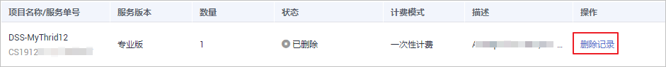

# 删除记录

## 操作场景

如果在验收订单过程中，勾选了确认验收并删除报告，则在验收订单后，可对该条实例记录进行删除。

## 前提条件

-   已获取管理控制台账号和密码。
-   实例的状态显示为“已删除“。

## 操作步骤

1.  [登录管理控制台](https://console.huaweicloud.com)。
2.  单击管理控制台左上角，选择区域或项目。
3.  单击，选择“安全  \>  数据加密服务“，默认进入数据加密服务的“密钥管理“界面。
4.  在左侧功能列表单击“数据安全治理“，进入“数据安全治理“界面。
5.  在需要删除记录所在行的“操作“列，单击“删除记录“。

    **图 1**  删除记录  
    

6.  在弹出的窗口中，单击“确定“，完成删除记录操作。

