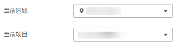

# 升级到专业版

用户首次使用KMS，可以直接使用基础版密钥管理。

当用户需要更多的密钥配额，或需要使用自动轮换密钥、创建授权等功能时，需要升级到专业版密钥管理。基础版与专业版的功能差异请参见[密钥管理功能介绍](https://support.huaweicloud.com/productdesc-dew/dew_01_0001.html)。

> **须知：**   
>-   专业版密钥管理仅支持“包年/包月“付费方式。  
>-   升级成功后，所有密钥都使用的是专业版密钥管理。  

## 前提条件

-   已获取管理控制台的登录账号（拥有KMS Administrator权限）与密码。
-   当前使用的是基础版密钥管理。

## 操作步骤

1.  登录管理控制台。
2.  单击管理控制台左上角，选择区域或项目。
3.  单击页面上方的“服务列表“，选择“安全  \>  数据加密服务“，进入数据加密服务的“密钥管理“界面。
4.  在界面右上角，单击“升级为专业版“。

    **图 1**  升级  
    

5.  在购买密钥管理界面，选择“计费模式“。

    **图 2**  计费模式  
    

6.  选择“区域“。

    **图 3**  选择区域  
    

7.  设置“产品规格“。

    **图 4**  设置产品规格  
    

8.  选择“购买时长“。

    可以选择1个月～9个月、1年的购买时长。

    > **说明：**   
    >勾选“自动续费“后，当服务期满时，系统会自动按照购买周期进行续费。  

9.  单击“立即购买“。

    如果您对价格有疑问，可以单击“了解计费详情“，了解产品价格。

10. 在“订单详情“页面，确认订单详情，并单击“去支付“。
11. 在“付款“页面，选择付款方式进行付款。

    成功付款后，在密钥管理列表界面，若右上角无“升级为专业版“，表示升级成功。

