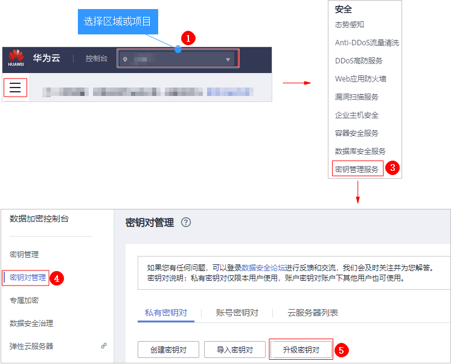
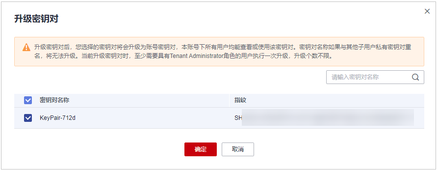

# 升级密钥对

## 操作场景

若用户希望本账号下的所有用户都能查看或使用本账号下已创建的密钥对，可将创建的密钥对升级为账号密钥对。

> **须知：** 
>-   升级前，您需要在管理控制台的右上角，单击“工单  \>  新建工单“，申请升级密钥对。申请成功后，您可以参考[操作步骤](#section39832311312)进行操作。
>-   如果密钥对名称与其他子用户的私有密钥对重名，将无法升级。

## 前提条件

-   已创建密钥对或者已导入密钥对。
-   已成功申请升级密钥对。

## 操作步骤

1.  [登录管理控制台](https://console.huaweicloud.com)。
2.  进入升级密钥对入口。

    **图 1**  进入升级密钥对入口  
    

3.  在弹出的对话框中，选择需要升级为账号密钥对的密钥对名称，单击“确定“，如[图2](#fig43321541055)所示。

    **图 2**  升级密钥对  
    

    > **说明：** 
    >已升级的密钥对，在“账号密钥队“列表中可以查看。

