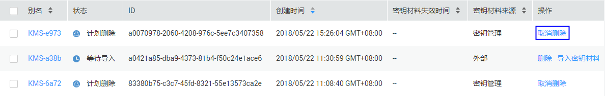
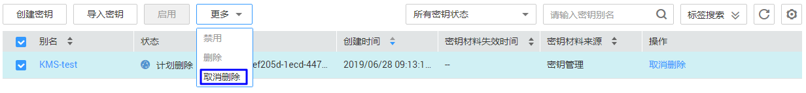

# 取消删除密钥

该任务指导用户在未超出删除密钥的推迟时间，通过密钥管理界面对用户主密钥进行取消删除操作，取消删除后密钥处于“禁用“状态。

## 前提条件

-   已获取管理控制台的登录帐号与密码。
-   待取消删除的密钥需处于“计划删除“状态。

## 取消删除单个密钥

1.  登录管理控制台。
2.  单击管理控制台左上角，选择区域或项目。
3.  单击页面上方的“服务列表“，选择“安全  \>  数据加密服务“，默认进入数据加密服务的“密钥管理“界面。
4.  单击目标密钥管理所在行，展开密钥管理。
5.  在需要取消删除的密钥所在行，单击“取消删除“。

    **图 1**  取消删除单个密钥  
    

6.  在弹出的窗口中，单击“确定“，完成取消删除单个密钥操作。

    -   如果是通过KMS创建的密钥，取消删除后密钥状态为“禁用“，如需启用密钥，请参见[启用密钥](启用密钥.md)操作。
    -   如果是外部导入的密钥，且有密钥材料，取消删除后密钥状态为“禁用“，如需启用密钥，请参见[启用密钥](启用密钥.md)操作。
    -   如果是外部导入的密钥，且没有密钥材料，取消删除后密钥状态为“等待导入“，如需使用该密钥，请参见[导入密钥](导入密钥.md)操作。

## 批量取消删除密钥

1.  登录管理控制台。
2.  单击管理控制台左上角，选择区域或项目。
3.  单击页面上方的“服务列表“，选择“安全  \>  数据加密服务“，默认进入数据加密服务的“密钥管理“界面。
4.  单击目标密钥管理所在行，展开密钥管理。
5.  在密钥列表中，勾选所有需要取消删除的密钥，单击“取消删除“。

    **图 2**  批量取消删除密钥  
    

6.  在弹出的窗口中，单击“确定“，完成批量取消删除密钥操作。

    -   如果是通过KMS创建的密钥，取消删除后密钥状态为“禁用“，如需启用密钥，请参见[启用密钥](启用密钥.md)操作。
    -   如果是外部导入的密钥，且有密钥材料，取消删除后密钥状态为“禁用“，如需启用密钥，请参见[启用密钥](启用密钥.md)操作。
    -   如果是外部导入的密钥，且没有密钥材料，取消删除后密钥状态为“等待导入“，如需使用该密钥，请参见[导入密钥](导入密钥.md)操作。

