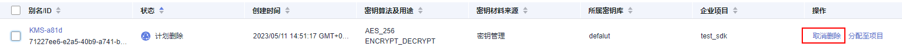

# 取消删除密钥

该任务指导用户在未超出删除密钥的推迟时间，通过密钥管理界面对用户主密钥进行取消删除操作，取消删除后密钥处于“禁用“状态。

## 前提条件

-   已获取管理控制台的登录帐号与密码。
-   待取消删除的密钥需处于“计划删除“状态。

## 操作步骤

1.  [登录管理控制台](https://console.huaweicloud.com)。
2.  单击管理控制台左上角，选择区域或项目。
3.  单击页面左侧，选择“安全与合规  \>  数据加密服务“，默认进入“密钥管理“界面。
4.  在需要取消删除的密钥所在行，单击“取消删除“。

    **图 1**  取消删除单个密钥  
    

5.  在弹出的窗口中，单击“是“，完成取消删除单个密钥操作。

    > **说明：** 
    >如果您想批量取消删除密钥，可以勾选所有需要取消删除的密钥，然后在列表左上角，单击“取消删除“。

