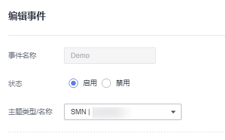

# 启用事件

该任务指导用户通过事件通知页面针对被禁用的事件，进行启用操作。

## 前提条件

待启用的事件需处于“禁用“状态。

## 操作步骤

1.  [登录管理控制台](https://console.huaweicloud.com)。
2.  单击管理控制台左上角，选择区域或项目。
3.  单击页面左侧，选择“安全与合规  \>  数据加密服务“，默认进入“密钥管理“界面。
4.  在左侧导航树中，选择“凭据管理“，单击“事件通知“，进入“事件通知“页面。
5.  单击需启用时间所在列的“编辑“，进入编辑事件界面。
6.  单击选择“启用“，将禁用状态事件修改为启用状态。

    **图 1**  启用事件  
    

7.  单击“确定“，右上角提示更新事件状态成功，完成启用事件操作

