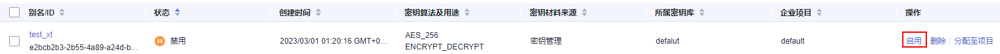

# 启用密钥

该任务指导用户通过密钥管理界面对单个或多个用户主密钥进行启用操作，使被禁用的密钥恢复到数据加解密能力。新建的用户主密钥默认为“启用“状态。

## 前提条件

-   已获取管理控制台的登录帐号与密码。
-   待启用的密钥需处于“禁用“状态。

## 启用单个密钥

1.  登录管理控制台。
2.  单击管理控制台左上角，选择区域或项目。
3.  单击页面上方的“服务列表“，选择“安全  \>  数据加密服务“，默认进入数据加密服务的“密钥管理“界面。
4.  单击目标密钥管理所在行，展开密钥管理。
5.  在需要启用的密钥所在行，单击“启用“。

    **图 1**  启用单个密钥  
    

6.  在弹出窗口中，单击“确定“，完成启用单个密钥操作。

## 批量启用密钥

1.  登录管理控制台。
2.  单击管理控制台左上角，选择区域或项目。
3.  单击页面上方的“服务列表“，选择“安全  \>  数据加密服务“，默认进入数据加密服务的“密钥管理“界面。
4.  单击目标密钥管理所在行，展开密钥管理。
5.  在密钥列表中，勾选所有需要启用的密钥，单击“启用“。

    **图 2**  批量启用密钥  
    

6.  在弹出窗口中，单击“确定“，完成批量启用密钥操作。

