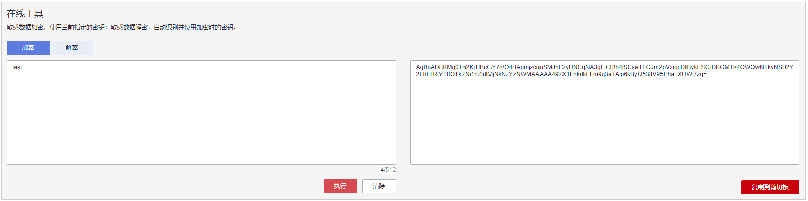
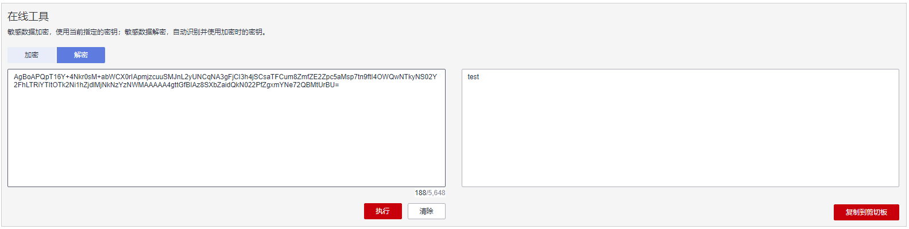

# 在线工具加解密小数据

该任务指导用户通过密钥管理界面使用在线工具加解密不大于4KB的数据。

## 前提条件

自定义密钥处于“启用“状态。

## 约束条件

-   在线工具不支持通过默认密钥加解密小数据。
-   在线工具不支持非对称密钥加解密小数据。
-   用户可使用调用API接口的方式，使用默认密钥加解密小数据，详细信息请参考《数据加密服务API参考》。
-   加密数据时，使用当前指定的密钥加密数据。
-   解密数据时，在线工具自动识别并使用数据被加密时使用的密钥解密数据，如果加密时使用的密钥已被删除，会导致解密失败。

## 加密数据

1.  [登录管理控制台](https://console.huaweicloud.com)。
2.  单击管理控制台左上角，选择区域或项目。
3.  单击页面左侧，选择“安全与合规  \>  数据加密服务“，默认进入“密钥管理“界面。

1.  单击目标自定义密钥的别名，进入密钥详细信息在线工具加密数据页面。
2.  在“加密“文本框中输入待加密的数据，如[图1](#fig61927028183617)所示。

    **图 1**  加密数据  
    

3.  单击“执行“，右侧文本框显示加密后的密文数据。

    > **说明：** 
    >-   加密数据时，使用当前指定的密钥加密数据。
    >-   用户可单击“清除“，清除已输入的数据。
    >-   用户可单击“复制到剪切板“拷贝加密后的密文数据，并保存到本地文件中。

## 解密数据

1.  [登录管理控制台](https://console.huaweicloud.com)。
2.  单击管理控制台左上角，选择区域或项目。
3.  单击页面左侧，选择“安全与合规  \>  数据加密服务“，默认进入“密钥管理“界面。

1.  解密数据时，可单击任意“启用“状态的非默认密钥别名，进入该密钥的在线工具页面。
2.  单击“解密“，在左侧文本框中数据待解密的密文数据，如[图2](#fig1586514341014)所示。

    > **说明：** 
    >-   在线工具自动识别并使用数据被加密时使用的密钥解密数据。
    >-   若该密钥已被删除，会导致解密失败。

    **图 2**  解密数据  
    

3.  单击“执行“，右侧文本框中显示解密后的明文数据。

    > **说明：** 
    >-   用户可直接单击“复制到剪切板“拷贝解密后的明文数据，并保存到本地文件中。

