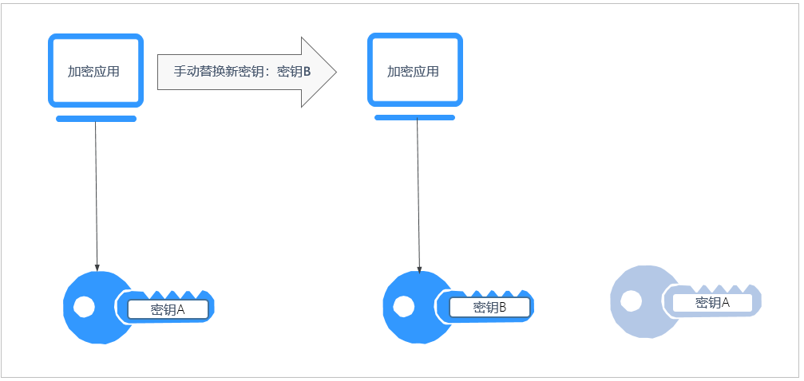
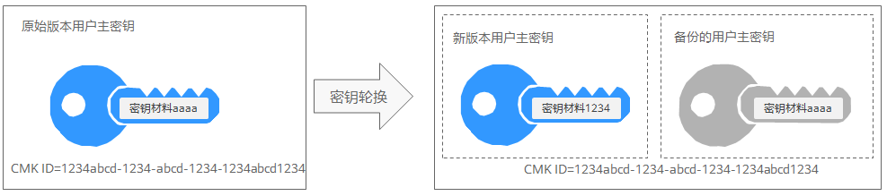

# 密钥轮换概述

## 为什么需要轮换密钥

广泛重复的使用加密密钥，会对加密密钥的安全造成风险。为了确保加密密钥的安全性，建议您定期轮换密钥，更改原密钥的密钥材料。

定期轮换密钥有如下优点：

-   减少每个密钥加密的数据量

    一个密钥的安全性与被它加密的数据量呈反比。数据量通常是指同一个密钥加密的数据总字节数或总消息数。

-   增强应对安全事件的能力

    在系统安全设计的初期，设计密钥轮换功能并将其作为日常运维手段。这样可以使系统在特定安全事件发生时具备实际执行能力。

-   加强对数据的隔离能力

    轮换密钥使得轮换前后产生的密文数据形成隔离效果。特定密钥的安全事件可以被快速定义影响范围，从而采取进一步措施。

## 密钥轮换的两种方法

华为云服务提供了两种密钥轮换方法：

-   手动轮换密钥

    方式一：创建一个新的密钥B，使用密钥B替换当前正在使用的密钥A。

    方式二：对密钥A的密钥材料进行更改，继续使用密钥A。

    示例：

    以OBS服务为例：需要手动轮换密钥时，用户先在KMS界面创建一个新的自定义密钥，后在OBS界面将原自定义密钥替换为新的自定义密钥。

    **图 1**  手动轮换密钥工作原理  
    

-   自动轮换密钥

    KMS会根据设置的轮换周期（默认365天）自动轮换密钥，系统自动生成一个新的密钥B，并替换当前使用的密钥A。自动轮换密钥只会更改主密钥的密钥材料，即加密操作中所使用的加密材料。不管密钥材料有没有变更或变更了多少次，该主密钥仍是相同的逻辑资源。主密钥的属性（密钥ID、别名、描述、权限）不会发生变化。

    自动密钥轮换具有以下特点：

    1.  为现有的自定义密钥开启密钥轮换后，KMS自动为该自定义密钥生成新的密钥材料。
    2.  自动密钥轮换对主密钥所保护的数据无效。它不会轮换主密钥生成的数据密钥，也不会对任何受主密钥保护的数据重新加密，并且它无法减轻数据密钥泄露的影响。

    **图 2**  自动密钥轮换工作原理  
    

> **说明：** 
>KMS会保留与该自定义密钥关联的所有版本的自定义密钥。这使得KMS可以解密使用该自定义密钥加密的任何密文。
>-   加密数据时，KMS会自动使用当前最新版本的自定义密钥来执行加密操作。
>-   解密数据时，KMS会自动使用加密时所使用的自定义密钥来执行解密操作。

## 密钥支持的轮换方式

**表 1**  密钥轮换方式

<table><thead align="left"><tr id="row283919111323"><th class="cellrowborder" valign="top" width="24.03%" id="mcps1.2.3.1.1">
密钥的来源或状态

</th>
<th class="cellrowborder" valign="top" width="75.97%" id="mcps1.2.3.1.2">
支持的密钥轮换方式

</th>
</tr>
</thead>
<tbody><tr id="row15839191143217"><td class="cellrowborder" valign="top" width="24.03%" headers="mcps1.2.3.1.1 ">
默认密钥

</td>
<td class="cellrowborder" valign="top" width="75.97%" headers="mcps1.2.3.1.2 ">
不支持密钥轮换。

</td>
</tr>
<tr id="row185231129480"><td class="cellrowborder" valign="top" width="24.03%" headers="mcps1.2.3.1.1 ">
自定义密钥

</td>
<td class="cellrowborder" valign="top" width="75.97%" headers="mcps1.2.3.1.2 ">
支持自动轮换密钥或手动轮换密钥，根据密钥算法类型决定。

<ul id="ul16557203418104"><li>对称密钥：支持自动轮换密钥和手动轮换密钥。</li><li>非对称密钥：仅支持手动轮换密钥。</li></ul>
</td>
</tr>
<tr id="row98391912326"><td class="cellrowborder" valign="top" width="24.03%" headers="mcps1.2.3.1.1 ">
已禁用的主密钥

</td>
<td class="cellrowborder" valign="top" width="75.97%" headers="mcps1.2.3.1.2 ">
禁用主密钥后，KMS不会对它进行轮换。但是，密钥轮换状态不会发生改变，并且在主密钥处于禁用状态时不能对其进行更改。重新启用主密钥后，如果已禁用的自定义密钥已超过轮换周期，KMS会立即轮换。如果已禁用的自定义密钥少于轮换周期，KMS会恢复之前的密钥轮换计划。

关于禁用密钥的信息，请参见<a href="禁用密钥.md">已禁用的主密钥</a>。

</td>
</tr>
<tr id="row1840716322"><td class="cellrowborder" valign="top" width="24.03%" headers="mcps1.2.3.1.1 ">
计划删除的主密钥

</td>
<td class="cellrowborder" valign="top" width="75.97%" headers="mcps1.2.3.1.2 ">
对于计划删除的主密钥，KMS不会对它进行轮换。如果取消删除，将恢复之前的密钥轮换状态。如果计划删除的自定义密钥已超过轮换周期，KMS会立即轮换。如果计划删除的用户主密钥少于轮换周期，KMS会恢复之前的密钥轮换计划。

关于计划删除密钥的信息，请参见<a href="删除密钥.md">计划删除的主密钥</a>。

</td>
</tr>
</tbody>
</table>

> **说明：** 
>用户可在“轮换策略“页面查看轮换详情，例如：上次轮换时间、轮换次数。

## 轮换密钥的定价

启用密钥轮换可能会生成额外的费用。费用详情查阅[计费说明](https://support.huaweicloud.com/price-dew/dew_03_0001.html)。

