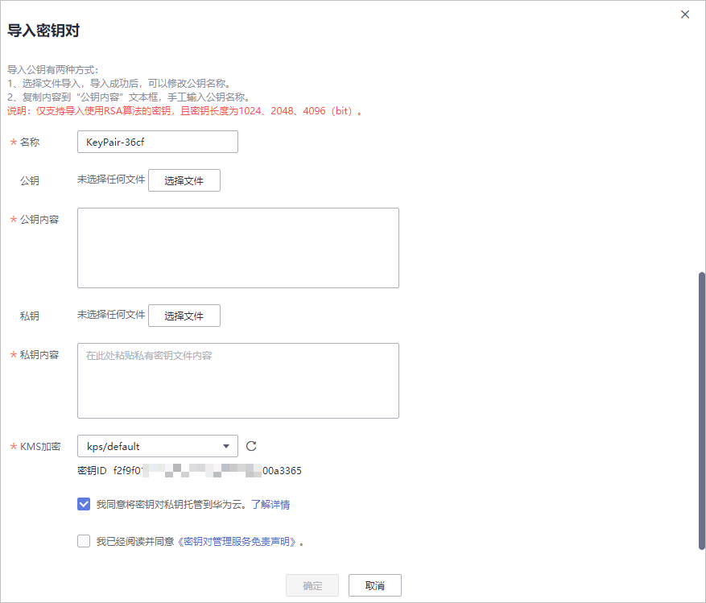

# 导入密钥对

若用户需要使用自己的密钥对（例如，使用**PuTTYgen**工具生成的密钥对），而不使用KMS生成的密钥对，用户可以把密钥对的公钥文件导入管理控制台使用，在远程登录弹性云服务器时，使用对应的私钥进行身份认证。用户也可根据自己的需要将私钥托管在华为云中，由华为云统一管理。

该任务指导用户通过密钥对管理界面导入密钥对。

## 前提条件

-   已获取管理控制台的登录帐号与密码。
-   支持导入的公钥文件的加解密算法为：
    -   SSH-2（RSA，1024）
    -   SSH-2（RSA，2048）
    -   SSH-2（RSA，4096）

## 导入密钥对

1.  登录管理控制台。
2.  单击管理控制台左上角，选择区域或项目。
3.  单击页面上方的“服务列表“，选择“安全  \>  数据加密服务“，默认进入数据加密服务的“密钥管理“界面。
4.  在左侧导航树中，选择“密钥对管理“，进入“密钥对列表“页面。
5.  单击“密钥对列表“页面右上角的“导入密钥对“，弹出“导入密钥对“对话框，如[图1](#fig5941841714437)所示。

    **图 1**  导入密钥对  
    

6.  单击“选择文件“，选择本地保存的公钥文件，或者将公钥内容复制并粘贴至“公钥内容“文本框中。

    > **说明：**   
    >用户可自定义导入密钥对的名称。  

7.  若需要托管私钥，请确认并勾选“我同意将密钥对私钥托管到华为云“，如[图2](#fig0776181161613)所示。若不需要托管私钥，请跳过此步骤。

    **图 2**  托管私钥到华为云  
    

    1.  单击“选择文件“，选择本地保存的私钥文件，或者将私钥内容复制并粘贴至“私钥内容“文本框中。

        上传或者拷贝至文本框的私钥必须是“.pem“格式文件，若是“.ppk“格式文件，需要通过以下步骤将“.ppk“格式文件转换为“.pem“格式文件。

        1.  双击“PUTTYGEN.exe“，打开“PuTTY Key Generator“，如[图3](#f68625d7525504cc1bbc7b0bc9efe3597)所示。

            **图 3**  打开PuTTY Key Generator  
            

        2.  选择“Conversions \> Import Key“导入格式为“.ppk“的私钥文件。
        3.  选择“Conversions \> Export OpenSSH Key“，弹出“PuTTYgen Warning“对话框。
        4.  单击“是“，将文件保存为“.pem“格式文件。

    2.  在“KMS加密“下拉列表中选择加密密钥。

        > **说明：**   
        >-   用户使用密钥对的KMS加密功能时，KMS会自动为密钥对创建一个“kps/default“默认主密钥。  
        >-   用户在选择加密密钥时，可选择已有的加密密钥，或者单击“查看密钥列表“，创建新的加密密钥。  

8.  请阅读并勾选“我已阅读并同意《密钥对管理服务免责声明》“。
9.  单击“确定“，导入密钥对。

