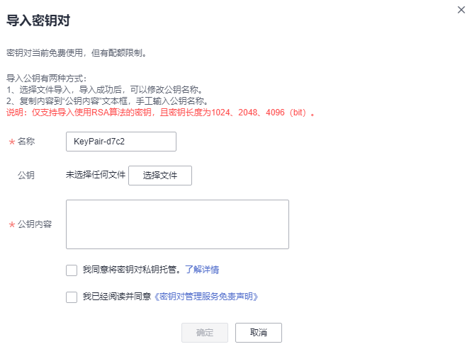

# 导入密钥对

若用户需要使用自己的密钥对时（例如，使用**PuTTYgen**工具创建的密钥对），用户可以把密钥对的公钥文件导入管理控制台，使用对应的私钥远程登录弹性云服务器。用户也可根据需要将私钥托管在华为云中，由华为云统一管理。

若多个IAM用户需要使用相同的密钥对时，用户可以先通过其他工具（例如，**PuTTYgen**工具）创建密钥对，然后分别在两个IAM用户的资源中导入您创建的密钥对。

## 前提条件

-   已准备好待导入的密钥对公钥文件和对应的私钥文件。
-   导入的密钥对为帐号密钥对，如果已经创建了相同名称的私有密钥对，导入账号密钥对时会提示密钥对名称已存在。
-   每个IAM用户下没有相同名称的私有密钥对。

## 约束条件

-   通过外部导入的SSH密钥对支持的加解密算法为：
    -   SSH-DSS
    -   SSH-ED25519
    -   ECDSA-SHA2-NISTP256
    -   ECDSA-SHA2-NISTP384
    -   ECDSA-SHA2-NISTP521
    -   SSH\_RSA有效长度为：2048，3072，4096

-   支持托管的私钥文件格式为“.pem“。

    若是“.ppk“格式文件，请参考[如何将“.ppk”格式的私钥文件转化为“.pem”格式](https://support.huaweicloud.com/dew_faq/dew_01_0099.html)进行转换。

## 操作步骤

1.  [登录管理控制台](https://console.huaweicloud.com)。
2.  单击管理控制台左上角的，选择区域或项目。
3.  单击页面左侧，选择“安全与合规  \>  数据加密服务“，默认进入“密钥管理“界面。
4.  在左侧导航树中，选择“密钥对管理“，进入“密钥对管理“页面。
5.  单击“导入密钥对“。
6.  在弹出“导入密钥对“对话框中，单击“选择文件“，导入公钥文件，或将公钥内容复制并粘贴至“公钥内容“文本框中，如[图1](#fig5941841714437)所示。

    **图 1**  导入密钥对  
    

    > **说明：** 
    >-   用户可自定义导入密钥对的名称。
    >-   若提示名称已存在，是由于其他IAM用户创建了同名的私有密钥对，需修改密钥对名称。

7.  若需要托管私钥，请确认并勾选“我同意将密钥对私钥托管“，如[图 托管私钥](#fig551553412127)所示。若不需要托管私钥，请跳过此步骤。

    **图 2**  托管私钥  
    

    1.  单击“选择文件“，选择待导入的私钥文件（“.pem“格式），或将私钥内容复制并粘贴至“私钥内容“文本框中。
    2.  在“KMS加密“下拉列表中选择加密密钥。

        > **说明：** 
        >-   KPS采用KMS提供的加密密钥对私钥进行加密，用户在密钥对的KMS加密功能时，KMS会自动为密钥对创建一个默认主密钥“kps/default“。
        >-   用户在选择加密密钥时，可选择已有的加密密钥，或者单击“查看密钥列表“，创建新的加密密钥。

8.  请阅读《密钥对管理服务免责声明》后，勾选“我已阅读并同意《密钥对管理服务免责声明》“。
9.  单击“确定“，导入密钥对。

