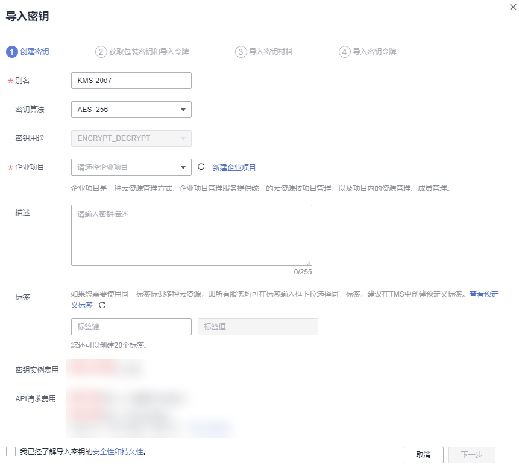
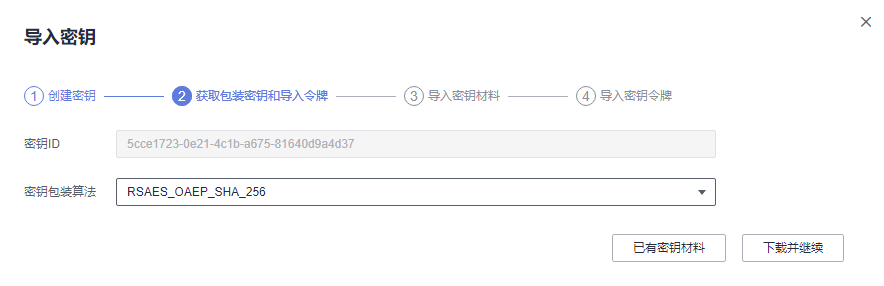

# 导入密钥材料<a name="dew_01_0089"></a>

当用户希望使用自己的密钥材料，而不是KMS生成的密钥材料时，可通过密钥管理界面将自己的密钥材料导入到KMS，由KMS统一管理。

该任务指导用户通过密钥管理界面导入密钥材料。

## 约束条件<a name="section89579198379"></a>

HMAC密钥算法不支持导入密钥材料。

## 操作步骤<a name="scfd68ea997e74909a825386e20128afc"></a>

1.  [登录管理控制台](https://console.huaweicloud.com)。
2.  单击管理控制台左上角，选择区域或项目。
3.  单击页面左侧，选择“安全与合规  \>  数据加密服务“，默认进入“密钥管理“界面。
4.  单击“导入密钥“，弹出“导入密钥“对话框。
5.  在弹出的对话框中填写密钥参数。

    **图 1**  创建空密钥<a name="fig1056075517247"></a>  
    

    -   别名：待创建密钥的别名。

        > **说明：** 
        >-   输入字符支持数字、字母、“\_”、“-”、“:”和“/”。
        >-   支持长度为1 \~ 255个字符。

    -   密钥算法：选择密钥算法。KMS支持的密钥算法说明如[表1](#dew_01_0178_table0624027274)所示。

        **表 1**  KMS支持的密钥算法类型

        <a name="dew_01_0178_table0624027274"></a>
        <table><thead align="left"><tr id="dew_01_0178_dew_01_7775_row1062492152718"><th class="cellrowborder" valign="top" width="19.79%" id="mcps1.2.6.1.1"><p id="dew_01_0178_dew_01_7775_p6624525278"><a name="dew_01_0178_dew_01_7775_p6624525278"></a><a name="dew_01_0178_dew_01_7775_p6624525278"></a>密钥类型</p>
        </th>
        <th class="cellrowborder" valign="top" width="17.82%" id="mcps1.2.6.1.2"><p id="dew_01_0178_dew_01_7775_p126241216278"><a name="dew_01_0178_dew_01_7775_p126241216278"></a><a name="dew_01_0178_dew_01_7775_p126241216278"></a>算法类型</p>
        </th>
        <th class="cellrowborder" valign="top" width="22.29%" id="mcps1.2.6.1.3"><p id="dew_01_0178_dew_01_7775_p1262442102713"><a name="dew_01_0178_dew_01_7775_p1262442102713"></a><a name="dew_01_0178_dew_01_7775_p1262442102713"></a>密钥规格</p>
        </th>
        <th class="cellrowborder" valign="top" width="20.1%" id="mcps1.2.6.1.4"><p id="dew_01_0178_dew_01_7775_p062416292712"><a name="dew_01_0178_dew_01_7775_p062416292712"></a><a name="dew_01_0178_dew_01_7775_p062416292712"></a>说明</p>
        </th>
        <th class="cellrowborder" valign="top" width="20%" id="mcps1.2.6.1.5"><p id="dew_01_0178_dew_01_7775_p12624827271"><a name="dew_01_0178_dew_01_7775_p12624827271"></a><a name="dew_01_0178_dew_01_7775_p12624827271"></a>用途</p>
        </th>
        </tr>
        </thead>
        <tbody><tr id="dew_01_0178_dew_01_7775_row1762412272713"><td class="cellrowborder" valign="top" width="19.79%" headers="mcps1.2.6.1.1 "><p id="dew_01_0178_dew_01_7775_p13624162172711"><a name="dew_01_0178_dew_01_7775_p13624162172711"></a><a name="dew_01_0178_dew_01_7775_p13624162172711"></a>对称密钥</p>
        </td>
        <td class="cellrowborder" valign="top" width="17.82%" headers="mcps1.2.6.1.2 "><p id="dew_01_0178_dew_01_7775_p462412152717"><a name="dew_01_0178_dew_01_7775_p462412152717"></a><a name="dew_01_0178_dew_01_7775_p462412152717"></a>AES</p>
        </td>
        <td class="cellrowborder" valign="top" width="22.29%" headers="mcps1.2.6.1.3 "><p id="dew_01_0178_dew_01_7775_p146244272717"><a name="dew_01_0178_dew_01_7775_p146244272717"></a><a name="dew_01_0178_dew_01_7775_p146244272717"></a>AES_256</p>
        </td>
        <td class="cellrowborder" valign="top" width="20.1%" headers="mcps1.2.6.1.4 "><p id="dew_01_0178_dew_01_7775_p86241925279"><a name="dew_01_0178_dew_01_7775_p86241925279"></a><a name="dew_01_0178_dew_01_7775_p86241925279"></a>AES对称密钥</p>
        </td>
        <td class="cellrowborder" valign="top" width="20%" headers="mcps1.2.6.1.5 "><p id="dew_01_0178_dew_01_7775_p1962410232712"><a name="dew_01_0178_dew_01_7775_p1962410232712"></a><a name="dew_01_0178_dew_01_7775_p1962410232712"></a>小量数据的加解密或用于加解密数据密钥。</p>
        </td>
        </tr>
        <tr id="dew_01_0178_dew_01_7775_row451864395510"><td class="cellrowborder" valign="top" width="19.79%" headers="mcps1.2.6.1.1 "><p id="dew_01_0178_dew_01_7775_p11259105313457"><a name="dew_01_0178_dew_01_7775_p11259105313457"></a><a name="dew_01_0178_dew_01_7775_p11259105313457"></a>对称密钥</p>
        </td>
        <td class="cellrowborder" valign="top" width="17.82%" headers="mcps1.2.6.1.2 "><p id="dew_01_0178_dew_01_7775_p19518194320558"><a name="dew_01_0178_dew_01_7775_p19518194320558"></a><a name="dew_01_0178_dew_01_7775_p19518194320558"></a>SM4</p>
        </td>
        <td class="cellrowborder" valign="top" width="22.29%" headers="mcps1.2.6.1.3 "><p id="dew_01_0178_dew_01_7775_p15518104375516"><a name="dew_01_0178_dew_01_7775_p15518104375516"></a><a name="dew_01_0178_dew_01_7775_p15518104375516"></a>SM4</p>
        </td>
        <td class="cellrowborder" valign="top" width="20.1%" headers="mcps1.2.6.1.4 "><p id="dew_01_0178_dew_01_7775_p951814375518"><a name="dew_01_0178_dew_01_7775_p951814375518"></a><a name="dew_01_0178_dew_01_7775_p951814375518"></a>国密SM4对称密钥</p>
        </td>
        <td class="cellrowborder" valign="top" width="20%" headers="mcps1.2.6.1.5 "><p id="dew_01_0178_dew_01_7775_p351816433557"><a name="dew_01_0178_dew_01_7775_p351816433557"></a><a name="dew_01_0178_dew_01_7775_p351816433557"></a>小量数据的加解密或用于加解密数据密钥。</p>
        </td>
        </tr>
        <tr id="dew_01_0178_dew_01_7775_row51341950153118"><td class="cellrowborder" rowspan="2" valign="top" width="19.79%" headers="mcps1.2.6.1.1 "><p id="dew_01_0178_dew_01_7775_p17135145013312"><a name="dew_01_0178_dew_01_7775_p17135145013312"></a><a name="dew_01_0178_dew_01_7775_p17135145013312"></a>非对称密钥</p>
        </td>
        <td class="cellrowborder" valign="top" width="17.82%" headers="mcps1.2.6.1.2 "><p id="dew_01_0178_dew_01_7775_p121351050163112"><a name="dew_01_0178_dew_01_7775_p121351050163112"></a><a name="dew_01_0178_dew_01_7775_p121351050163112"></a>RSA</p>
        </td>
        <td class="cellrowborder" valign="top" width="22.29%" headers="mcps1.2.6.1.3 "><a name="dew_01_0178_dew_01_7775_ul858832973417"></a><a name="dew_01_0178_dew_01_7775_ul858832973417"></a><ul id="dew_01_0178_dew_01_7775_ul858832973417"><li>RSA_2048</li><li>RSA_3072</li><li>RSA_4096</li></ul>
        </td>
        <td class="cellrowborder" valign="top" width="20.1%" headers="mcps1.2.6.1.4 "><p id="dew_01_0178_dew_01_7775_p1613595015317"><a name="dew_01_0178_dew_01_7775_p1613595015317"></a><a name="dew_01_0178_dew_01_7775_p1613595015317"></a>RSA非对称密钥</p>
        </td>
        <td class="cellrowborder" valign="top" width="20%" headers="mcps1.2.6.1.5 "><p id="dew_01_0178_dew_01_7775_p72784171290"><a name="dew_01_0178_dew_01_7775_p72784171290"></a><a name="dew_01_0178_dew_01_7775_p72784171290"></a>小量数据的加解密或数字签名。</p>
        </td>
        </tr>
        <tr id="dew_01_0178_dew_01_7775_row037145343118"><td class="cellrowborder" valign="top" headers="mcps1.2.6.1.1 "><p id="dew_01_0178_dew_01_7775_p14371539318"><a name="dew_01_0178_dew_01_7775_p14371539318"></a><a name="dew_01_0178_dew_01_7775_p14371539318"></a>ECC</p>
        </td>
        <td class="cellrowborder" valign="top" headers="mcps1.2.6.1.2 "><a name="dew_01_0178_dew_01_7775_ul384511534343"></a><a name="dew_01_0178_dew_01_7775_ul384511534343"></a><ul id="dew_01_0178_dew_01_7775_ul384511534343"><li>EC_P256</li><li>EC_P384</li></ul>
        </td>
        <td class="cellrowborder" valign="top" headers="mcps1.2.6.1.3 "><p id="dew_01_0178_dew_01_7775_p43795363116"><a name="dew_01_0178_dew_01_7775_p43795363116"></a><a name="dew_01_0178_dew_01_7775_p43795363116"></a>椭圆曲线密码，使用NIST推荐的椭圆曲线</p>
        </td>
        <td class="cellrowborder" valign="top" headers="mcps1.2.6.1.4 "><p id="dew_01_0178_dew_01_7775_p1537145343114"><a name="dew_01_0178_dew_01_7775_p1537145343114"></a><a name="dew_01_0178_dew_01_7775_p1537145343114"></a>数字签名</p>
        </td>
        </tr>
        <tr id="dew_01_0178_dew_01_7775_row870310269368"><td class="cellrowborder" valign="top" width="19.79%" headers="mcps1.2.6.1.1 "><p id="dew_01_0178_dew_01_7775_p108071810104611"><a name="dew_01_0178_dew_01_7775_p108071810104611"></a><a name="dew_01_0178_dew_01_7775_p108071810104611"></a>非对称密钥</p>
        </td>
        <td class="cellrowborder" valign="top" width="17.82%" headers="mcps1.2.6.1.2 "><p id="dew_01_0178_dew_01_7775_p11703926143613"><a name="dew_01_0178_dew_01_7775_p11703926143613"></a><a name="dew_01_0178_dew_01_7775_p11703926143613"></a>SM2</p>
        </td>
        <td class="cellrowborder" valign="top" width="22.29%" headers="mcps1.2.6.1.3 "><p id="dew_01_0178_dew_01_7775_p137039261366"><a name="dew_01_0178_dew_01_7775_p137039261366"></a><a name="dew_01_0178_dew_01_7775_p137039261366"></a>SM2</p>
        </td>
        <td class="cellrowborder" valign="top" width="20.1%" headers="mcps1.2.6.1.4 "><p id="dew_01_0178_dew_01_7775_p11703112610366"><a name="dew_01_0178_dew_01_7775_p11703112610366"></a><a name="dew_01_0178_dew_01_7775_p11703112610366"></a>国密SM2非对称密钥</p>
        </td>
        <td class="cellrowborder" valign="top" width="20%" headers="mcps1.2.6.1.5 "><p id="dew_01_0178_dew_01_7775_p2070372653614"><a name="dew_01_0178_dew_01_7775_p2070372653614"></a><a name="dew_01_0178_dew_01_7775_p2070372653614"></a>小量数据的加解密或数字签名。</p>
        </td>
        </tr>
        </tbody>
        </table>

    -   密钥用途：可选择“SIGN\_VERIFY“、“ENCRYPT\_DECRYPT“、“GENERATE\_VERIFY\_MAC“。

        -   对于AES\_256对称密钥，默认值“ENCRYPT\_DECRYPT“。
        -   对于HMAC对称密钥，默认值“GENERATE\_VERIFY\_MAC“。
        -   对于RSA非对称密钥，可选择“ENCRYPT\_DECRYPT“或“SIGN\_VERIFY“，省略参数为默认值“SIGN\_VERIFY“。
        -   对于ECC非对称密钥，默认值“SIGN\_VERIFY“。
        -   对于SM2非对称密钥，可选择“ENCRYPT\_DECRYPT“或“SIGN\_VERIFY“，省略参数为默认值“SIGN\_VERIFY“。

        > **说明：** 
        >创建密钥时请选择“密钥用途“，密钥创建后不可修改。

    -   （可选）描述：可根据自己的需要为自定义密钥添加描述。
    -   企业项目：该参数针对企业用户使用。

        如果您是企业用户，且已创建企业项目，则请从下拉列表中为密钥选择需要绑定的企业项目，默认项目为“default“。

        未开通企业管理的用户页面则没有“企业项目“参数项，无需进行配置。

        > **说明：** 
        >-   企业项目是一种云资源管理方式，企业项目管理服务提供统一的云资源按项目管理，以及项目内的资源管理、成员管理。更多关于企业项目的信息，请参见[《什么是企业项目管理？》](https://support.huaweicloud.com/usermanual-em/em_eps_01_0000.html)。
        >-   如需开通企业项目，请参考[如何开通企业项目/企业多帐号](https://support.huaweicloud.com/usermanual-em/em_am_0008.html)。

6.  （可选）用户可根据自己的需要为自定义密钥添加标签，输入“标签键“和“标签值“。

    > **说明：** 
    >-   当用户在创建密钥时，没有为该自定义密钥添加标签。若用户需要为该自定义密钥添加标签，可单击该自定义密钥的别名，进入密钥详情页面，单击“标签“，为该自定义密钥添加标签。
    >-   同一个自定义密钥下，一个标签键只能对应一个标签值；不同的自定义密钥下可以使用相同的标签键。
    >-   用户最多可以给单个自定义密钥添加20个标签。
    >-   当同时添加多个标签，需要删除其中一个待添加的标签时，可单击该标签所在行的“删除“，删除标签。

7.  单击“安全性与持久性“阅读并了解导入密钥的安全性和持久性。
8.  勾选“我已经了解导入密钥的安全性和持久性“，创建密钥材料为空的自定义密钥。
9.  单击“下一步“，进入“获取包装密钥和导入令牌“页面。根据[表2](#tc7ccf66255f74e4a8a34c7dbf91b9e91)选择密钥包装算法。

    **图 2**  获取包装密钥和导入令牌<a name="fe56edb123b2a43fabac94367be45655d"></a>  
    

    **表 2**  密钥包装算法说明

    <a name="tc7ccf66255f74e4a8a34c7dbf91b9e91"></a>
    <table><thead align="left"><tr id="r5af13f78ad7a4a52888456be117e309d"><th class="cellrowborder" valign="top" width="23.232323232323235%" id="mcps1.2.4.1.1"><p id="a84e13d4eda974a34b6047aaaaf2609b9"><a name="a84e13d4eda974a34b6047aaaaf2609b9"></a><a name="a84e13d4eda974a34b6047aaaaf2609b9"></a>密钥包装算法</p>
    </th>
    <th class="cellrowborder" valign="top" width="36%" id="mcps1.2.4.1.2"><p id="a8ba32982efd5488b8a941628e5f32d67"><a name="a8ba32982efd5488b8a941628e5f32d67"></a><a name="a8ba32982efd5488b8a941628e5f32d67"></a>说明</p>
    </th>
    <th class="cellrowborder" valign="top" width="40.76767676767677%" id="mcps1.2.4.1.3"><p id="a50f597a548154ba3a479f3598b557cca"><a name="a50f597a548154ba3a479f3598b557cca"></a><a name="a50f597a548154ba3a479f3598b557cca"></a>设置</p>
    </th>
    </tr>
    </thead>
    <tbody><tr id="r62d12246873e493f93cca24c61f27e1d"><td class="cellrowborder" valign="top" width="23.232323232323235%" headers="mcps1.2.4.1.1 "><p id="a8a51426c118645de8a23c7b66d0a48f0"><a name="a8a51426c118645de8a23c7b66d0a48f0"></a><a name="a8a51426c118645de8a23c7b66d0a48f0"></a>RSAES_OAEP_SHA_256</p>
    </td>
    <td class="cellrowborder" valign="top" width="36%" headers="mcps1.2.4.1.2 "><p id="a58e8d154b0ef4fca80e18c1266e7682d"><a name="a58e8d154b0ef4fca80e18c1266e7682d"></a><a name="a58e8d154b0ef4fca80e18c1266e7682d"></a>具有<span class="parmvalue" id="p2d5cd9fb83f84f34b9727ee1280eaf07"><a name="p2d5cd9fb83f84f34b9727ee1280eaf07"></a><a name="p2d5cd9fb83f84f34b9727ee1280eaf07"></a>“SHA-256”</span>哈希函数的OAEP的RSA加密算法。</p>
    </td>
    <td class="cellrowborder" rowspan="2" valign="top" width="40.76767676767677%" headers="mcps1.2.4.1.3 "><p id="p11171362019"><a name="p11171362019"></a><a name="p11171362019"></a>请您根据自己的HSM功能选择加密算法。</p>
    <a name="ol3171561612"></a><a name="ol3171561612"></a><ol id="ol3171561612"><li>如果您的HSM支持<span class="parmvalue" id="parmvalue141716616119"><a name="parmvalue141716616119"></a><a name="parmvalue141716616119"></a>“RSAES_OAEP_SHA_256”</span>加密算法，推荐使用<span class="parmvalue" id="parmvalue717186515"><a name="parmvalue717186515"></a><a name="parmvalue717186515"></a>“RSAES_OAEP_SHA_256”</span>加密密钥材料。</li><li>如果您的HSM不支持<span class="parmvalue" id="parmvalue91718616115"><a name="parmvalue91718616115"></a><a name="parmvalue91718616115"></a>“OAEP”</span>选项，用户可以使用<span class="parmvalue" id="parmvalue1171196617"><a name="parmvalue1171196617"></a><a name="parmvalue1171196617"></a>“RSAES_PKCS1_V1_5”</span>加密密钥材料。</li></ol>
    <div class="notice" id="note1917112610117"><a name="note1917112610117"></a><a name="note1917112610117"></a><span class="noticetitle"> 须知： </span><div class="noticebody"><p id="p71715617117"><a name="p71715617117"></a><a name="p71715617117"></a><span class="parmvalue" id="parmvalue81711161214"><a name="parmvalue81711161214"></a><a name="parmvalue81711161214"></a>“RSAES_OAEP_SHA_1”</span>加密算法已经不再安全，请谨慎选择。</p>
    </div></div>
    </td>
    </tr>
    <tr id="row7557102825917"><td class="cellrowborder" valign="top" headers="mcps1.2.4.1.1 "><p id="p115591291209"><a name="p115591291209"></a><a name="p115591291209"></a>RSAES_OAEP_SHA_1</p>
    </td>
    <td class="cellrowborder" valign="top" headers="mcps1.2.4.1.2 "><p id="p95597910017"><a name="p95597910017"></a><a name="p95597910017"></a>具有<span class="parmvalue" id="parmvalue1355911916014"><a name="parmvalue1355911916014"></a><a name="parmvalue1355911916014"></a>“SHA-1”</span>哈希函数的OAEP的RSA加密算法。</p>
    </td>
    </tr>
    <tr id="row17802111612501"><td class="cellrowborder" valign="top" width="23.232323232323235%" headers="mcps1.2.4.1.1 "><p id="p1880261615019"><a name="p1880261615019"></a><a name="p1880261615019"></a>SM2_ENCRYPT</p>
    </td>
    <td class="cellrowborder" valign="top" width="36%" headers="mcps1.2.4.1.2 "><p id="p18802141618504"><a name="p18802141618504"></a><a name="p18802141618504"></a>国密推荐的SM2椭圆曲线公钥密码算法。</p>
    </td>
    <td class="cellrowborder" valign="top" width="40.76767676767677%" headers="mcps1.2.4.1.3 "><p id="p118021816165011"><a name="p118021816165011"></a><a name="p118021816165011"></a>请在支持国密的局点使用SM2加密算法。</p>
    </td>
    </tr>
    </tbody>
    </table>

    > **说明：** 
    >当用户执行“导入密钥”操作，但未成功导入密钥材料便退出操作过程时，可在待导入密钥材料的自定义密钥所在行单击“导入密钥材料”，页面会弹出“导入密钥材料”对话框，用户可继续执行导入密钥材料的操作。

10. 获取“包装密钥“和“导入令牌“，并加密密钥材料，如果您已有密钥材料，可跳过本步骤。
    1.  获取“包装密钥“和“导入令牌“。
        -   方法一：单击“下载并继续“，下载的文件为包装密钥，如[图 下载文件](#fig118341118183611)所示。

            **图 3**  下载文件<a name="fig118341118183611"></a>  
            

            -   wrappingKey\__密钥ID_：即包装密钥，编码为二进制格式，用于加密密钥材料的包装密钥。
            -   导入令牌：引导程序自动传递导入令牌，无需下载，若中途退出引导程序，导入令牌将自动失效。

            > **须知：** 
            >包装密钥将在24小时后失效，失效后将不能使用。如果包装密钥失效，请重新下载包装密钥。
            >引导程序将自动传递导入令牌，若创建密钥过程中，关闭或者退出设置则导入令牌失效。重新发起导入密钥材料操作时，导入令牌引导程序自动启动。

        -   <a name="li452117406444"></a>方法二：通过调用API接口的方式获取包装密钥和导入令牌。
            1.  调用“get-parameters-for-import“接口，获取包装密钥和导入令牌。

                -   public\_key：调用API接口返回的base64编码的包装密钥内容。
                -   import\_token：调用API接口返回的base64编码的导入令牌内容。

                以获取密钥ID为“43f1ffd7-18fb-4568-9575-602e009b7ee8“，加密算法为“RSAES\_OAEP\_SHA\_256“的包装密钥和导入令牌为例。

                -   请求样例

                    ```
                    {      
                        "key_id": "43f1ffd7-18fb-4568-9575-602e009b7ee8",
                        "wrapping_algorithm":"RSAES_OAEP_SHA_256"
                    }
                    ```

                -   响应样例

                    ```
                    {
                        "key_id": "43f1ffd7-18fb-4568-9575-602e009b7ee8",    
                        "public_key":"public key base64 encoded data",
                        "import_token":"import token base64 encoded data",
                        "expiration_time":1501578672
                    }
                    ```

            2.  保存包装密钥，包装密钥需要按照以下步骤转换格式。使用转换格式后的包装密钥加密的密钥材料才能成功导入管理控制台。
                1.  复制包装密钥“public\_key“的内容，粘贴到“.txt“文件中，并保存为“PublicKey.b64“。
                2.  使用OpenSSL，执行以下命令，对“PublicKey.b64“文件内容进行base64转码，生成二进制数据，并将转码后的文件保存为“PublicKey.bin“。

                    **openssl** **enc** **-d** **-base64** **-A** **-in** **PublicKey.b64** **-out** **PublicKey.bin**

            3.  保存导入令牌，复制导入令牌“import\_token“的内容，粘贴到“.txt“文件中，并保存为“ImportToken.b64“。

    2.  使用“包装密钥“加密密钥材料。

        > **说明：** 
        >执行完此步骤后可获得以下文件：
        >对称密钥场景：**EncryptedKeyMaterial.bin**密钥材料
        >非对称密钥场景：**EncryptedKeyMaterial.bin**临时密钥材料和**out\_rsa\_private\_key.der/out\_sm2\_private\_key**私钥密文

        方法一：使用下载的包装密钥在自己的HSM中加密密钥材料，详细信息请参考您的HSM操作指南。

        方法二：使用OpenSSL生成密钥材料，并用下载的“包装密钥“对密钥材料进行加密。

        > **说明：** 
        >若用户需要使用**openssl** **pkeyutl**命令，OpenSSL需要是1.0.2及以上版本。
        >若用户使用SM2公钥包装，需要支持gmssl命令。

        1.  生成密钥材料（256位对称密钥），并将生成的密钥材料以“PlaintextKeyMaterial.bin“命名保存。
            -   配套算法为AES256对称密钥时，在已安装OpenSSL工具的客户端上，执行以下命令。

                **openssl** **rand** **-out** _**PlaintextKeyMaterial.bin**_ **32**

            -   配套算法为SM4国密时，在已安装OpenSSL工具的客户端上，执行以下命令。

                **openssl rand -out  _PlaintextKeyMaterial.bin _16**

            -   配套算法为RSA、ECC非对称密钥时，在已安装OpenSSL工具的客户端上，执行以下命令。
                1.  生成16进制AES256密钥：

                    **openssl rand -out 0xPlaintextKeyMaterial.bin -hex 32**

                2.  将16进制AES256密钥转换成二进制格式：

                    **cat 0xPlaintextKeyMaterial.bin | xxd -r -ps \> PlaintextKeyMaterial.bin**

            -   配套算法为SM2非对称密钥时，在已安装OpenSSL工具的客户端上，执行以下命令。
                1.  生成16进制SM4密钥：

                    **openssl rand -out 0xPlaintextKeyMaterial.bin -hex 16**

                2.  将16进制SM4密钥转换成二进制格式：

                    **cat 0xPlaintextKeyMaterial.bin | xxd -r -ps \> PlaintextKeyMaterial.bin**

        2.  <a name="li12585410398"></a>使用下载的“包装密钥“加密密钥材料，并将加密后的密钥材料按“EncryptedKeyMaterial.bin“命名保存。

            若“包装密钥“由控制台下载，以下命令中的**_PublicKey.bin_**参数请以下载的包装密钥名称_wrappingKey\_密钥ID_进行替换。

            **表 3**  使用下载的包装密钥加密生成的密钥材料

            <a name="table1487623916588"></a>
            <table><thead align="left"><tr id="row8876123912581"><th class="cellrowborder" valign="top" width="27.97%" id="mcps1.2.3.1.1"><p id="p108761739105812"><a name="p108761739105812"></a><a name="p108761739105812"></a>包装密钥算法</p>
            </th>
            <th class="cellrowborder" valign="top" width="72.03%" id="mcps1.2.3.1.2"><p id="p14876163945812"><a name="p14876163945812"></a><a name="p14876163945812"></a>加密生成的密钥材料</p>
            </th>
            </tr>
            </thead>
            <tbody><tr id="row118761393587"><td class="cellrowborder" valign="top" width="27.97%" headers="mcps1.2.3.1.1 "><p id="p38763394588"><a name="p38763394588"></a><a name="p38763394588"></a>RSAES_OAEP_SHA_256</p>
            </td>
            <td class="cellrowborder" valign="top" width="72.03%" headers="mcps1.2.3.1.2 "><p id="p128763392586"><a name="p128763392586"></a><a name="p128763392586"></a><strong id="b887619392588"><a name="b887619392588"></a><a name="b887619392588"></a>openssl</strong> <strong id="b1787653914586"><a name="b1787653914586"></a><a name="b1787653914586"></a>pkeyutl</strong></p>
            <p id="p887643915583"><a name="p887643915583"></a><a name="p887643915583"></a><strong id="b20876113945818"><a name="b20876113945818"></a><a name="b20876113945818"></a>-in</strong> <em id="i9876113955817"><a name="i9876113955817"></a><a name="i9876113955817"></a><strong id="b08761239145810"><a name="b08761239145810"></a><a name="b08761239145810"></a>PlaintextKeyMaterial.bin</strong></em></p>
            <p id="p4876839165812"><a name="p4876839165812"></a><a name="p4876839165812"></a><strong id="b12876163915589"><a name="b12876163915589"></a><a name="b12876163915589"></a>-inkey</strong> <strong id="b38761939175817"><a name="b38761939175817"></a><a name="b38761939175817"></a><em id="i17876183918581"><a name="i17876183918581"></a><a name="i17876183918581"></a>PublicKey.bin</em></strong></p>
            <p id="p1387620398584"><a name="p1387620398584"></a><a name="p1387620398584"></a><strong id="b5876123915812"><a name="b5876123915812"></a><a name="b5876123915812"></a>-out</strong> <em id="i68761439135818"><a name="i68761439135818"></a><a name="i68761439135818"></a><strong id="b287653916581"><a name="b287653916581"></a><a name="b287653916581"></a>EncryptedKeyMaterial.bin</strong></em></p>
            <p id="p1876113910589"><a name="p1876113910589"></a><a name="p1876113910589"></a><strong id="b2876113985810"><a name="b2876113985810"></a><a name="b2876113985810"></a>-keyform</strong> <strong id="b138761939115813"><a name="b138761939115813"></a><a name="b138761939115813"></a>der</strong></p>
            <p id="p17876153917585"><a name="p17876153917585"></a><a name="p17876153917585"></a><strong id="b1876193915585"><a name="b1876193915585"></a><a name="b1876193915585"></a>-pubin</strong> <strong id="b12876839175819"><a name="b12876839175819"></a><a name="b12876839175819"></a>-encrypt</strong></p>
            <p id="p12877163919582"><a name="p12877163919582"></a><a name="p12877163919582"></a><strong id="b987703995811"><a name="b987703995811"></a><a name="b987703995811"></a>-pkeyopt</strong> <strong id="b178770398587"><a name="b178770398587"></a><a name="b178770398587"></a>rsa_padding_mode:oaep</strong> <strong id="b1987716392587"><a name="b1987716392587"></a><a name="b1987716392587"></a>-pkeyopt rsa_oaep_md:sha256</strong></p>
            </td>
            </tr>
            <tr id="row78771839205814"><td class="cellrowborder" valign="top" width="27.97%" headers="mcps1.2.3.1.1 "><p id="p1787723975811"><a name="p1787723975811"></a><a name="p1787723975811"></a>RSAES_OAEP_SHA_1</p>
            </td>
            <td class="cellrowborder" valign="top" width="72.03%" headers="mcps1.2.3.1.2 "><p id="p12877739195814"><a name="p12877739195814"></a><a name="p12877739195814"></a><strong id="b108771939125820"><a name="b108771939125820"></a><a name="b108771939125820"></a>openssl</strong> <strong id="b158771398583"><a name="b158771398583"></a><a name="b158771398583"></a>pkeyutl</strong></p>
            <p id="p9877239115819"><a name="p9877239115819"></a><a name="p9877239115819"></a><strong id="b1387823975817"><a name="b1387823975817"></a><a name="b1387823975817"></a>-in</strong> <em id="i58781639195820"><a name="i58781639195820"></a><a name="i58781639195820"></a><strong id="b3878183995819"><a name="b3878183995819"></a><a name="b3878183995819"></a>PlaintextKeyMaterial.bin</strong></em></p>
            <p id="p1887803913582"><a name="p1887803913582"></a><a name="p1887803913582"></a><strong id="b5878193912584"><a name="b5878193912584"></a><a name="b5878193912584"></a>-inkey</strong> <strong id="b5878153925819"><a name="b5878153925819"></a><a name="b5878153925819"></a><em id="i1587823935817"><a name="i1587823935817"></a><a name="i1587823935817"></a>PublicKey.bin</em></strong></p>
            <p id="p787873914588"><a name="p787873914588"></a><a name="p787873914588"></a><strong id="b1587812395582"><a name="b1587812395582"></a><a name="b1587812395582"></a>-out</strong> <em id="i28782039125817"><a name="i28782039125817"></a><a name="i28782039125817"></a><strong id="b8878143945815"><a name="b8878143945815"></a><a name="b8878143945815"></a>EncryptedKeyMaterial.bin</strong></em></p>
            <p id="p2878173995813"><a name="p2878173995813"></a><a name="p2878173995813"></a><strong id="b287873945819"><a name="b287873945819"></a><a name="b287873945819"></a>-keyform</strong> <strong id="b18878173910586"><a name="b18878173910586"></a><a name="b18878173910586"></a>der</strong></p>
            <p id="p13878163985811"><a name="p13878163985811"></a><a name="p13878163985811"></a><strong id="b08784391583"><a name="b08784391583"></a><a name="b08784391583"></a>-pubin</strong> <strong id="b487823915587"><a name="b487823915587"></a><a name="b487823915587"></a>-encrypt</strong></p>
            <p id="p4878439105815"><a name="p4878439105815"></a><a name="p4878439105815"></a><strong id="b8878183925812"><a name="b8878183925812"></a><a name="b8878183925812"></a>-pkeyopt</strong> <strong id="b13878439105815"><a name="b13878439105815"></a><a name="b13878439105815"></a>rsa_padding_mode:oaep</strong> <strong id="b387823919587"><a name="b387823919587"></a><a name="b387823919587"></a>-pkeyopt</strong> <strong id="b48781739185819"><a name="b48781739185819"></a><a name="b48781739185819"></a>rsa_oaep_md:sha1</strong></p>
            </td>
            </tr>
            <tr id="row4878143915580"><td class="cellrowborder" valign="top" width="27.97%" headers="mcps1.2.3.1.1 "><p id="p887863917585"><a name="p887863917585"></a><a name="p887863917585"></a>SM2_ENCRYPT</p>
            </td>
            <td class="cellrowborder" valign="top" width="72.03%" headers="mcps1.2.3.1.2 "><p id="p148787398589"><a name="p148787398589"></a><a name="p148787398589"></a><strong id="b148785393587"><a name="b148785393587"></a><a name="b148785393587"></a>gmssl pkeyutl</strong></p>
            <p id="p987833995810"><a name="p987833995810"></a><a name="p987833995810"></a><strong id="b987833975818"><a name="b987833975818"></a><a name="b987833975818"></a>-encrypt -pkeyopt ec_scheme:sm2</strong></p>
            <p id="p148781939175811"><a name="p148781939175811"></a><a name="p148781939175811"></a><strong id="b7878193912589"><a name="b7878193912589"></a><a name="b7878193912589"></a>-pkeyopt ec_encrypt_param:sm3</strong></p>
            <p id="p387853919580"><a name="p387853919580"></a><a name="p387853919580"></a><strong id="b1287823911586"><a name="b1287823911586"></a><a name="b1287823911586"></a>-in <em id="i48781339195817"><a name="i48781339195817"></a><a name="i48781339195817"></a>PlaintextKeyMaterial.bin</em></strong></p>
            <p id="p10878139125816"><a name="p10878139125816"></a><a name="p10878139125816"></a><strong id="b16878143925820"><a name="b16878143925820"></a><a name="b16878143925820"></a>-pubin -inkey <i><span class="varname" id="varname4878739175810"><a name="varname4878739175810"></a><a name="varname4878739175810"></a>PublicKey.bin</span></i></strong></p>
            <p id="p9878739165815"><a name="p9878739165815"></a><a name="p9878739165815"></a><strong id="b1887813395582"><a name="b1887813395582"></a><a name="b1887813395582"></a>-keyform der</strong></p>
            <p id="p4878173915819"><a name="p4878173915819"></a><a name="p4878173915819"></a><strong id="b1987812391587"><a name="b1987812391587"></a><a name="b1987812391587"></a>-out EncryptedKeyMaterial.bin</strong></p>
            </td>
            </tr>
            </tbody>
            </table>

        3.  <a name="li287144863910"></a>（可选）对于导入非对称密钥的场景，需要生成非对称私钥，并使用临时密钥材料（“ EncryptedKeyMaterial.bin“）对私钥进行加密，加密后的文件作为“私钥密文“导入。
            -   执行以下命令（以配套算法为“RSA4096算法“为例）：
                1.  生成私钥

                    **openssl genrsa -out pkcs1\_rsa\_private\_key.pem 4096**

                2.  格式转换成pkcs8格式

                    **openssl pkcs8 -topk8 -inform PEM -in pkcs1\_rsa\_private\_key.pem -outform pem -nocrypt -out rsa\_private\_key.pem**

                3.  pkcs8格式转换成der格式

                    **openssl pkcs8 -topk8 -inform PEM -outform DER -in rsa\_private\_key.pem -out rsa\_private\_key.der -nocrypt**

                4.  使用临时密钥材料对私钥进行加密

                    **openssl enc -id-aes256-wrap-pad -K $\(cat 0xPlaintextKeyMaterial.bin\) -iv A65959A6 -in rsa\_private\_key.der -out out\_rsa\_private\_key.der**

                    > **说明：** 
                    >默认情况下，OpenSSL命令行工具中未启用包装密码算法-id-aes256-wrap-pad。您可以下载并安装最新版本的OpenSSL，然后对其进行修补，以完成导入非对称密钥所需的信封包装。修补方式可以参考常见问题。

            -   （可选）对于使用SM4临时密钥材料加密SM2私钥（以sm2p256v1为例）的场景，参考如下步骤：
                1.  生成私钥

                    **openssl genrsa -out pkcs1\_rsa\_private\_key.pem 4096**

                2.  格式转换成pkcs8格式

                    **openssl pkcs8 -topk8 -inform PEM -in pkcs1\_rsa\_private\_key.pem -outform pem -nocrypt -out rsa\_private\_key.pem**

                3.  转换成der格式

                    **gmssl pkcs8 -topk8 -inform PEM -outform DER -in sm2\_private\_key.pem -out sm2\_private\_key.der -nocrypt**

                4.  使用临时密钥材料对私钥进行加密

                    **gmssl enc -sms4-wrap-pad -K $\(cat 0xPlaintextKeyMaterial.bin\) -iv A65959A6 -in sm2\_private\_key.der -out out\_sm2\_private\_key.der**

                    > **说明：** 
                    >默认情况下，GmSSL命令行工具中未启用包装密码算法-sms4-wrap-pad。您可以下载并安装最新版本的GmSSL，然后对其进行修补，以完成导入非对称密钥所需的信封包装。修补方式可以参考常见问题。

11. 已有密钥材料时，单击“已有密钥材料“，进入“导入密钥材料“页面。

    **表 4**  导入密钥材料参数说明（对称密钥场景）

    <a name="ta53da73a8072468e9b86d7fa3a6fd53e"></a>
    <table><thead align="left"><tr id="r989bb16df63d4b9ca9f10e4a4a44cb2c"><th class="cellrowborder" valign="top" width="22.31%" id="mcps1.2.3.1.1"><p id="a7eac1e350af74ef59e09d9063252796b"><a name="a7eac1e350af74ef59e09d9063252796b"></a><a name="a7eac1e350af74ef59e09d9063252796b"></a>参数</p>
    </th>
    <th class="cellrowborder" valign="top" width="77.69%" id="mcps1.2.3.1.2"><p id="aebcfd684c8734c71a7132dbd7cc5465e"><a name="aebcfd684c8734c71a7132dbd7cc5465e"></a><a name="aebcfd684c8734c71a7132dbd7cc5465e"></a>说明</p>
    </th>
    </tr>
    </thead>
    <tbody><tr id="rc65d9ddff5b44d41ad16b3c562ab4beb"><td class="cellrowborder" valign="top" width="22.31%" headers="mcps1.2.3.1.1 "><p id="a0f3fbf51160745f4a7aad88f02074b9e"><a name="a0f3fbf51160745f4a7aad88f02074b9e"></a><a name="a0f3fbf51160745f4a7aad88f02074b9e"></a>密钥ID</p>
    </td>
    <td class="cellrowborder" valign="top" width="77.69%" headers="mcps1.2.3.1.2 "><p id="zh-cn_topic_0087368090_p595620423342"><a name="zh-cn_topic_0087368090_p595620423342"></a><a name="zh-cn_topic_0087368090_p595620423342"></a>创建密钥时，随机生成的密钥ID。</p>
    </td>
    </tr>
    <tr id="r6e823183e2854549ba6adc1e56e15752"><td class="cellrowborder" valign="top" width="22.31%" headers="mcps1.2.3.1.1 "><p id="a58d27bac09a740ed8918e8f353d04946"><a name="a58d27bac09a740ed8918e8f353d04946"></a><a name="a58d27bac09a740ed8918e8f353d04946"></a>密钥材料</p>
    </td>
    <td class="cellrowborder" valign="top" width="77.69%" headers="mcps1.2.3.1.2 "><p id="p114712710505"><a name="p114712710505"></a><a name="p114712710505"></a>导入密钥材料。</p>
    <p id="p121881818115017"><a name="p121881818115017"></a><a name="p121881818115017"></a>例如：使用<a href="#li12585410398">10.b.ii</a>中<span class="filepath" id="filepath18174152220501"><a name="filepath18174152220501"></a><a name="filepath18174152220501"></a>“EncryptedKeyMaterial.bin”</span>文件。</p>
    </td>
    </tr>
    </tbody>
    </table>

    **表 5**  导入密钥材料参数说明（非对称密钥场景）

    <a name="table12470654143712"></a>
    <table><thead align="left"><tr id="row1647025463719"><th class="cellrowborder" valign="top" width="22.31%" id="mcps1.2.3.1.1"><p id="p547195463715"><a name="p547195463715"></a><a name="p547195463715"></a>参数</p>
    </th>
    <th class="cellrowborder" valign="top" width="77.69%" id="mcps1.2.3.1.2"><p id="p17471185463720"><a name="p17471185463720"></a><a name="p17471185463720"></a>说明</p>
    </th>
    </tr>
    </thead>
    <tbody><tr id="row1647155403712"><td class="cellrowborder" valign="top" width="22.31%" headers="mcps1.2.3.1.1 "><p id="p74711154153718"><a name="p74711154153718"></a><a name="p74711154153718"></a>密钥ID</p>
    </td>
    <td class="cellrowborder" valign="top" width="77.69%" headers="mcps1.2.3.1.2 "><p id="p144711354203713"><a name="p144711354203713"></a><a name="p144711354203713"></a>创建密钥时，随机生成的密钥ID。</p>
    </td>
    </tr>
    <tr id="row19471175416376"><td class="cellrowborder" valign="top" width="22.31%" headers="mcps1.2.3.1.1 "><p id="p5472145413374"><a name="p5472145413374"></a><a name="p5472145413374"></a>临时密钥材料</p>
    </td>
    <td class="cellrowborder" valign="top" width="77.69%" headers="mcps1.2.3.1.2 "><p id="p19472354183716"><a name="p19472354183716"></a><a name="p19472354183716"></a>选择导入临时密钥材料。</p>
    <p id="p10572103254715"><a name="p10572103254715"></a><a name="p10572103254715"></a>例如：选择<a href="#li12585410398">10.b.ii</a>中<span class="filepath" id="filepath1028914498497"><a name="filepath1028914498497"></a><a name="filepath1028914498497"></a>“EncryptedKeyMaterial.bin”</span>文件。</p>
    </td>
    </tr>
    <tr id="row20472754183717"><td class="cellrowborder" valign="top" width="22.31%" headers="mcps1.2.3.1.1 "><p id="p1647235463717"><a name="p1647235463717"></a><a name="p1647235463717"></a>私钥密文</p>
    </td>
    <td class="cellrowborder" valign="top" width="77.69%" headers="mcps1.2.3.1.2 "><p id="p1878220416514"><a name="p1878220416514"></a><a name="p1878220416514"></a>选择导入私钥密文。</p>
    <p id="p19988202105218"><a name="p19988202105218"></a><a name="p19988202105218"></a>例如：选择<a href="#li287144863910">10.b.iii</a>中<span class="filepath" id="filepath87301498549"><a name="filepath87301498549"></a><a name="filepath87301498549"></a>“out_rsa_private_key.der/out_sm2_private_key”</span>文件。</p>
    </td>
    </tr>
    </tbody>
    </table>

    **图 4**  导入密钥材料<a name="fb3b7e892e3ab492683050d9df66a22b2"></a>  
    

12. 单击“下一步“，进入“密钥导入令牌“页面。根据[表6](#tf00e7c9f3be04375a6ceb8b65a9b1697)设置参数。

    **图 5**  导入密钥令牌<a name="f06115c4d58c5421aa75ed091bf8c8131"></a>  
    

    **表 6**  导入密钥令牌参数说明

    <a name="tf00e7c9f3be04375a6ceb8b65a9b1697"></a>
    <table><thead align="left"><tr id="rf59951b771844ecca3dbe56fb80fdb29"><th class="cellrowborder" valign="top" width="21.37%" id="mcps1.2.3.1.1"><p id="a552017a60d544972abdc5c4ea8f8ce62"><a name="a552017a60d544972abdc5c4ea8f8ce62"></a><a name="a552017a60d544972abdc5c4ea8f8ce62"></a>参数</p>
    </th>
    <th class="cellrowborder" valign="top" width="78.63%" id="mcps1.2.3.1.2"><p id="aa6cf08d8bf344b4e83c5a7e77b967087"><a name="aa6cf08d8bf344b4e83c5a7e77b967087"></a><a name="aa6cf08d8bf344b4e83c5a7e77b967087"></a>操作说明</p>
    </th>
    </tr>
    </thead>
    <tbody><tr id="rfcb26ba6947e47f4bec8caf271d98201"><td class="cellrowborder" valign="top" width="21.37%" headers="mcps1.2.3.1.1 "><p id="a71d222757dd945d08cec1e16c8c52b43"><a name="a71d222757dd945d08cec1e16c8c52b43"></a><a name="a71d222757dd945d08cec1e16c8c52b43"></a>密钥ID</p>
    </td>
    <td class="cellrowborder" valign="top" width="78.63%" headers="mcps1.2.3.1.2 "><p id="a4ecc1783cf204a349812d00a527e60a7"><a name="a4ecc1783cf204a349812d00a527e60a7"></a><a name="a4ecc1783cf204a349812d00a527e60a7"></a>创建密钥时，随机生成的密钥ID。</p>
    </td>
    </tr>
    <tr id="r2011af42808a4f37b275cfd2690351cd"><td class="cellrowborder" valign="top" width="21.37%" headers="mcps1.2.3.1.1 "><p id="a931e8dab4c22458db6d054d2831511f3"><a name="a931e8dab4c22458db6d054d2831511f3"></a><a name="a931e8dab4c22458db6d054d2831511f3"></a>密钥导入令牌</p>
    </td>
    <td class="cellrowborder" valign="top" width="78.63%" headers="mcps1.2.3.1.2 "><p id="aef9f37060e4040c6be5d6fea9b0edca3"><a name="aef9f37060e4040c6be5d6fea9b0edca3"></a><a name="aef9f37060e4040c6be5d6fea9b0edca3"></a>选择<a href="#li452117406444">12.b</a>调用API获取的导入令牌。</p>
    </td>
    </tr>
    <tr id="r3d8b4931db9c43b1b6af2c1388762c5c"><td class="cellrowborder" valign="top" width="21.37%" headers="mcps1.2.3.1.1 "><p id="ae3deeda9b6d148219900add0ddac60c4"><a name="ae3deeda9b6d148219900add0ddac60c4"></a><a name="ae3deeda9b6d148219900add0ddac60c4"></a>密钥材料失效模式</p>
    </td>
    <td class="cellrowborder" valign="top" width="78.63%" headers="mcps1.2.3.1.2 "><a name="uecc055812f1d4fc898eec34955de39f6"></a><a name="uecc055812f1d4fc898eec34955de39f6"></a><ul id="uecc055812f1d4fc898eec34955de39f6"><li>永不失效：导入的密钥材料永久不失效。</li><li>失效时间：用户可指定导入的密钥材料的失效时间，默认失效时间为24小时。<p id="af9defe111c8645aca783d36a31e249d5"><a name="af9defe111c8645aca783d36a31e249d5"></a><a name="af9defe111c8645aca783d36a31e249d5"></a>密钥材料失效后，KMS会在24小时内自动删除密钥材料，删除后密钥将无法使用，且密钥状态变更为<span class="parmvalue" id="p910db4e3c692423d86a7363c8093a9bf"><a name="p910db4e3c692423d86a7363c8093a9bf"></a><a name="p910db4e3c692423d86a7363c8093a9bf"></a>“等待导入”</span>。</p>
    </li></ul>
    </td>
    </tr>
    </tbody>
    </table>

13. 单击“确定“，页面右上角弹出“密钥导入成功“，则说明导入密钥成功。

    > **须知：** 
    >密钥ID、导入的密钥材料和导入的令牌需要全部匹配，密钥材料才能导入成功，否则会导入失败。

    用户可在密钥列表中查看到导入的密钥信息，导入密钥的默认状态为“启用“。

