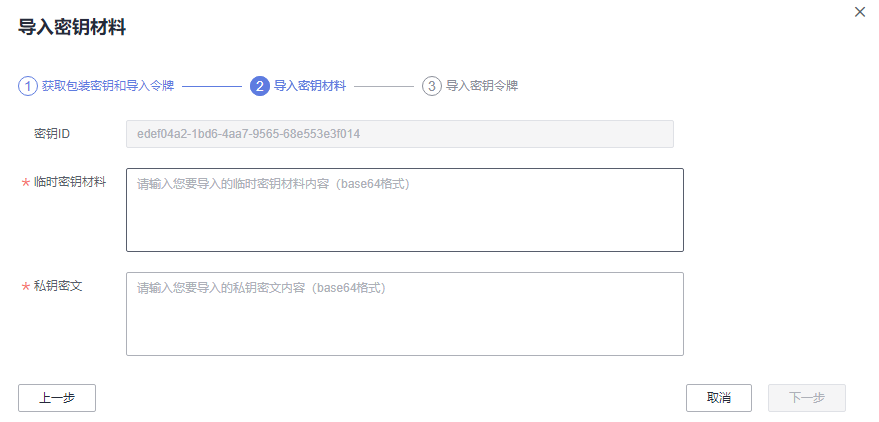

# 导入密钥材料<a name="dew_01_0089"></a>

## 操作场景<a name="s491b6038773145bda831d2000a54c15b"></a>

当用户希望使用自己的密钥材料，而不是KMS生成的密钥材料时，可通过密钥管理界面将自己的密钥材料导入到KMS，由KMS统一管理。

该任务指导用户通过密钥管理界面导入密钥材料。

> **说明：**   
>-   导入的密钥与创建的用户主密钥一样支持启用、禁用、计划删除和取消删除等操作。  
>-   用户仅能导入256位对称密钥。  

## 前提条件<a name="s45c1e1d2a89e4c99bb0ce13912b6fd78"></a>

-   已获取管理控制台的登录帐号与密码。
-   已准备好待导入的密钥材料。

## 操作步骤<a name="scfd68ea997e74909a825386e20128afc"></a>

1.  登录管理控制台。
2.  单击管理控制台左上角，选择区域或项目。
3.  单击页面上方的“服务列表“，选择“安全  \>  数据加密服务“，默认进入数据加密服务的“密钥管理“界面。
4.  单击“导入密钥“，弹出“导入密钥“对话框。
5.  在弹出的对话框中填写密钥的“别名“和“描述“信息。

    **图 1**  创建空密钥（基础版密钥管理）<a name="f0ba0ba0f46d645588f1107b03aac4f8e"></a>  
    

    **图 2**  创建空密钥（专业版密钥管理）<a name="fig1056075517247"></a>  
    

6.  （可选）用户可根据自己的需要为用户主密钥添加标签，输入“标签键“和“标签值“。

    > **说明：**   
    >-   当用户在创建密钥时，没有为该用户主密钥添加标签。若用户需要为该用户主密钥添加标签，可单击该用户主密钥的别名，进入密钥详情页面，为该用户主密钥添加标签。  
    >-   同一个用户主密钥下，一个标签键只能对应一个标签值；不同的用户主密钥下可以使用相同的标签键。  
    >-   用户最多可以给单个用户主密钥添加10个标签。  
    >-   当同时添加多个标签，需要删除其中一个待添加的标签时，可单击该标签所在行的“删除“，删除标签。  

7.  单击“安全性与持久性“阅读并了解导入密钥的安全性和持久性。
8.  勾选“我已经了解导入密钥的安全性和持久性“，创建密钥材料为空的用户主密钥。
9.  单击“下一步“，进入“获取包装密钥和导入令牌“页面。根据[表1](#tc7ccf66255f74e4a8a34c7dbf91b9e91)选择密钥包装算法。

    **图 3**  获取包装密钥和导入令牌<a name="fe56edb123b2a43fabac94367be45655d"></a>  
    

    **表 1**  密钥包装算法说明

    <a name="tc7ccf66255f74e4a8a34c7dbf91b9e91"></a>
    <table><thead align="left"><tr id="r5af13f78ad7a4a52888456be117e309d"><th class="cellrowborder" valign="top" width="23.232323232323235%" id="mcps1.2.4.1.1"><p id="a84e13d4eda974a34b6047aaaaf2609b9"><a name="a84e13d4eda974a34b6047aaaaf2609b9"></a><a name="a84e13d4eda974a34b6047aaaaf2609b9"></a>密钥包装算法</p>
    </th>
    <th class="cellrowborder" valign="top" width="35.35353535353536%" id="mcps1.2.4.1.2"><p id="a8ba32982efd5488b8a941628e5f32d67"><a name="a8ba32982efd5488b8a941628e5f32d67"></a><a name="a8ba32982efd5488b8a941628e5f32d67"></a>说明</p>
    </th>
    <th class="cellrowborder" valign="top" width="41.41414141414141%" id="mcps1.2.4.1.3"><p id="a50f597a548154ba3a479f3598b557cca"><a name="a50f597a548154ba3a479f3598b557cca"></a><a name="a50f597a548154ba3a479f3598b557cca"></a>设置</p>
    </th>
    </tr>
    </thead>
    <tbody><tr id="r62d12246873e493f93cca24c61f27e1d"><td class="cellrowborder" valign="top" width="23.232323232323235%" headers="mcps1.2.4.1.1 "><p id="a8a51426c118645de8a23c7b66d0a48f0"><a name="a8a51426c118645de8a23c7b66d0a48f0"></a><a name="a8a51426c118645de8a23c7b66d0a48f0"></a>RSAES_OAEP_SHA_256</p>
    </td>
    <td class="cellrowborder" valign="top" width="35.35353535353536%" headers="mcps1.2.4.1.2 "><p id="a58e8d154b0ef4fca80e18c1266e7682d"><a name="a58e8d154b0ef4fca80e18c1266e7682d"></a><a name="a58e8d154b0ef4fca80e18c1266e7682d"></a>具有<span class="parmvalue" id="p2d5cd9fb83f84f34b9727ee1280eaf07"><a name="p2d5cd9fb83f84f34b9727ee1280eaf07"></a><a name="p2d5cd9fb83f84f34b9727ee1280eaf07"></a>“SHA-256”</span>哈希函数的OAEP的RSA加密算法。</p>
    </td>
    <td class="cellrowborder" rowspan="3" valign="top" width="41.41414141414141%" headers="mcps1.2.4.1.3 "><p id="a32eaa93da7d1438b9ae7db16e9e744e7"><a name="a32eaa93da7d1438b9ae7db16e9e744e7"></a><a name="a32eaa93da7d1438b9ae7db16e9e744e7"></a>请用户根据自己的HSM功能选择加密算法。</p>
    <a name="oe5e1bb170e9045708503dc2c7e8d10de"></a><a name="oe5e1bb170e9045708503dc2c7e8d10de"></a><ol id="oe5e1bb170e9045708503dc2c7e8d10de"><li>如果您的HSM支持<span class="parmvalue" id="pefc9244895d24bc1a7ef2221c34596c8"><a name="pefc9244895d24bc1a7ef2221c34596c8"></a><a name="pefc9244895d24bc1a7ef2221c34596c8"></a>“RSAES_OAEP_SHA_256”</span>加密算法，推荐使用<span class="parmvalue" id="pad87d0f90c5643df8070f6a85f2c96ce"><a name="pad87d0f90c5643df8070f6a85f2c96ce"></a><a name="pad87d0f90c5643df8070f6a85f2c96ce"></a>“RSAES_OAEP_SHA_256”</span>加密密钥材料。</li><li>如果您的HSM不支持<span class="parmvalue" id="pe302f813610247db9ce704e3cbeeda17"><a name="pe302f813610247db9ce704e3cbeeda17"></a><a name="pe302f813610247db9ce704e3cbeeda17"></a>“OAEP”</span>选项，用户可以使用<span class="parmvalue" id="p2ee40118c8d0415b876b95a98c7c826f"><a name="p2ee40118c8d0415b876b95a98c7c826f"></a><a name="p2ee40118c8d0415b876b95a98c7c826f"></a>“RSAES_PKCS1_V1_5”</span>加密密钥材料。</li></ol>
    <div class="notice" id="nb782a35adf36497497b6d81572c1736d"><a name="nb782a35adf36497497b6d81572c1736d"></a><a name="nb782a35adf36497497b6d81572c1736d"></a><span class="noticetitle"> 须知： </span><div class="noticebody"><p id="a724dcf2cdd874cb7a1d983cba12b87c6"><a name="a724dcf2cdd874cb7a1d983cba12b87c6"></a><a name="a724dcf2cdd874cb7a1d983cba12b87c6"></a><span class="parmvalue" id="p14bee3bf2cb54343b4d277d7e00327db"><a name="p14bee3bf2cb54343b4d277d7e00327db"></a><a name="p14bee3bf2cb54343b4d277d7e00327db"></a>“RSAES_OAEP_SHA_1”</span>加密算法已经不再安全，请谨慎选择。</p>
    </div></div>
    </td>
    </tr>
    <tr id="r9eb14ca065f04315921b48ffac84c8c9"><td class="cellrowborder" valign="top" headers="mcps1.2.4.1.1 "><p id="a8da2ee48a3cf470d9b4d5454e59f2ad1"><a name="a8da2ee48a3cf470d9b4d5454e59f2ad1"></a><a name="a8da2ee48a3cf470d9b4d5454e59f2ad1"></a>RSAES_PKCS1_V1_5</p>
    </td>
    <td class="cellrowborder" valign="top" headers="mcps1.2.4.1.2 "><p id="af7bec5cf23214e799ec0d794b4b151e1"><a name="af7bec5cf23214e799ec0d794b4b151e1"></a><a name="af7bec5cf23214e799ec0d794b4b151e1"></a>PKCS#1 v1.5版本的RSA加密算法。</p>
    </td>
    </tr>
    <tr id="row181359191257"><td class="cellrowborder" valign="top" headers="mcps1.2.4.1.1 "><p id="a5f8e5510ed674cbb90d27ae93b542374"><a name="a5f8e5510ed674cbb90d27ae93b542374"></a><a name="a5f8e5510ed674cbb90d27ae93b542374"></a>RSAES_OAEP_SHA_1</p>
    </td>
    <td class="cellrowborder" valign="top" headers="mcps1.2.4.1.2 "><p id="ae3c2706cfb9848f08aeff6e24ab27bf9"><a name="ae3c2706cfb9848f08aeff6e24ab27bf9"></a><a name="ae3c2706cfb9848f08aeff6e24ab27bf9"></a>具有<span class="parmvalue" id="paf1671e309b6441b9d5ba74781d9938a"><a name="paf1671e309b6441b9d5ba74781d9938a"></a><a name="paf1671e309b6441b9d5ba74781d9938a"></a>“SHA-1”</span>哈希函数的OAEP的RSA加密算法。</p>
    </td>
    </tr>
    </tbody>
    </table>

10. <a name="l3a203e8c8d5f4859ac54ed94a8d9693a"></a>单击“下载“，下载的文件包含包装密钥、导入令牌和说明文件，如[图4](#f974ef357a8e8429bafac0f34a208e27f)所示。

    **图 4**  下载文件<a name="f974ef357a8e8429bafac0f34a208e27f"></a>  
    

    -   wrappingKey\__密钥ID_\__下载时间_：即包装密钥，用于加密密钥材料的包装密钥。
    -   importToken\__密钥ID_\__下载时间_：即导入令牌，KMS导入密钥材料时需要使用。
    -   README\__密钥ID\_下载时间_：即说明文件，记录包装密钥序列号、密钥包装算法、包装密钥文件名称、令牌文件名称以及包装密钥和令牌的过期时间。

    > **须知：**   
    >包装密钥和导入令牌将在24小时后失效，失效后将不能使用。如果包装密钥和导入令牌失效，请重新下载包装密钥和导入令牌。  

    同时，用户也可以通过调用API接口的方式获取包装密钥和导入令牌。

    1.  调用“get-parameters-for-import“接口，获取包装密钥和导入令牌。

        如下以获取密钥ID为“43f1ffd7-18fb-4568-9575-602e009b7ee8“，加密算法为“RSAES\_PKCS1\_V1\_5“的包装密钥和导入令牌为例。

        “public\_key“：调用API接口返回的base64编码的包装密钥内容。

        “import\_token“：调用API接口返回的base64编码的导入令牌内容。

        -   请求样例

            ```
            {      
                "key_id": "43f1ffd7-18fb-4568-9575-602e009b7ee8",
                "wrapping_algorithm":"RSAES_PKCS1_V1_5"
            }
            ```

        -   响应样例

            ```
            {
                "key_id": "43f1ffd7-18fb-4568-9575-602e009b7ee8",    
                "public_key":"public key base64 encoded data",
                "import_token":"import token base64 encoded data",
                "expiration_time":1501578672
            }
            ```

    2.  保存包装密钥，包装密钥需要按照以下步骤转换格式。使用转换格式后的包装密钥进行加密的密钥材料才能成功导入管理控制台。
        1.  复制包装密钥“public\_key“的内容，粘贴到“.txt“文件中，并保存为“PublicKey.b64“。
        2.  使用OpenSSL，执行以下命令，对“PublicKey.b64“文件内容进行base64转码，生成二进制数据，并将转码后的文件保存为“PublicKey.bin“。

            **openssl** **enc** **-d** **-base64** **-A** **-in** **PublicKey.b64** **-out** **PublicKey.bin**

    3.  保存导入令牌，复制导入令牌“import\_token“的内容，粘贴到“.txt“文件中，并保存为“ImportToken.b64“。

11. 使用下载的“包装密钥“对待导入的密钥材料进行加密。
    -   方法一：使用下载的包装密钥在自己的HSM中加密密钥材料，详细信息请参考您的HSM操作指南。
    -   方法二：采用OpenSSL加密密钥材料。

        > **说明：**   
        >若用户需要使用**openssl** **pkeyutl**命令，OpenSSL需要是1.0.2及以上版本。  

        如下以使用下载的包装密钥，加密生成的密钥材料（256位对称密钥）为例说明，操作步骤如下所示：

        1.  执行以下命令，生成密钥材料（256位对称密钥），并将生成的密钥材料以“PlaintextKeyMaterial.bin“命名保存。

            **openssl** **rand** **-out** _**PlaintextKeyMaterial.bin**_ **32**

        2.  使用下载的包装密钥加密密钥材料，并将加密后的密钥材料按“EncryptedKeyMaterial.bin“命名保存。

            以下命令中的**_PublicKey.bin_**参数请以[10](#l3a203e8c8d5f4859ac54ed94a8d9693a)下载的包装密钥名称_wrappingKey\_密钥ID\_下载时间_进行替换。

            **表 2**  使用下载的包装密钥加密生成的密钥材料

            <a name="table12753165710914"></a>
            <table><thead align="left"><tr id="zh-cn_topic_0112947063_row695911161267"><th class="cellrowborder" valign="top" width="28.000000000000004%" id="mcps1.2.3.1.1"><p id="zh-cn_topic_0112947063_p13959016965"><a name="zh-cn_topic_0112947063_p13959016965"></a><a name="zh-cn_topic_0112947063_p13959016965"></a>包装密钥算法</p>
            </th>
            <th class="cellrowborder" valign="top" width="72%" id="mcps1.2.3.1.2"><p id="zh-cn_topic_0112947063_p13959516367"><a name="zh-cn_topic_0112947063_p13959516367"></a><a name="zh-cn_topic_0112947063_p13959516367"></a>加密生成的密钥材料</p>
            </th>
            </tr>
            </thead>
            <tbody><tr id="zh-cn_topic_0112947063_row095901616618"><td class="cellrowborder" valign="top" width="28.000000000000004%" headers="mcps1.2.3.1.1 "><p id="zh-cn_topic_0112947063_p7959131613619"><a name="zh-cn_topic_0112947063_p7959131613619"></a><a name="zh-cn_topic_0112947063_p7959131613619"></a>RSAES_OAEP_SHA_256</p>
            </td>
            <td class="cellrowborder" valign="top" width="72%" headers="mcps1.2.3.1.2 "><p id="zh-cn_topic_0112947063_p152747519815"><a name="zh-cn_topic_0112947063_p152747519815"></a><a name="zh-cn_topic_0112947063_p152747519815"></a><strong id="zh-cn_topic_0112947063_b17491112695410"><a name="zh-cn_topic_0112947063_b17491112695410"></a><a name="zh-cn_topic_0112947063_b17491112695410"></a>openssl</strong> <strong id="zh-cn_topic_0112947063_b124917266549"><a name="zh-cn_topic_0112947063_b124917266549"></a><a name="zh-cn_topic_0112947063_b124917266549"></a>pkeyutl</strong></p>
            <p id="zh-cn_topic_0112947063_p132741351484"><a name="zh-cn_topic_0112947063_p132741351484"></a><a name="zh-cn_topic_0112947063_p132741351484"></a><strong id="zh-cn_topic_0112947063_b939786201916"><a name="zh-cn_topic_0112947063_b939786201916"></a><a name="zh-cn_topic_0112947063_b939786201916"></a>-in</strong> <em id="zh-cn_topic_0112947063_i22741351783"><a name="zh-cn_topic_0112947063_i22741351783"></a><a name="zh-cn_topic_0112947063_i22741351783"></a><strong id="zh-cn_topic_0112947063_b1327435489"><a name="zh-cn_topic_0112947063_b1327435489"></a><a name="zh-cn_topic_0112947063_b1327435489"></a>PlaintextKeyMaterial.bin</strong></em></p>
            <p id="zh-cn_topic_0112947063_p12741511819"><a name="zh-cn_topic_0112947063_p12741511819"></a><a name="zh-cn_topic_0112947063_p12741511819"></a><strong id="zh-cn_topic_0112947063_b19239112291910"><a name="zh-cn_topic_0112947063_b19239112291910"></a><a name="zh-cn_topic_0112947063_b19239112291910"></a>-inkey</strong> <strong id="zh-cn_topic_0112947063_b192401422171912"><a name="zh-cn_topic_0112947063_b192401422171912"></a><a name="zh-cn_topic_0112947063_b192401422171912"></a><em id="zh-cn_topic_0112947063_i102401522131919"><a name="zh-cn_topic_0112947063_i102401522131919"></a><a name="zh-cn_topic_0112947063_i102401522131919"></a><i><span class="varname" id="zh-cn_topic_0112947063_varname182401222191916"><a name="zh-cn_topic_0112947063_varname182401222191916"></a><a name="zh-cn_topic_0112947063_varname182401222191916"></a>PublicKey.bin</span></i></em></strong></p>
            <p id="zh-cn_topic_0112947063_p1274125389"><a name="zh-cn_topic_0112947063_p1274125389"></a><a name="zh-cn_topic_0112947063_p1274125389"></a><strong id="zh-cn_topic_0112947063_b2429027111918"><a name="zh-cn_topic_0112947063_b2429027111918"></a><a name="zh-cn_topic_0112947063_b2429027111918"></a>-out</strong> <em id="zh-cn_topic_0112947063_i10274755812"><a name="zh-cn_topic_0112947063_i10274755812"></a><a name="zh-cn_topic_0112947063_i10274755812"></a><strong id="zh-cn_topic_0112947063_b92741351389"><a name="zh-cn_topic_0112947063_b92741351389"></a><a name="zh-cn_topic_0112947063_b92741351389"></a>EncryptedKeyMaterial.bin</strong></em></p>
            <p id="zh-cn_topic_0112947063_p152759513818"><a name="zh-cn_topic_0112947063_p152759513818"></a><a name="zh-cn_topic_0112947063_p152759513818"></a><strong id="zh-cn_topic_0112947063_b104811331191912"><a name="zh-cn_topic_0112947063_b104811331191912"></a><a name="zh-cn_topic_0112947063_b104811331191912"></a>-keyform</strong> <strong id="zh-cn_topic_0112947063_b8482031141920"><a name="zh-cn_topic_0112947063_b8482031141920"></a><a name="zh-cn_topic_0112947063_b8482031141920"></a>der</strong></p>
            <p id="zh-cn_topic_0112947063_p1727515485"><a name="zh-cn_topic_0112947063_p1727515485"></a><a name="zh-cn_topic_0112947063_p1727515485"></a><strong id="zh-cn_topic_0112947063_b1227517514820"><a name="zh-cn_topic_0112947063_b1227517514820"></a><a name="zh-cn_topic_0112947063_b1227517514820"></a>-pubin</strong> <strong id="zh-cn_topic_0112947063_b4275352814"><a name="zh-cn_topic_0112947063_b4275352814"></a><a name="zh-cn_topic_0112947063_b4275352814"></a>-encrypt</strong></p>
            <p id="zh-cn_topic_0112947063_p923941411719"><a name="zh-cn_topic_0112947063_p923941411719"></a><a name="zh-cn_topic_0112947063_p923941411719"></a><strong id="zh-cn_topic_0112947063_b79791848191917"><a name="zh-cn_topic_0112947063_b79791848191917"></a><a name="zh-cn_topic_0112947063_b79791848191917"></a>-pkeyopt</strong> <strong id="zh-cn_topic_0112947063_b64337537193"><a name="zh-cn_topic_0112947063_b64337537193"></a><a name="zh-cn_topic_0112947063_b64337537193"></a>rsa_padding_mode:oaep</strong> <strong id="zh-cn_topic_0112947063_b14433853111914"><a name="zh-cn_topic_0112947063_b14433853111914"></a><a name="zh-cn_topic_0112947063_b14433853111914"></a>-pkeyopt rsa_oaep_md:sha256</strong></p>
            </td>
            </tr>
            <tr id="zh-cn_topic_0112947063_row109597161068"><td class="cellrowborder" valign="top" width="28.000000000000004%" headers="mcps1.2.3.1.1 "><p id="zh-cn_topic_0112947063_p1195921613615"><a name="zh-cn_topic_0112947063_p1195921613615"></a><a name="zh-cn_topic_0112947063_p1195921613615"></a>RSAES_PKCS1_V1_5</p>
            </td>
            <td class="cellrowborder" valign="top" width="72%" headers="mcps1.2.3.1.2 "><p id="zh-cn_topic_0112947063_p82752055817"><a name="zh-cn_topic_0112947063_p82752055817"></a><a name="zh-cn_topic_0112947063_p82752055817"></a><strong id="zh-cn_topic_0112947063_b136931120229"><a name="zh-cn_topic_0112947063_b136931120229"></a><a name="zh-cn_topic_0112947063_b136931120229"></a>openssl</strong> <strong id="zh-cn_topic_0112947063_b1649410208225"><a name="zh-cn_topic_0112947063_b1649410208225"></a><a name="zh-cn_topic_0112947063_b1649410208225"></a>rsautl</strong> <strong id="zh-cn_topic_0112947063_b134941820192210"><a name="zh-cn_topic_0112947063_b134941820192210"></a><a name="zh-cn_topic_0112947063_b134941820192210"></a>-encrypt</strong></p>
            <p id="zh-cn_topic_0112947063_p92751051189"><a name="zh-cn_topic_0112947063_p92751051189"></a><a name="zh-cn_topic_0112947063_p92751051189"></a><strong id="zh-cn_topic_0112947063_b1635422519229"><a name="zh-cn_topic_0112947063_b1635422519229"></a><a name="zh-cn_topic_0112947063_b1635422519229"></a>-in</strong> <em id="zh-cn_topic_0112947063_i122753512814"><a name="zh-cn_topic_0112947063_i122753512814"></a><a name="zh-cn_topic_0112947063_i122753512814"></a><strong id="zh-cn_topic_0112947063_b1127511514813"><a name="zh-cn_topic_0112947063_b1127511514813"></a><a name="zh-cn_topic_0112947063_b1127511514813"></a>PlaintextKeyMaterial.bin</strong></em></p>
            <p id="zh-cn_topic_0112947063_p827517514812"><a name="zh-cn_topic_0112947063_p827517514812"></a><a name="zh-cn_topic_0112947063_p827517514812"></a><strong id="zh-cn_topic_0112947063_b1227517518818"><a name="zh-cn_topic_0112947063_b1227517518818"></a><a name="zh-cn_topic_0112947063_b1227517518818"></a>-pkcs</strong></p>
            <p id="zh-cn_topic_0112947063_p112751451988"><a name="zh-cn_topic_0112947063_p112751451988"></a><a name="zh-cn_topic_0112947063_p112751451988"></a><strong id="zh-cn_topic_0112947063_b979152912217"><a name="zh-cn_topic_0112947063_b979152912217"></a><a name="zh-cn_topic_0112947063_b979152912217"></a>-inkey</strong> <strong id="zh-cn_topic_0112947063_b979132912224"><a name="zh-cn_topic_0112947063_b979132912224"></a><a name="zh-cn_topic_0112947063_b979132912224"></a><em id="zh-cn_topic_0112947063_i579192922219"><a name="zh-cn_topic_0112947063_i579192922219"></a><a name="zh-cn_topic_0112947063_i579192922219"></a><i><span class="varname" id="zh-cn_topic_0112947063_varname97972913222"><a name="zh-cn_topic_0112947063_varname97972913222"></a><a name="zh-cn_topic_0112947063_varname97972913222"></a>PublicKey.bin</span></i></em></strong></p>
            <p id="zh-cn_topic_0112947063_p92761956813"><a name="zh-cn_topic_0112947063_p92761956813"></a><a name="zh-cn_topic_0112947063_p92761956813"></a><strong id="zh-cn_topic_0112947063_b3380185482215"><a name="zh-cn_topic_0112947063_b3380185482215"></a><a name="zh-cn_topic_0112947063_b3380185482215"></a>-keyform</strong> <strong id="zh-cn_topic_0112947063_b1738035413228"><a name="zh-cn_topic_0112947063_b1738035413228"></a><a name="zh-cn_topic_0112947063_b1738035413228"></a>der</strong></p>
            <p id="zh-cn_topic_0112947063_p1027618517813"><a name="zh-cn_topic_0112947063_p1027618517813"></a><a name="zh-cn_topic_0112947063_p1027618517813"></a><strong id="zh-cn_topic_0112947063_b1527612518820"><a name="zh-cn_topic_0112947063_b1527612518820"></a><a name="zh-cn_topic_0112947063_b1527612518820"></a>-pubin</strong></p>
            <p id="zh-cn_topic_0112947063_p42761251981"><a name="zh-cn_topic_0112947063_p42761251981"></a><a name="zh-cn_topic_0112947063_p42761251981"></a><strong id="zh-cn_topic_0112947063_b9942059182215"><a name="zh-cn_topic_0112947063_b9942059182215"></a><a name="zh-cn_topic_0112947063_b9942059182215"></a>-out</strong> <em id="zh-cn_topic_0112947063_i112761852814"><a name="zh-cn_topic_0112947063_i112761852814"></a><a name="zh-cn_topic_0112947063_i112761852814"></a><strong id="zh-cn_topic_0112947063_b122761853814"><a name="zh-cn_topic_0112947063_b122761853814"></a><a name="zh-cn_topic_0112947063_b122761853814"></a>EncryptedKeyMaterial.bin</strong></em></p>
            </td>
            </tr>
            <tr id="zh-cn_topic_0112947063_row1495916161062"><td class="cellrowborder" valign="top" width="28.000000000000004%" headers="mcps1.2.3.1.1 "><p id="zh-cn_topic_0112947063_p9959916969"><a name="zh-cn_topic_0112947063_p9959916969"></a><a name="zh-cn_topic_0112947063_p9959916969"></a>RSAES_OAEP_SHA_1</p>
            </td>
            <td class="cellrowborder" valign="top" width="72%" headers="mcps1.2.3.1.2 "><p id="zh-cn_topic_0112947063_p42761658817"><a name="zh-cn_topic_0112947063_p42761658817"></a><a name="zh-cn_topic_0112947063_p42761658817"></a><strong id="zh-cn_topic_0112947063_b33112582313"><a name="zh-cn_topic_0112947063_b33112582313"></a><a name="zh-cn_topic_0112947063_b33112582313"></a>openssl</strong> <strong id="zh-cn_topic_0112947063_b1531117514236"><a name="zh-cn_topic_0112947063_b1531117514236"></a><a name="zh-cn_topic_0112947063_b1531117514236"></a>pkeyutl</strong></p>
            <p id="zh-cn_topic_0112947063_p11276852086"><a name="zh-cn_topic_0112947063_p11276852086"></a><a name="zh-cn_topic_0112947063_p11276852086"></a><strong id="zh-cn_topic_0112947063_b52772810232"><a name="zh-cn_topic_0112947063_b52772810232"></a><a name="zh-cn_topic_0112947063_b52772810232"></a>-in</strong> <em id="zh-cn_topic_0112947063_i52768515819"><a name="zh-cn_topic_0112947063_i52768515819"></a><a name="zh-cn_topic_0112947063_i52768515819"></a><strong id="zh-cn_topic_0112947063_b427618518814"><a name="zh-cn_topic_0112947063_b427618518814"></a><a name="zh-cn_topic_0112947063_b427618518814"></a>PlaintextKeyMaterial.bin</strong></em></p>
            <p id="zh-cn_topic_0112947063_p1027785185"><a name="zh-cn_topic_0112947063_p1027785185"></a><a name="zh-cn_topic_0112947063_p1027785185"></a><strong id="zh-cn_topic_0112947063_b18504131242319"><a name="zh-cn_topic_0112947063_b18504131242319"></a><a name="zh-cn_topic_0112947063_b18504131242319"></a>-inkey</strong> <strong id="zh-cn_topic_0112947063_b850413124232"><a name="zh-cn_topic_0112947063_b850413124232"></a><a name="zh-cn_topic_0112947063_b850413124232"></a><em id="zh-cn_topic_0112947063_i050410125235"><a name="zh-cn_topic_0112947063_i050410125235"></a><a name="zh-cn_topic_0112947063_i050410125235"></a><i><span class="varname" id="zh-cn_topic_0112947063_varname11504312122317"><a name="zh-cn_topic_0112947063_varname11504312122317"></a><a name="zh-cn_topic_0112947063_varname11504312122317"></a>PublicKey.bin</span></i></em></strong></p>
            <p id="zh-cn_topic_0112947063_p1527745881"><a name="zh-cn_topic_0112947063_p1527745881"></a><a name="zh-cn_topic_0112947063_p1527745881"></a><strong id="zh-cn_topic_0112947063_b429211719238"><a name="zh-cn_topic_0112947063_b429211719238"></a><a name="zh-cn_topic_0112947063_b429211719238"></a>-out</strong> <em id="zh-cn_topic_0112947063_i14277155989"><a name="zh-cn_topic_0112947063_i14277155989"></a><a name="zh-cn_topic_0112947063_i14277155989"></a><strong id="zh-cn_topic_0112947063_b10277151781"><a name="zh-cn_topic_0112947063_b10277151781"></a><a name="zh-cn_topic_0112947063_b10277151781"></a>EncryptedKeyMaterial.bin</strong></em></p>
            <p id="zh-cn_topic_0112947063_p172771251080"><a name="zh-cn_topic_0112947063_p172771251080"></a><a name="zh-cn_topic_0112947063_p172771251080"></a><strong id="zh-cn_topic_0112947063_b440012115237"><a name="zh-cn_topic_0112947063_b440012115237"></a><a name="zh-cn_topic_0112947063_b440012115237"></a>-keyform</strong> <strong id="zh-cn_topic_0112947063_b10401221172314"><a name="zh-cn_topic_0112947063_b10401221172314"></a><a name="zh-cn_topic_0112947063_b10401221172314"></a>der</strong></p>
            <p id="zh-cn_topic_0112947063_p1227735586"><a name="zh-cn_topic_0112947063_p1227735586"></a><a name="zh-cn_topic_0112947063_p1227735586"></a><strong id="zh-cn_topic_0112947063_b152777514815"><a name="zh-cn_topic_0112947063_b152777514815"></a><a name="zh-cn_topic_0112947063_b152777514815"></a>-pubin</strong> <strong id="zh-cn_topic_0112947063_b11277651589"><a name="zh-cn_topic_0112947063_b11277651589"></a><a name="zh-cn_topic_0112947063_b11277651589"></a>-encrypt</strong></p>
            <p id="zh-cn_topic_0112947063_p16855188287"><a name="zh-cn_topic_0112947063_p16855188287"></a><a name="zh-cn_topic_0112947063_p16855188287"></a><strong id="zh-cn_topic_0112947063_b128891534192310"><a name="zh-cn_topic_0112947063_b128891534192310"></a><a name="zh-cn_topic_0112947063_b128891534192310"></a>-pkeyopt</strong> <strong id="zh-cn_topic_0112947063_b522913911234"><a name="zh-cn_topic_0112947063_b522913911234"></a><a name="zh-cn_topic_0112947063_b522913911234"></a>rsa_padding_mode:oaep</strong> <strong id="zh-cn_topic_0112947063_b166921440131"><a name="zh-cn_topic_0112947063_b166921440131"></a><a name="zh-cn_topic_0112947063_b166921440131"></a>-pkeyopt</strong> <strong id="zh-cn_topic_0112947063_b3692114017319"><a name="zh-cn_topic_0112947063_b3692114017319"></a><a name="zh-cn_topic_0112947063_b3692114017319"></a>rsa_oaep_md:sha1</strong></p>
            </td>
            </tr>
            </tbody>
            </table>


12. 单击“下一步“，进入“导入密钥材料“页面。根据[表3](#tca3671bdc0a241caa4320e72b18ece16)配置参数。

    **图 5**  导入密钥材料<a name="fb3b7e892e3ab492683050d9df66a22b2"></a>  
    

    **表 3**  导入密钥材料参数说明

    <a name="tca3671bdc0a241caa4320e72b18ece16"></a>
    <table><thead align="left"><tr id="r390eb23e8c3a4e25b019ccd4946262bc"><th class="cellrowborder" valign="top" width="22.31%" id="mcps1.2.3.1.1"><p id="aed4471233c87458ba79f8ddd5ac38549"><a name="aed4471233c87458ba79f8ddd5ac38549"></a><a name="aed4471233c87458ba79f8ddd5ac38549"></a>参数</p>
    </th>
    <th class="cellrowborder" valign="top" width="77.69%" id="mcps1.2.3.1.2"><p id="ac25db9b0ee6c4c6d983a4d731ce24692"><a name="ac25db9b0ee6c4c6d983a4d731ce24692"></a><a name="ac25db9b0ee6c4c6d983a4d731ce24692"></a>操作说明</p>
    </th>
    </tr>
    </thead>
    <tbody><tr id="r12b5847cd40a4c24b87515eac14e998c"><td class="cellrowborder" valign="top" width="22.31%" headers="mcps1.2.3.1.1 "><p id="ae065c16b69e048fdb9daa70a35c8394d"><a name="ae065c16b69e048fdb9daa70a35c8394d"></a><a name="ae065c16b69e048fdb9daa70a35c8394d"></a>密钥ID</p>
    </td>
    <td class="cellrowborder" valign="top" width="77.69%" headers="mcps1.2.3.1.2 "><p id="af6233f51eb9340d29f5352b323e1f2a6"><a name="af6233f51eb9340d29f5352b323e1f2a6"></a><a name="af6233f51eb9340d29f5352b323e1f2a6"></a>创建密钥时，随机生成的密钥ID。</p>
    </td>
    </tr>
    <tr id="rd829bccb264642a7abd1ffc91e8aa180"><td class="cellrowborder" valign="top" width="22.31%" headers="mcps1.2.3.1.1 "><p id="a9145963e5d6641ba8c08632182502704"><a name="a9145963e5d6641ba8c08632182502704"></a><a name="a9145963e5d6641ba8c08632182502704"></a>密钥材料</p>
    </td>
    <td class="cellrowborder" valign="top" width="77.69%" headers="mcps1.2.3.1.2 "><a name="o28c8a93cd3714ec5afea30e1dbf046f1"></a><a name="o28c8a93cd3714ec5afea30e1dbf046f1"></a><ol id="o28c8a93cd3714ec5afea30e1dbf046f1"><li>选择使用<a href="#l3a203e8c8d5f4859ac54ed94a8d9693a">10</a>下载的<span class="parmname" id="p76ef99348c324f38a0065e24efaf2bf3"><a name="p76ef99348c324f38a0065e24efaf2bf3"></a><a name="p76ef99348c324f38a0065e24efaf2bf3"></a>“包装密钥”</span>加密的密钥材料。</li><li>单击<span class="uicontrol" id="u1c1ad2cf30294a62aa9feaa3f3405a81"><a name="u1c1ad2cf30294a62aa9feaa3f3405a81"></a><a name="u1c1ad2cf30294a62aa9feaa3f3405a81"></a>“导入”</span>，导入密钥材料。</li></ol>
    </td>
    </tr>
    </tbody>
    </table>

13. 单击“下一步“，进入“导入密钥令牌“页面。根据[表4](#tf00e7c9f3be04375a6ceb8b65a9b1697)设置参数。

    **图 6**  导入密钥令牌<a name="f06115c4d58c5421aa75ed091bf8c8131"></a>  
    

    **表 4**  导入密钥令牌参数说明

    <a name="tf00e7c9f3be04375a6ceb8b65a9b1697"></a>
    <table><thead align="left"><tr id="rf59951b771844ecca3dbe56fb80fdb29"><th class="cellrowborder" valign="top" width="21.37%" id="mcps1.2.3.1.1"><p id="a552017a60d544972abdc5c4ea8f8ce62"><a name="a552017a60d544972abdc5c4ea8f8ce62"></a><a name="a552017a60d544972abdc5c4ea8f8ce62"></a>参数</p>
    </th>
    <th class="cellrowborder" valign="top" width="78.63%" id="mcps1.2.3.1.2"><p id="aa6cf08d8bf344b4e83c5a7e77b967087"><a name="aa6cf08d8bf344b4e83c5a7e77b967087"></a><a name="aa6cf08d8bf344b4e83c5a7e77b967087"></a>操作说明</p>
    </th>
    </tr>
    </thead>
    <tbody><tr id="rfcb26ba6947e47f4bec8caf271d98201"><td class="cellrowborder" valign="top" width="21.37%" headers="mcps1.2.3.1.1 "><p id="a71d222757dd945d08cec1e16c8c52b43"><a name="a71d222757dd945d08cec1e16c8c52b43"></a><a name="a71d222757dd945d08cec1e16c8c52b43"></a>密钥ID</p>
    </td>
    <td class="cellrowborder" valign="top" width="78.63%" headers="mcps1.2.3.1.2 "><p id="a4ecc1783cf204a349812d00a527e60a7"><a name="a4ecc1783cf204a349812d00a527e60a7"></a><a name="a4ecc1783cf204a349812d00a527e60a7"></a>创建密钥时，随机生成的密钥ID。</p>
    </td>
    </tr>
    <tr id="r2011af42808a4f37b275cfd2690351cd"><td class="cellrowborder" valign="top" width="21.37%" headers="mcps1.2.3.1.1 "><p id="a931e8dab4c22458db6d054d2831511f3"><a name="a931e8dab4c22458db6d054d2831511f3"></a><a name="a931e8dab4c22458db6d054d2831511f3"></a>密钥导入令牌</p>
    </td>
    <td class="cellrowborder" valign="top" width="78.63%" headers="mcps1.2.3.1.2 "><p id="aef9f37060e4040c6be5d6fea9b0edca3"><a name="aef9f37060e4040c6be5d6fea9b0edca3"></a><a name="aef9f37060e4040c6be5d6fea9b0edca3"></a>选择<a href="#l3a203e8c8d5f4859ac54ed94a8d9693a">10</a><span class="uicontrol" id="u08d6c34bedd44ee4b9e32a86da4cd99d"><a name="u08d6c34bedd44ee4b9e32a86da4cd99d"></a><a name="u08d6c34bedd44ee4b9e32a86da4cd99d"></a>“下载”</span>的导入令牌。</p>
    </td>
    </tr>
    <tr id="r3d8b4931db9c43b1b6af2c1388762c5c"><td class="cellrowborder" valign="top" width="21.37%" headers="mcps1.2.3.1.1 "><p id="ae3deeda9b6d148219900add0ddac60c4"><a name="ae3deeda9b6d148219900add0ddac60c4"></a><a name="ae3deeda9b6d148219900add0ddac60c4"></a>密钥材料失效模式</p>
    </td>
    <td class="cellrowborder" valign="top" width="78.63%" headers="mcps1.2.3.1.2 "><a name="uecc055812f1d4fc898eec34955de39f6"></a><a name="uecc055812f1d4fc898eec34955de39f6"></a><ul id="uecc055812f1d4fc898eec34955de39f6"><li>永不失效：导入的密钥材料永久不失效。</li><li>失效时间：用户可指定导入的密钥材料的失效时间，默认失效时间为24小时。<p id="af9defe111c8645aca783d36a31e249d5"><a name="af9defe111c8645aca783d36a31e249d5"></a><a name="af9defe111c8645aca783d36a31e249d5"></a>密钥材料失效后，KMS会在24小时内自动删除密钥材料，删除后密钥将无法使用，且密钥状态变更为<span class="parmvalue" id="p910db4e3c692423d86a7363c8093a9bf"><a name="p910db4e3c692423d86a7363c8093a9bf"></a><a name="p910db4e3c692423d86a7363c8093a9bf"></a>“等待导入”</span>。</p>
    </li></ul>
    </td>
    </tr>
    </tbody>
    </table>

14. 单击“确定“，页面右上角弹出“密钥导入成功“，则说明导入密钥成功。

    > **须知：**   
    >密钥ID、导入的密钥材料和导入的令牌需要全部匹配，密钥材料才能导入成功，否则会导入失败。  

    用户可在密钥列表中查看到导入的密钥信息，导入密钥的默认状态为“启用“。


