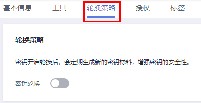

# 开启密钥轮换

该任务指导用户通过密钥管理界面开启自动轮换密钥。

默认情况下，自定义密钥的自动密钥轮换处于禁用状态。当您启用（或重新启用）密钥轮换时，KMS会根据您设置的轮换周期自动轮换自定义密钥。开启密钥轮换后会产生一定费用，具体费用计算可参见[开通密钥轮转如何收费？](https://support.huaweicloud.com/dew_faq/dew_01_0234.html)。

## 前提条件

-   密钥处于“启用“状态。
-   “密钥材料来源“为“密钥管理“。
-   仅对称密钥支持开启密钥轮换。

## 约束条件

如果自定义密钥开启密钥轮换以后，禁用了自定义密钥，KMS也不会轮换该自定义密钥。

当自定义密钥恢复到“启用“状态时，密钥轮换将立即重新激活。如果刚恢复“启用“状态的自定义密钥距离上次轮换的时间已超过轮换周期，KMS将在24小时内轮换该自定义密钥。

## 操作步骤

1.  [登录管理控制台](https://console.huaweicloud.com)。
2.  单击管理控制台左上角，选择区域或项目。
3.  单击页面左侧，选择“安全与合规  \>  数据加密服务“，默认进入“密钥管理“界面。

1.  单击目标自定义密钥的别名，进入密钥详细信息页面。
2.  单击“轮换策略“，进入“密钥轮换管理“页签，如[图1](#fig947023217481)所示。

    **图 1**  密钥轮换  
    

3.  单击，将“密钥轮换“设置为，弹出“启用轮换策略“对话框。
4.  设置轮换周期（天），单击“确定“。如[图2](#fig163766132919)所示。参数说明如[表1](#table663816112917)所示。

    **图 2**  开启密钥轮换  
    

    **表 1**  密钥轮换参数说明

    
    <table><thead align="left"><tr id="row1463710622919"><th class="cellrowborder" valign="top" width="18.48%" id="mcps1.2.3.1.1">
参数

    </th>
    <th class="cellrowborder" valign="top" width="81.52000000000001%" id="mcps1.2.3.1.2">
说明

    </th>
    </tr>
    </thead>
    <tbody><tr id="row176389662913"><td class="cellrowborder" valign="top" width="18.48%" headers="mcps1.2.3.1.1 ">
密钥轮换

    </td>
    <td class="cellrowborder" valign="top" width="81.52000000000001%" headers="mcps1.2.3.1.2 ">
密钥轮换开关，默认。

    
：关闭。

    
：开启。

    
开启密钥轮换后，密钥在设置的轮换周期到达后开始轮换。

    
 说明： 

如果自定义密钥开启密钥轮换以后，禁用了自定义密钥，KMS也不会轮换该自定义密钥。

    
当自定义密钥恢复到“启用”状态时，密钥轮换将立即重新激活。如果刚恢复“启用”状态的自定义密钥距离上次轮换的时间已超过轮换周期，KMS将在24小时内轮换该自定义密钥。

    

    </td>
    </tr>
    <tr id="row176384615297"><td class="cellrowborder" valign="top" width="18.48%" headers="mcps1.2.3.1.1 ">
轮换周期（天）

    </td>
    <td class="cellrowborder" valign="top" width="81.52000000000001%" headers="mcps1.2.3.1.2 ">
轮换周期。取值范围为“30~365”的整数，默认“365”天。

    
轮换周期需要根据自定义密钥的使用频率进行设置，若密钥使用频率高，建议设置为短周期；反之，则设置为长周期。

    </td>
    </tr>
    </tbody>
    </table>

5.  开启后，页面显示密钥轮换详情，如[图 密钥轮换详情](#fig87835532225)所示。

    **图 3**  密钥轮换详情  
    

    > **说明：** 
    >用户可单击，修改轮换周期。修改轮换周期后，根据新设置的轮换周期进行轮换。

