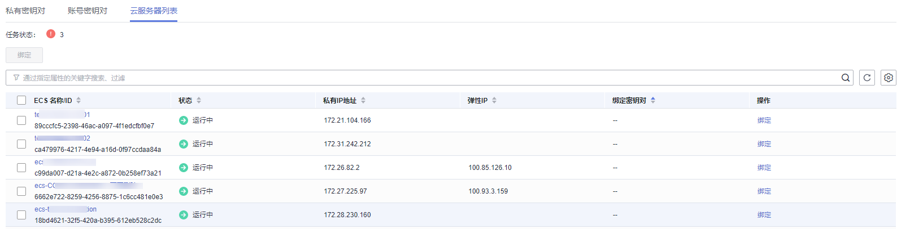
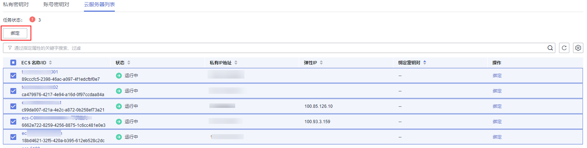
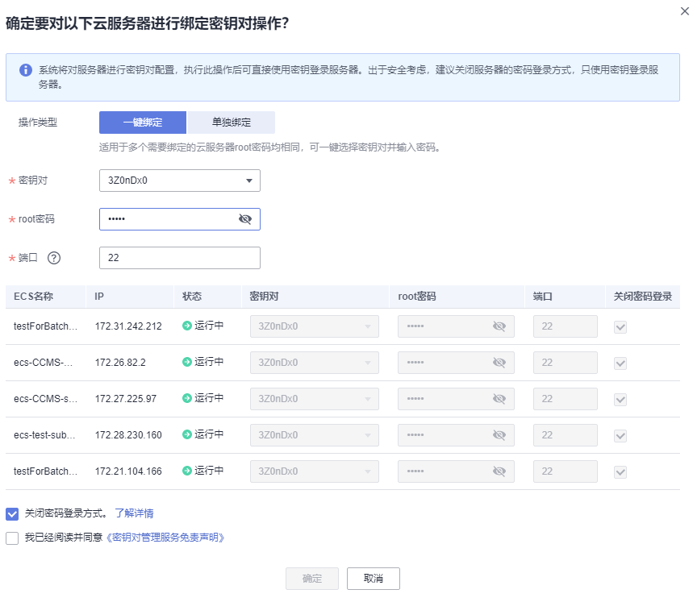
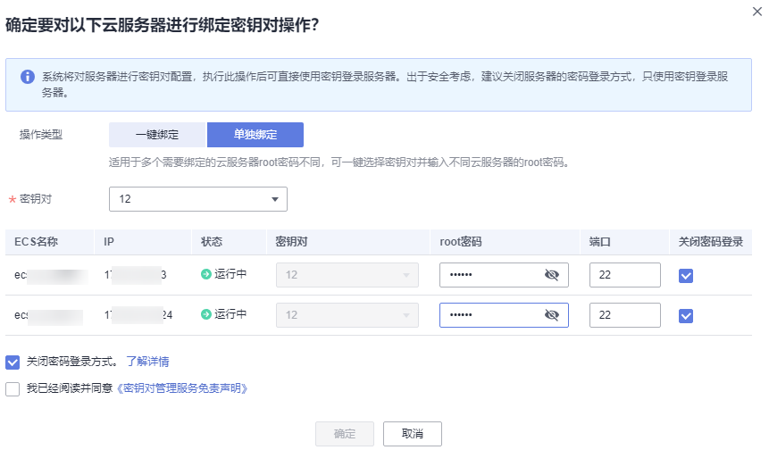

# 批量绑定密钥对

当弹性云服务器处于“运行中“状态时，通过控制台可进行批量绑定密钥对操作。

该任务指导用户通过密钥对管理界面批量绑定密钥对。

## 适用场景

-   当多个需要绑定的弹性云服务器密码相同时，可输入密码并一键选择密钥。
-   当多个需要绑定的弹性云服务器密码不同时，输入弹性云服务器的密码后，需选择同一密钥对进行绑定。

## 前提条件

-   弹性云服务器的状态处于“运行中“状态。
-   弹性云服务器未绑定密钥对。

## 约束条件

-   在管理控制台上，不支持对Windows操作系统的弹性云服务器进行密钥对的绑定操作。
-   公共镜像上，不支持CoreOS、OpenEuler、FreeBSD（Other）、Kylin V10 64bit和UnionTech OS Server 20 Euler 64bit系统进行密钥对的绑定绑定操作。
-   用户最多可同时选择10个弹性云服务器绑定密钥对。

## 操作步骤

1.  [登录管理控制台](https://console.huaweicloud.com)。
2.  单击管理控制台左上角的，选择区域或项目。
3.  单击页面左侧，选择“安全与合规  \>  数据加密服务“，默认进入“密钥管理“界面。
4.  在左侧导航树中，选择“密钥对管理“，进入“密钥对管理“页面。
5.  单击“云服务器列表“，显示云服务器列表页面，如[图 云服务器列表](#fig658653193610)所示。

    **图 1**  云服务器列表  
    

6.  勾选需要进行批量绑定的服务器，单击搜索框上方的“绑定“，如[图 批量绑定密钥对](#fig1382219211861)所示。

    **图 2**  批量绑定密钥对  
    

7.  单击“绑定“后,弹出绑定对话框。
    -   若多个需要绑定的弹性云服务器密码相同，可一键选择密钥对并输入密码进行绑定，如[图 一键绑定](#fig455610295180)所示。

        **图 3**  一键绑定  
        

    -   若多个需要绑定的弹性云服务器密码不同，可选择单独绑定，如[图 单独绑定](#fig93817165372)所示。

        **图 4**  单独绑定  
        

        > **说明：** 
        >选择一键绑定时，只允许使用同一密钥对进行绑定。

8.  “端口“的默认参数为22，可进行自定义修改。

    > **说明：** 
    >使用自定义端口参数，需确认以下内容：
    >-   密钥对可以通过端口参数连接到弹性云服务器。修改弹性云服务器中的安全组配置具体操作请参见[配置安全组规则](https://support.huaweicloud.com/usermanual-ecs/zh-cn_topic_0030878383.html)。
    >-   弹性云服务器中的默认端口参数修改并确认端口开放。具体操作请参见[Linux云服务器SSH登录的安全加固](https://support.huaweicloud.com/bestpractice-ecs/zh-cn_topic_0165501097.html)

9.  用户可根据自己的需要选择是否勾选“关闭密码登录方式“，默认勾选“关闭密码登录方式“。

    > **说明：** 
    >-   若不关闭密码登录方式，用户既可使用密码登录弹性云服务器，也可以使用密钥对登录弹性云服务器。
    >-   若关闭了密码登录方式，用户只能使用密钥对登录弹性云服务器，若用户仍然需要使用密码登录弹性云服务器，可再次开启密码登录方式，具体操作请参见[关闭弹性云服务器的密码登录方式后如何重新开启？](https://support.huaweicloud.com/dew_faq/dew_01_0072.html)。

1.  请阅读并勾选“我已阅读并同意《密钥对管理服务免责声明》“。
2.  单击“确定“，完成批量绑定密钥对操作，等待约3-5分钟可绑定成功。

